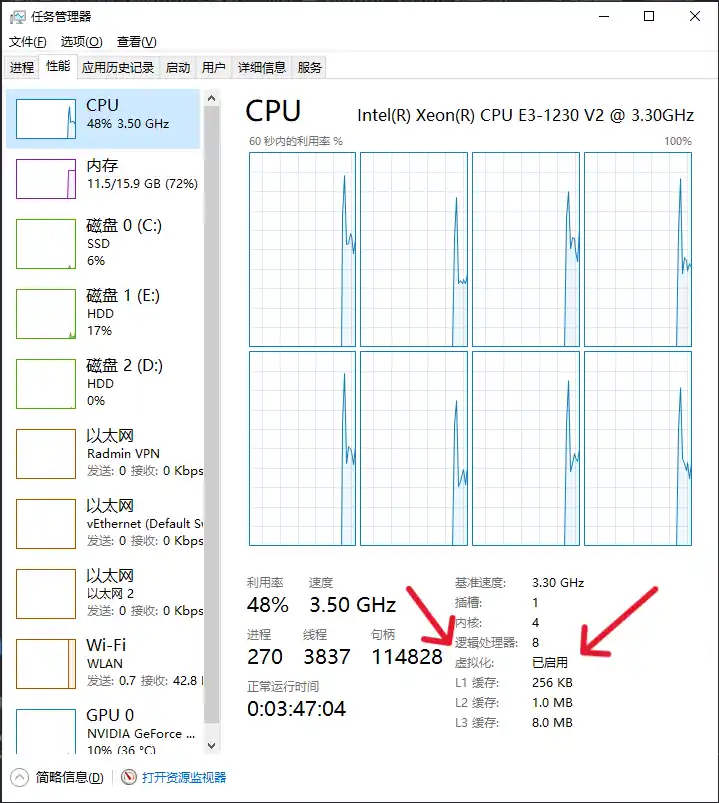
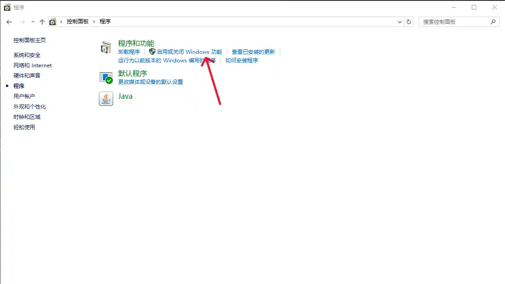
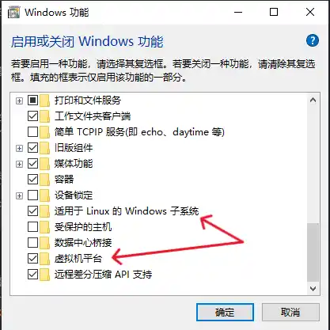
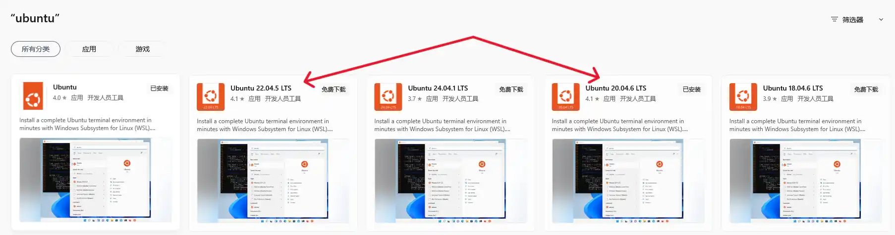

用 PyWebview 写完应用，打包成 Android APK 是最后一步。官方文档给了方向，但细节需要自己摸索。以下是我验证过的完整流程。

## 1. 准备 Linux 环境

Android 打包依赖 Buildozer，它只能跑在 Linux 上。Windows 用户可通过 WSL 搭建环境。

### 1.1 启用虚拟化并安装 WSL Ubuntu

首先确认 CPU 虚拟化已开启：任务管理器 → 性能 → CPU → 虚拟化，显示“已启用”。



接着打开系统功能：控制面板 → 程序 → 启用或关闭 Windows 功能，勾选“适用于 Linux 的 Windows 子系统”和“虚拟机平台”。




在 Microsoft Store 中搜索 Ubuntu，安装 **20.04.6 LTS** 或 **22.04.5 LTS**。安装后会自动弹出终端，按提示设置用户名和密码。



### 1.2 安装系统依赖与 Buildozer

在 Ubuntu 终端执行以下命令，安装编译所需的工具链：

```bash
sudo apt update
sudo apt install -y git zip unzip openjdk-17-jdk python3-pip autoconf libtool \
  pkg-config zlib1g-dev libncurses5-dev libncursesw5-dev libtinfo5 cmake \
  libffi-dev libssl-dev

pip3 install --user Cython==0.29.33 virtualenv buildozer
echo 'export PATH=$PATH:~/.local/bin/' >> ~/.bashrc
source ~/.bashrc
```

如果系统中另有 Java 版本冲突，可尝试安装 `openjdk-11-jdk` 替代。

## 2. 配置打包信息

### 2.1 初始化 buildozer.spec

进入项目根目录，执行：

```bash
buildozer init
```

会生成 `buildozer.spec`。PyWebview 项目可直接下载官方示例配置作为基础：[buildozer.spec 示例](https://github.com/r0x0r/pywebview/blob/a2b8d0449b206db75f9f364639b85db6eac7f07e/examples/todos/buildozer.spec)。

### 2.2 必须修改的项

*   `title`：应用名称
*   `package.name`：包名
*   `package.domain`：域名格式的包 ID
*   `requirements`：至少包含 `python3,kivy,pywebview`，其他依赖也一并列出
*   `android.add_jars`：需要指向 pywebview 自带的 jar 包。运行以下 Python 代码获取它的绝对路径：

```python
from webview import util
print(util.android_jar_path())
```

将输出路径填入 `android.add_jars`。

* 如果需要联网权限，确保 `android.permissions` 中包含 `INTERNET`。

## 3. 开始构建

第一次构建会下载 Android SDK、NDK 等组件，耗时很长，后续构建会大幅加快。

### 调试版 (debug)

生成 debug APK，用于快速测试：

```bash
buildozer android debug
```

### 正式版 (release)

生成用于发布的 AAB 文件：

```bash
buildozer android release
```

产物位于 `bin/` 目录。

## 4. 处理 APK/AAB 文件

如果直接得到 APK 可跳到签名步骤；如果是 AAB，需先提取通用 APK。

### 4.1 从 AAB 提取 universal.apk

使用 [bundletool](https://github.com/google/bundletool/releases)，确保电脑已装 Java：

```bash
java -jar bundletool.jar build-apks --bundle=your_app.aab --output=output.apks --mode=universal
```

`output.apks` 是一个 ZIP 文件，解压后得到 `universal.apk`。

### 4.2 允许明文 HTTP 流量

* 注：这种方法有安全风险，建议仅用于开发。目前我还没有找到更好的办法。

Android 9 及以上默认禁止明文 HTTP，如果 WebView 需要访问 `http://localhost`，必须修改 AndroidManifest。

用 [apktool](https://ibotpeaches.github.io/Apktool/) 反编译 APK：

```bash
java -jar apktool.jar d universal.apk -o decompiled
```

编辑 `decompiled/AndroidManifest.xml`，在 `<application` 标签内添加：

```xml
android:usesCleartextTraffic="true"
```

重新打包：

```bash
java -jar apktool.jar b decompiled -o unsigned.apk
```

### 4.3 生成签名密钥

如果还没有 keystore，用 keytool 生成一个：

```bash
keytool -genkey -keystore my-release.keystore -keyalg RSA -keysize 2048 -validity 10000 -alias my-key
```

按提示输入信息，记住设置的密码和别名。

### 4.4 对 APK 签名

使用 apksigner 完成签名：

```bash
apksigner sign --ks my-release.keystore --ks-key-alias my-key -out final.apk unsigned.apk
```

`final.apk` 即为可安装的安装包。

## 5. 自动化脚本

我将上述 AAB 处理流程写成 Python 脚本，一键完成提取、改 Manifest、签名。核心逻辑贴在下面，完整文件见 [QriaMath 仓库](https://github.com/gpchn/QriaMath)。

```python
#!/usr/bin/env python3
# coding=utf-8

from sys import argv
from os import system
from pathlib import Path

VER = "0.1.0"
JAVA = r"path\to\java"
SEVEN_ZIP = r"path\to\7z"
APK_SIGNER = r"path\to\apksigner"
AAB = "QriaMath-0.1.0-arm64-v8a_armeabi-v7a-release.aab"

print("(1/4) Building APK from AAB...")
system(f"{JAVA} -jar bundletool.jar build-apks --bundle={AAB} --output=output.apks --mode=universal")
system(f"{SEVEN_ZIP} x output.apks -ooutput")
print("(2/4) Modifying AndroidManifest...")
system(f"{JAVA} -jar apktool.jar d output/universal.apk -o dec")
xml = Path("dec/AndroidManifest.xml")
xml.write_text(xml.read_text().replace("<application", '<application android:usesCleartextTraffic="true"'))
print("(3/4) Rebuilding APK...")
system(f"{JAVA} -jar apktool.jar b dec -o unsigned.apk")
print("(4/4) Signing...")
system(f"{APK_SIGNER} sign --ks qriamath.keystore --ks-key-alias qriamath -out QriaMath-{VER}.apk unsigned.apk")
```

整个过程把 PyWebview 项目转为安卓 APK 的步骤连在一起了。如果遇到构建报错，优先检查 buildozer.spec 中的路径和依赖列表；WSL 用户注意项目文件必须放在 Linux 文件系统内，不要直接在 `/mnt/c` 下构建，否则权限和性能问题会很难排查。
