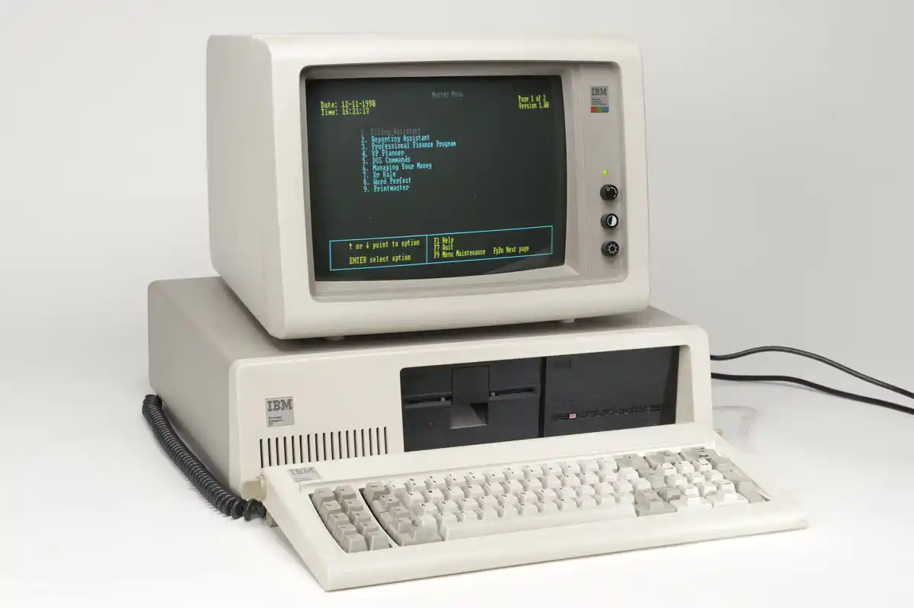
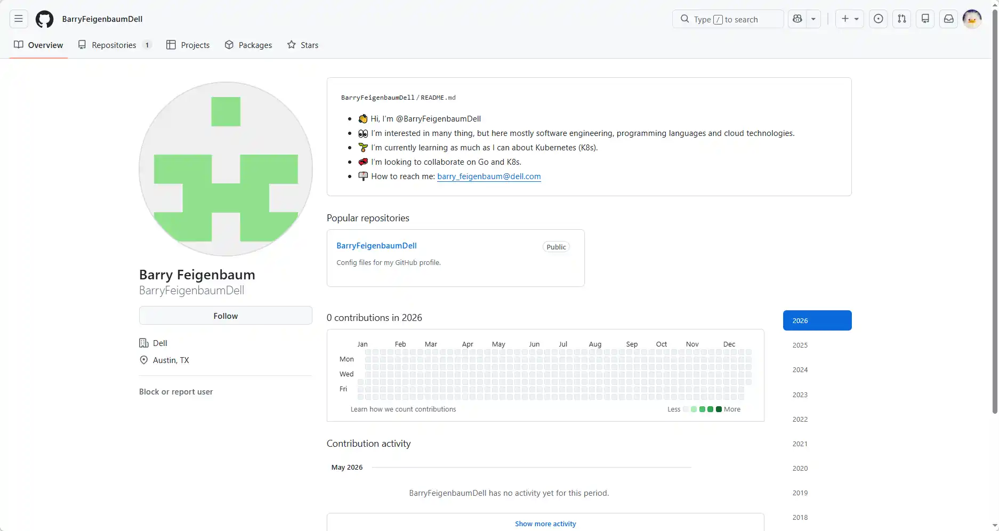
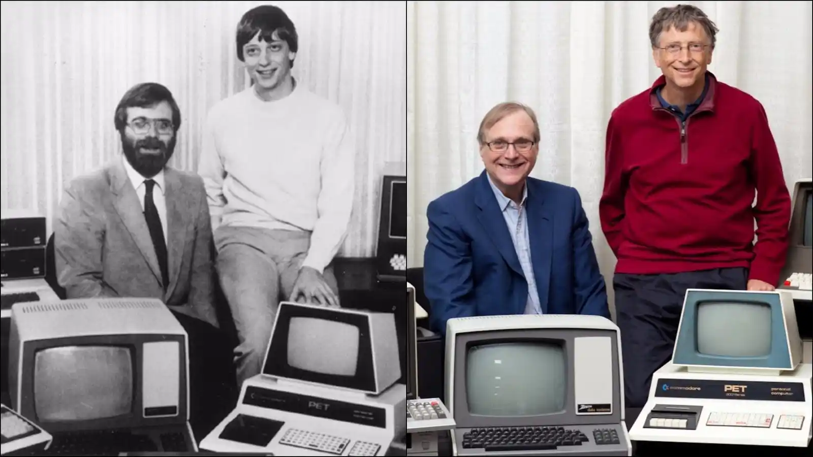
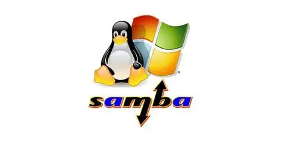
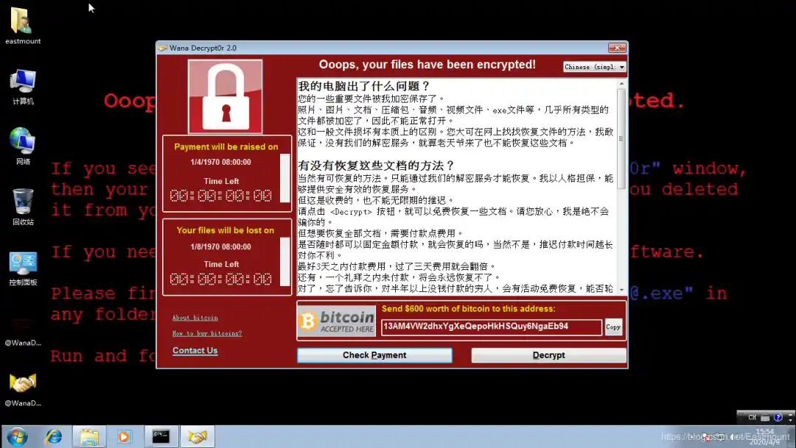
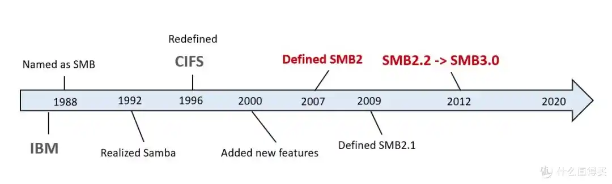

如果你是 Windows 老用户，你肯定记得这么一个东西。

在 Windows 95 和 98 的年代，它叫“网上邻居”，桌面上那个画着两台小电脑和一个地球的图标。到了 Windows XP 时代，它改名叫“My Network Places”。再后来，到了 Windows 7，微软大手一挥，名字直接精简成了“网络”。而到了 Windows 10 和 11，微软干脆把它藏进了文件资源管理器的侧边栏里。

名字换了一茬又一茬，图标从两台小电脑变成了一台小电脑，又从一台小电脑变成了一个抽象的网格。但不管它怎么变，当你在地址栏敲下 \\192.168.x.x 的那一刻，你面对的，依然是那个从 Windows 诞生之初就存在的功能。

这是一个比 Windows 本身还要古老的协议——它的第一条命令发出的时间，是 1984 年。那一年，乔布斯掏出了第一代 Macintosh，迈克尔·戴尔还没开始卖电脑，而中国大部分家庭连电视机都没有。

这个协议叫 **SMB**。

而这一切的起点，是一个在 IBM 上班的年轻工程师，他叫 **Barry Feigenbaum**。

---

## 一、一个差点被毙掉的项目：SMB 的诞生

1983 年，IBM 内部弥漫着一种古怪的焦虑。

那一年，IBM 刚刚发布了 PC/XT——世界上第一款内置硬盘的个人电脑。销量好得离谱，好到 IBM 自己都没准备好。但有一个问题正在各种办公隔间里悄悄发酵：这些电脑之间，互相之间完全不认识。

你在电脑 A 上写了一份报表，想送到电脑 B 上打印？对不起，你得先把文件拷进一张 5.25 英寸软盘，拔出来，走到电脑 B 旁边，插进去，读取，然后打印。如果电脑 B 在另一层楼——那恭喜你，今天的步数达标了。

整个 IBM 的 PC 生态，像是被精心建造出来的一百座孤岛，每一座岛上都有人在大喊“怎么把文件弄过去？？”，但没人能听见。

IBM 当然不是傻子。他们知道局域网这件事，他们甚至刚刚在 1982 年参与了 Ethernet 标准的制定。但 Ethernet 只是一条物理上的高速公路，你还需要一套交通规则——一个传输文件的协议。

而这个协议，被丢给了一个在当时 IBM 并不算核心的部门——位于德克萨斯州奥斯汀的 Entry Systems Division。这个部门里，有一个看起来普普通通的程序员，叫 Barry Feigenbaum。

关于 Barry Feigenbaum 这个人，公开资料少得可怜。他是个工程师，一个纯粹到不能再纯粹的工程师。在 SMB 这件事上，他干的活说起来也平平无奇：IBM 需要一个能让 DOS 系统在局域网上共享文件的工具，他负责写。

但“平平无奇”这个词，你得放在 1984 年的语境里看。

1984 年的 DOS 是什么水平？它不支持多任务，不支持多用户，连文件夹的概念都只是一个模糊的树形结构。在这样一个连“网络”这两个字都找不到的系统上，要让一台机器访问另一台机器的文件。

Feigenbaum 给出的方案，在当时看来，简单到有点粗暴。他设计了一套命令，让一台电脑可以通过网络对另一台电脑说四件事：

1.  我要连上你。（Session Setup）
2.  让我看看你都有啥文件。（Tree Connect）
3.  把那个文件打开。（Open）
4.  读它。写它。关它。（Read / Write / Close）

就这些。没有复杂的鉴权机制，没有冗余校验，没有加密——连用户名密码都是明文传的。但在 1984 年，这四件事已经足够让 IBM 的打印机共享和文件传输跑起来了。Feigenbaum 把这套命令打包成一个 IBM 内部工具，给它起了一个朴实无华的名字：**IBM PC Network SMB Protocol**。

对，SMB 最早不叫 Server Message Block。它叫 **SMB**，全称的含义在不同时期有过不同解释，但最初它可能只是 Feigenbaum 随手拼出来的三个字母。而这个“随手”——后来改变了整个局域网世界的运转方式。

---

## 二、从 IBM 到微软：一桩没人看好的联姻

好，SMB 被造出来了。但接下来的剧情，跟所有 B 级片剧本一样——英雄发明了毁灭性武器，然后被自己人束之高阁。

IBM 当时正在下一盘更大的棋。他们内部有一个更高级的网络协议叫 **NetBIOS**，有一套更豪华的文件系统叫 **OS/2**，有一整套更宏大的企业级网络蓝图叫 **Token Ring**。跟这些金光闪闪的名字比起来，SMB 就是个临时工——一个为了解决眼前问题而匆忙搭出来的代码脚手架，用完了就该拆掉。

如果历史按照 IBM 的剧本走，SMB 应该在三五年内被某个更高端的协议取代，然后被丢进技术史的废纸篓，和打孔卡、软盘驱动器一起沦为博物馆展品。

但历史没按这个剧本走。一个叫微软的小公司，把它捡走了。

1985 年，微软还是一个靠给 IBM 写 DOS 过活的小弟。IBM 是大哥，大哥说往东，小弟不敢往西。但小弟心里清楚得很：IBM 那个 OS/2 系统太贵、太重，普通人根本用不起。真正能让普通人买电脑的，是 DOS——而 DOS 需要网络功能。于是微软的内部团队开始在 SMB 的基础上做文章。他们接手了 IBM 扔掉的 SMB 代码，给它加了更多命令、扩展了文件锁定机制、引入了新的错误处理——更重要的是，他们把它打包进了 **LAN Manager** 这个产品里，让它真正变成了一个可以卖的东西。

这大概是技术史上最戏剧化的一幕：IBM 自己发明了 SMB，却亲手把它塞给了微软。而微软——这个当年还只会跟在 IBM 后面写操作系统的小弟——就靠着自己给 SMB 打的这个补丁，从此一脚踩进了企业网络市场。

等 IBM 反应过来，一切都晚了。到 1990 年代初，微软已经成了局域网协议事实上的话事人。IBM 的 LAN Server 和微软的 LAN Manager 在市场上对轰，但 IBM 的价格太贵、配置太复杂，微软的便宜货靠着一台 Windows for Workgroups 就卖遍了全球中小企业。

IBM 发明了 SMB，但微软让它活了下来。这不叫技术转让，这叫技术遗产的非自愿捐赠。

---

## 三、CIFS 与 Samba：一场属于极客的完美复仇

时间拨到 1996 年，SMB 已经被微软改得面目全非。

微软觉得，“Server Message Block” 这个名字听起来太土了，在严肃的金融和政府客户面前逼格不够。于是他们给它换了一个听着就很唬人的名字——**Common Internet File System**，简称 **CIFS**。

你品一品这个名字。Common，通用的。Internet，互联网的。File System，文件系统。三个词组合在一起，暗示着这是一个能统一全宇宙文件共享的标准。但撕开这层包装纸，CIFS 的内核就是 SMB——加了点料、换了套西装，连骨头架子都没动。

微软把 CIFS 提交给了 IETF（互联网工程任务组），企图把这个协议变成一个“互联网标准”。但与此同时，他们干了一件让整个开源世界血压飙升的事：**SMB/CIFS 是闭源的。** Windows 的原生文件共享是跑在 SMB 上的，但如果你想在你的 Linux 机器上读 Windows 共享文件夹——对不起，没有官方方案，自己想办法。

这就是标准战的经典套路：先把自己的私有协议包装成“事实标准”，然后利用生态优势锁死用户。你如果想在微软的局域网世界里活下去，就得买 Windows 授权。别的系统？乖乖当二等公民。

但微软低估了一个人。这个人叫 **Andrew Tridgell**。

1991 年 12 月，澳大利亚堪培拉，一个在读博的小伙子遇到了一个让他火大的问题。他的实验室里有一台装着 DOS 的 PC 和一台 Sun 工作站，两台机器之间得传文件。Tridgell 手里有一个 NFS 客户端，但 DOS 不支持。他翻了半天文档，发现 DOS 可以装一套叫“PC-NFS”的第三方软件——于是他买了一套，装上去，然后发现它 **根本连不上**。

如果你是一个普通人，你会接受这段插曲，骂骂咧咧地去买软盘拷文件。但 Tridgell 不是普通人。这个猛人后来凭一己之力写出了 **rsync**（你现在用的所有文件同步工具，源码里大概率有他的代码），是 Linux 内核的主要贡献者之一，还因为破解了 TiVo 的 DRM 加密而名震江湖。

总之，1991 年那个下午，Tridgell 被那个不好使的 PC-NFS 惹毛了。他决定自己动手，逆向工程 DOS 和 PC-NFS 之间的网络通信协议。他把一个嗅探器接进网线，一条一条抓包，一条一条分析——然后他发现，这套 PC-NFS 软件底层用的，就是 SMB 的一个变体。

**他造出来了。** 一套能在 Sun 工作站上挂载 DOS 共享文件夹的工具。他给它起了一个很朋克的名字——**Samba**。

为什么叫 Samba？因为 SMB 协议里有一个关键的握手命令叫 `SMBSERVER`，而 Tridgell 当时需要一个短一点的名字来命名自己的项目文件夹。他翻了一下 `grep` 的输出，发现 S-M-B 这三个字母是共用的，于是他在字典里搜“以 SMB 开头的词”，翻到了“Samba”——一个巴西舞蹈的名字。

是的，人类历史上最重要的开源文件共享工具之一，它的名字来自于一个程序员在字典里随手一翻。

1992 年，Samba 第一版正式发布。它的出现，意味着 Linux 用户可以无视微软的闭源战略，直接从网络里抓取 Windows 共享文件。微软一手建立的 CIFS 生态护城河，被一个澳大利亚博士用包嗅探和几万行 C 代码硬生生挖出了一个缺口。

这不是商业竞争，这是一场属于极客的技术平权运动。而微软对 Samba 的态度，从一开始的忽略，变成了警惕，最后变成了咬牙切齿但无可奈何的默认。

---

## 四、你可能也经历过的那个名场面：“网上邻居”的死亡转圈

好，SMB 在服务器端打得火热，但在桌面上——说实话，你在 1990 年代末到 2000 年代初用过 Windows 的话，你对 SMB 的印象大概率只有一个：**卡。**

是的。那个让你在 Windows XP 时代气到想砸显示器的“网上邻居”假死现象，元凶就是 SMB。

技术上是这么回事：Windows 的“网络发现”机制，依赖 SMB 协议在局域网里广播一种叫“浏览器服务”的数据包，用来选举出一个“主浏览器”——就是那个负责收集全网计算机名单的倒霉蛋。如果主浏览器掉线了，全网就得重新选举一次。而在选举完成之前，你点开“网上邻居”，系统就只能在一片漆黑里干等。

更阴间的是，如果网络里混进了几台老旧的 Windows 98 或 Windows ME 的机器，它们会发出和 XP 不同的浏览器选举消息，导致全网选举陷入死锁。你公司那台负责打印报销单的奔腾三旧电脑一旦开机，整个办公室的网上邻居就全瘫痪了——你以为是电脑坏了，其实是当年几个版本的老古董 SMB 在抢主浏览器的王座。

这就是 SMB 1.0 的遗产：一个 1984 年为 IBM 打印机共享而设计的协议，被微软一路加功能、打补丁、套壳重命名，硬撑着撑过了整个拨号上网时代和宽带时代。到了 2000 年代中期，SMB 1.0 代码里已经到处是屎山级别的修补痕迹，连微软自己的工程师都不太敢再往里加新东西了。

破局发生在 2007 年。随着 Windows Vista 和 Windows Server 2008 的发布，微软甩出了 **SMB 2.0**。这个版本几乎是推倒重来——命令数量从 100 多个砍到 19 个，消息流水线化，安全性大修，网络发现机制重写。那个让你咬牙的“网上邻居假死”，从这个版本开始正式进了历史的垃圾箱。

但 SMB 2.0 真正的王炸，是 **速度**。在同样的硬件条件下，SMB 2.0 传输大文件的速度比 SMB 1.0 快了将近 10 到 20 倍。凭什么？因为它把原来那种“发一条命令，等一个回复，再发下一条”的排队式通信，改成了可以同时发好几条命令的流水线。这就好比原来你雇一个邮差，每送一封信都要跑回来确认；现在你雇了一整队邮差，信一包一包地往外送，不用等回执——速度自然就飞起来了。

但即便如此，SMB 1.0 就像一颗砍不死的僵尸钉子，一直扎在微软的操作系统里。直到 2017 年——发生了一件事，逼得全世界的 IT 管理员不得不连夜关掉 SMB 1.0。

---

## 五、“永恒之蓝”：SMB 遭遇史上最狠背刺

2017 年 4 月 14 日，一个叫 **Shadow Brokers**（影子经纪人）的黑客组织，在互联网上公开了一批据称是从美国国家安全局（NSA）盗出的网络武器工具包。这里面有一把武器，名字听着就让人觉得不对劲——**EternalBlue**，中文翻译叫“永恒之蓝”。

永恒之蓝攻击的，正是微软的 SMB 1.0 协议。

这把武器的攻击方式，说起来不复杂：它向目标机器的 445 端口发一段精心构造的畸形数据包，SMB 1.0 的代码在处理这段数据包时会崩溃，然后永恒之蓝利用这个崩溃瞬间注入恶意代码。理论上，整个过程只需要几秒钟。

换句话说，一个暴露在公网、开着 445 端口、使用 SMB 1.0 的 Windows 机器，在永恒之蓝面前就是不设防的。它不需要你点开钓鱼链接，不需要你插入染毒 U 盘，它需要的只是你那台机器连在网上。

微软在 2017 年 3 月其实已经发过补丁了——MS17-010，补的就是永恒之蓝利用的这个漏洞。但问题是，全世界的 IT 管理员没怎么当回事。又是一个普通的星期二补丁日，谁会专门为了一个“远程代码执行漏洞”去打补丁呢？

答案在一个月后揭晓了。2017 年 5 月 12 日，基于永恒之蓝工具的勒索病毒 **WannaCry** 在全球爆发。英国 NHS 国家医疗系统、西班牙电信、德国铁路、中国高校校园网……超过 200,000 台电脑在 24 小时内被感染，文件被加密，屏幕跳出一个倒计时和比特币地址。

一夜之间，全世界的 IT 管理员齐刷刷地关掉了 SMB 1.0，然后把 MS17-010 补丁打到了自己能找到的每一台机器上。WannaCry 的破坏力之惊人，以至于微软在事后做了一个极其罕见的举动：他们甚至为早已停止官方支持的 Windows XP 和 Windows Server 2003 发布了紧急安全补丁。一个美国跨国公司，为一个十六年前的操作系统紧急发补丁——这件事本身的荒诞程度，就足以说明 SMB 1.0 这个漏洞有多致命。

永恒之蓝和 WannaCry 留下了一个影响深远的遗产：**SMB 1.0 终于被彻底钉死在历史的耻辱柱上。** 从那以后，几乎所有主流的 NAS 厂商、Linux 发行版、甚至微软自己的 Windows 10 和 Windows Server，都把 SMB 1.0 作为默认关闭的可选组件。Windows 10 从 2018 年春季更新开始，如果 15 天内没有用到 SMB 1.0，系统会自动卸载它。

这是 Barry Feigenbaum 在 1984 年绝对无法想象的结局。他当年在 DOS 上敲出的那几百行代码，既没有加密，也没有鉴权，连一个像样的错误处理都没有——因为那个年代没人会想到，三十多年后，这套代码会跑在连接全球几十亿台设备的网络上，而这几十亿台设备里，总会有人在一个深夜尝试攻击你。

他设计的不是一个安全的协议，他设计的是一把没有锁的万能钥匙。问题在于，这把钥匙从 1984 年一直用到 2017 年——用了整整三十三年，直到永恒之蓝提醒了全人类：你不能把原始人画在洞穴里的安保方案，用在配备了核武器的硅基城堡上。

---

## 六、SMB 3.0 与今天：这头老牛还能跑多远？

2012 年，微软随 Windows 8 和 Windows Server 2012 推出了 **SMB 3.0**。这个版本干了一件以前所有版本都没干过的事：**认真搞安全。**

SMB 3.0 引入了端到端加密，支持多通道传输（同时走好几条网线给你传文件），甚至针对服务器集群场景搞了一套透明故障转移——你正在拷文件，主节点挂了，连接自动切到备用节点，你连进度条都不会卡一下。

但比起这些技术特性，SMB 3.0 真正重要的，是它标志着一个“协议中年危机”的结束。SMB 终于不再是什么都得兼容的兼容怪了。它丢掉了一部分历史包袱，把安全摆到了和性能同等重要的位置上，开始学着在数据中心、虚拟化平台和云存储后端里扮演更现代的角色。

今天的 SMB，早已不是 Barry Feigenbaum 在 1984 年设计的那个只有四条命令的小东西了。它经历了被 IBM 抛弃、被微软收留、被开源社区逆向工程、被 NSA 武器化、被勒索病毒绑架——然后活了下来。

但有一个问题，值得每一个读者在划走这篇文章之前想一想：**为什么 SMB 活了这么久？**

你可能会说，因为它背靠微软生态——Windows 用它，所以大家不得不用。这当然对，但不够。更深层的原因是，SMB 抓住了局域网文件共享这件事里最基本、最核心的需求：**像用本地文件一样用远程文件。** 这句话说起来简单，但 1984 年的时候，所有其他协议都做不到这一点。FTP 只能整文件传输，NFS 在当时还只在 Unix 工作站上小范围流行。只有 SMB，做到了“打开、读、写、关”这四件事——和本地文件操作完全一致——而这一套语义的直觉感，到现在为止还没有第二个协议能在 Windows 生态里全面替代它。

当然，SMB 的对手也从来没少过。WebDAV 试图用 HTTP 做文件共享，Samba 从开源一侧包围了 SMB 的生态位，AFP 统治着苹果生态，NFS 在 Linux 服务器上稳如老狗。但 SMB 的对策很简单：你说你要兼容性？我支持你家里每一台 Windows、macOS、Linux、iOS、Android。你说你要安全？SMB 3.0 搞了加密、签名、密钥协商。你说你怕勒索病毒？微软直接帮你把 SMB 1.0 默认关闭——这大概是整个 IT 史上最坚决的一次“自断臂膀”式安全响应。

---

1984 年，Barry Feigenbaum 在德克萨斯州奥斯汀的一个不起眼的办公室里，写下了 SMB 的第一行代码。他大概从没想过，这行代码会在 40 年后仍然驱动着全球几亿台设备的日常文件共享——从一个办公室里两台 IBM PC 之间的临时连接，演变成连接整个星球局域网的底层脊梁。

2019 年 6 月，Barry Feigenbaum 去世。

他貌似真的很低调，在网上只留下一个领英页面，一些博客，和一个空 GitHub 账号。他唯一的一张照片是领英头像，很模糊，还没截全，表情是工程师的扑克脸。但 SMB 协议，至今还在每一台设备上，日日夜夜地搬运着人类那些永远搬不完的文件。

——这大概就是一个工程师最体面的墓志铭了。不是刻在石碑上，是跑在每一根网线里。

