上一回我们聊完了 1 MB。一张 1.44 MB 的软盘，能装下一两张模糊的照片，或者十几张安装盘才能喂饱一个操作系统。你大概还记得那个保存按钮——一张 3.5 英寸软盘的形状，至今还嵌在你屏幕的角落里。

从 MB 再往上跨一步，计算机信息的尺度进入了另一个量级。这个量级大到什么程度？大到人类第一次有资格跟计算机说：**来，把我爱听的歌都记住。**

这个量级，叫 **Gigabyte**，中文 **吉字节**，或者你用更熟悉的说法——**1 个 G**。

1 GB = 1024 MB = 1,048,576 KB = 1,073,741,824 字节。十亿个字节。这个数字在你的手机套餐里、在你的 U 盘包装上、在你下载一部电影时进度条旁边的小字里，无处不在。但你可能从来没有认真想过：当人类第一次拥有整整 1 GB 的存储空间时，他们需要动用多大的家伙来伺候它？

答案是：一辆叉车。

## 一、IBM 3380：当 1 GB 比你还重

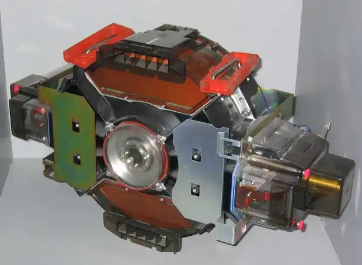

1980 年，IBM 向世界展示了人类历史上第一款突破 GB 级容量的商用硬盘——**IBM 3380**。它的容量达到了 2.52 GB，是第一款以 GB 为单位来标注存储空间的设备。

2.52 GB。今天这个数字大概只够你手机系统打个补丁。但在 1980 年，这台设备是一个工业巨兽：它的大小相当于一台双开门冰箱，重量约 250 公斤，售价 4 万美元。

你没有看错。250 公斤。现在的你如果把一台 1 TB 的移动硬盘搁在桌上，它大概重 150 克。而四十年前，存取区区 2.5 个 GB 的数据，你需要腾出半间屋子，还得确保地板不会被压塌。IBM 3380 的重量超过 500 磅，根本不是为任何个人用户设计的，它属于大型机机房，属于银行、航空公司和政府机构的数据中心。月租金折合成今天的币值，够你在硅谷租一套不错的公寓。

从一吨重的 5 MB（还记得上一篇的 RAMAC 吗？），到冰箱那么大的 2.5 GB，硬盘的“减肥史”在 1980 年才刚刚拉开序幕。而真正让 GB 走进普通人生活的，不是 IBM 这种天价机柜，而是另一场发生在 1980 年代末到 1990 年代的微型化革命。

## 二、3.5 英寸的逆袭：当 GB 爬上你的桌面

1980 年，就在 IBM 3380 震撼登场的同时，一家小公司悄悄地播下了一颗种子。这家公司的名字叫 Shugart Technology——是的，就是 Alan Shugart，上两篇我们反复提到的那个“软盘之父”。不过你大概率没听过这个名字，因为它很快就改了一个更响亮的名字：**Seagate**（希捷）。

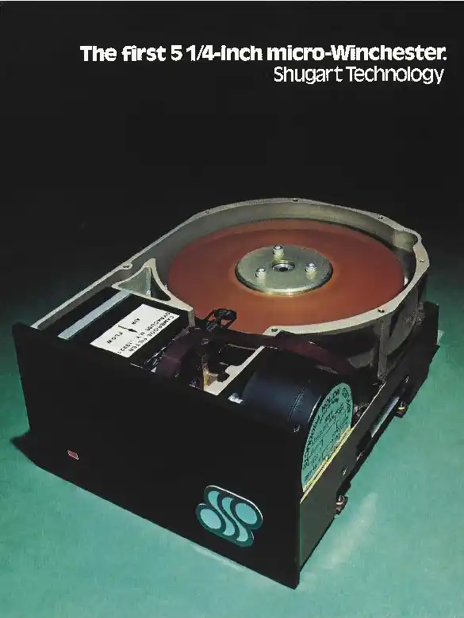

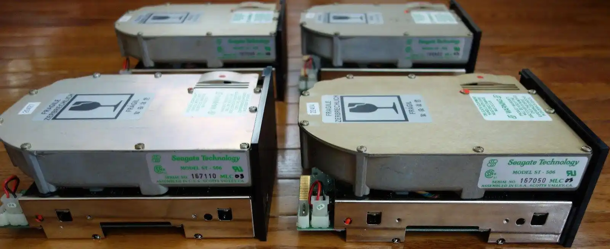

同一年，希捷推出了 **ST-506**，这是人类第一款 5.25 英寸硬盘。容量是多少？5 MB。对，只有 5 MB，连半首 MP3 都塞不下。但它的意义不在于容量，而在于尺寸——它第一次证明了，硬盘可以被塞进个人电脑的机箱里，而不是独享一间空调机房。

接下来十年，硬盘经历了一场疯狂的“缩水”竞赛。从 5.25 英寸缩小到 3.5 英寸，再缩小到 2.5 英寸。到 1990 年代末，一块 3.5 英寸的桌面硬盘已经能装下 10 到 20 GB 的数据。这个容量意味着什么？意味着你可以把整台电脑的操作系统、办公软件、几十款游戏、上百张 CD 抓下来的 MP3 全部塞进一块巴掌大的铁盒子里。

1998 年，你买一台新电脑，配置单上会赫然写着“硬盘：4.3 GB”——这是个能让你在同学面前走路带风的数字。也是在这一年，CD-ROM 驱动器成为了新电脑的标配。一张标准 CD-R 能刻 700 MB 的数据，而一张 DVD 则能装下 4.7 GB——恰好和一个入门级硬盘的容量不相上下。你会第一次发现，原来硬盘里装的东西可以刻满六张 CD-R，而你甚至没耐心刻完第一张。

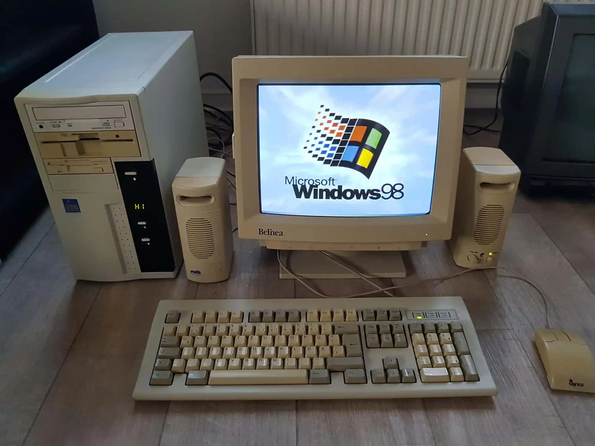

从那以后，光盘与硬盘携手统治了 GB 时代的“分发”与“存储”两大场景——光盘负责把软件和电影喂进电脑，硬盘负责把它们吃下来、记住、随时调出来。而一个原本毫不起眼的小配件，即将在 GB 的底座上完成人类计算机体验的一次巨大跃迁。它是一台 MP3 播放器。

## 三、“一千首歌，装进你的口袋”

2001 年 10 月 23 日，史蒂夫·乔布斯站在苹果公司总部一个小型发布会的舞台上，从牛仔裤口袋里掏出了一个东西。

在此之前的 MP3 播放器，要么体积巨大，要么容量可怜——32 MB、64 MB，勉强装得下十几首歌。当同行们还在用 MB 数歌的时候，乔布斯直接把单位换成了 GB。第一代 iPod 的容量是 **5 GB**，售价 399 美元。

5 GB 有多大？乔布斯用一句后来被刻进营销史教科书的话回答了这个问题：**“把一千首歌装进你的口袋。”** （"1000 songs in your pocket."）

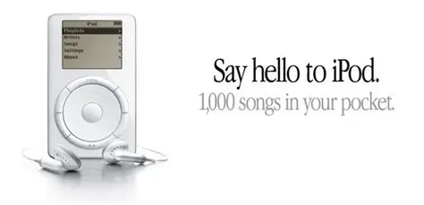

这句话的精妙之处在于，它完全没有提什么 gigabyte、什么 megabyte、什么二进制十进制——它只告诉你一件事：从今往后，你不再需要随身带一摞 CD。你所有的音乐，都在这个比你手掌还小的白盒子里。

但一千首歌只是开始。2007 年 9 月，苹果发布了第六代 iPod——**iPod classic**，容量直接拉到 160 GB。160 GB。这意味着四万首歌，或者两百小时的视频。

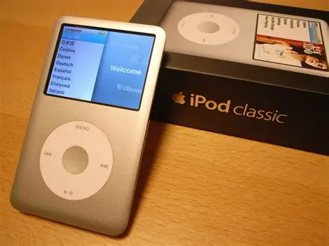

从 5 GB 到 160 GB，iPod 用了六年时间，把 GB 这个原本属于机房和服务器机柜的专业单位，硬生生地揉进了每一个普通人的口袋里。你不需要知道 1 GB 等于 1024 MB，你只需要知道“我的 iPod 还有 3 个 G 没用完”。从乔布斯掏出那个白色小盒子的下午开始，GB 的语言成为了大众度量衡的基准——它变成了一种数字化的亲切感，不再冰冷，不再只属于技术人员的行话。

但就在 iPod 一路高歌猛进的时候，硬盘世界正在酝酿两个截然不同的故事。一个关于信任的崩塌，另一个关于速度的颠覆。

## 四、希捷“固件门”：当一个 TB 近在咫尺时，信任先崩了

2008 年，硬盘产业迎来了一个里程碑式的时刻：希捷发布了酷鱼 Barracuda 7200.11 系列的 1.5 TB 版本。这是世界上第一块 1.5 TB 容量的台式机硬盘，是 GB 尺度不断膨胀后迈出的标志性一步。

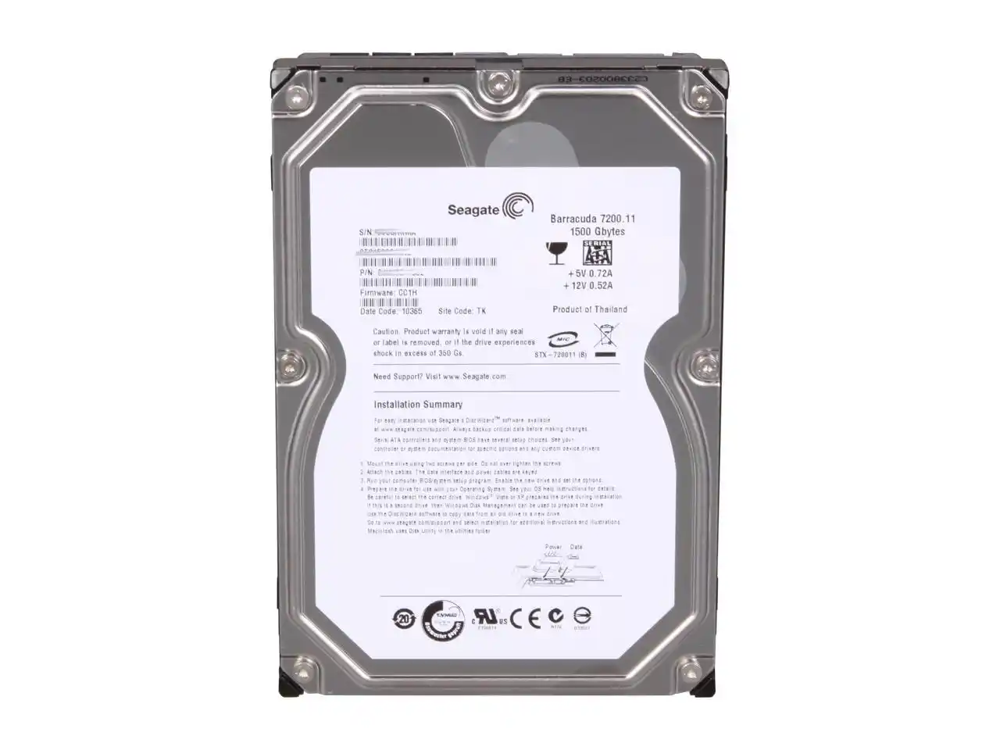

然而就在用户们兴冲冲地把数据往这块“海量”硬盘里搬的时候，诡异的事情发生了。硬盘会随机出现“卡死”现象——在 Linux、Mac OS X 和 Windows Vista 下都有可能发作，电脑突然就认不出这块盘了。

这就是后来震惊整个 PC 圈的**希捷“固件门”事件**。受影响的远不止 1.5 TB 那一个型号，从 160 GB 到 1.5 TB 共 30 多款产品全被卷入其中，包括 Barracuda 7200.11、Barracuda ES.2 SATA 乃至迈拓 DiamondMax 22 系列。希捷最终不得不发布固件更新来修复问题，但那几个月里，数以万计的用户对着硬盘里拿不出来的数据，第一次对“海量存储”这四个字产生了一种混杂着不安的复杂感情。

固件门是 GB 时代一个意味深长的注脚。它提醒了所有人一件事：当存储空间大到可以装下你半辈子照片和全部工作文档的时候，“可靠性”就不再是一个技术参数，而是一个情感问题。硬盘不再是那个被供奉在恒温机房里、有专人伺候的神龛，它已经变成了你桌子下面那个嗡嗡作响的铁盒子——你信任它，就像信任你家楼下的银行保险柜。而当这个保险柜突然告诉你“钥匙打不开了”的时候，那种恐慌是 5 MB 时代的人永远无法体会的。

## 五、GB 时代的遗产：那些靠 GB 活着的东西

让我们从事故现场移开目光，看看 GB 量级诞生的地方。在那个时代，GB 除了在硬盘和播放器里膨胀，还在几个更贴近桌面的位置上各自插下一面旗帜。这三面旗帜至今还飘在你的电脑里。

**第一面旗，叫操作系统。**

Windows 95 需要 30 到 40 MB 的安装空间，Windows 98 也不过 195 MB。到了 Windows XP，安装大小膨胀到约 1.5 GB。再到 Windows 10 和 11，轻轻松松 20 到 30 GB。操作系统越大，能做的事越多——图形界面、网络协议栈、驱动库、安全模块——每一层功能都是用 GB 堆出来的。你觉得电脑“变慢了”，往往不是因为 CPU 不行了，而是因为新系统的“身躯”已经胖到能压塌老硬盘的脊梁。

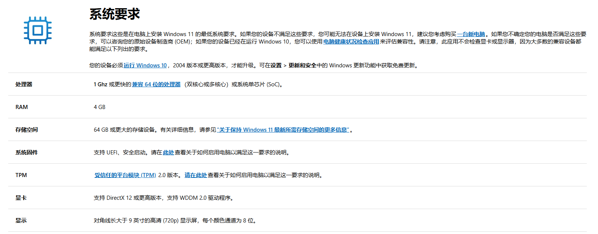

**第二面旗，叫游戏。**

1990 年代初，一张 3.5 英寸软盘能装下一个完整的游戏。到了 1990 年代末，一张 CD-ROM（700 MB）成了游戏的标准载体。而进入 2000 年代，DVD 单面单层 4.7 GB 成了新标配。游戏从几十 MB 膨胀到几个 GB，再到几十 GB——今天你玩的《使命召唤》或《原神》，动辄 100 GB 起步。GB 的膨胀，在游戏产业里表现得比任何地方都更加凶猛和不可逆转。

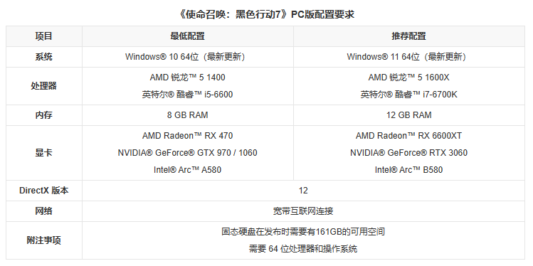

**第三面旗，叫照片和视频。**

1990 年代中后期，一台家用数码相机的照片大小大约是几百 KB 到 1 MB 左右。今天，你的手机主摄随手一按，一张照片 5 到 15 MB，一段 4K 视频每分钟吞掉 400 MB。你手机里的 128 GB 或 256 GB 存储，在 2000 年是一整排服务器机柜才堆得出来的容量，而今天它刚刚够你存半年不删的照片和微信聊天记录。

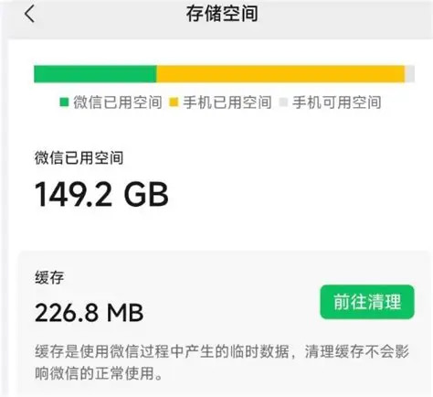

## 六、GB 的告别：当硬盘不再是硬盘

GB 时代真正的终结者，不是更大的容量，而是一种完全不同的技术。

当第一代 iPod 还在用 1.8 英寸的微型硬盘时，一个安静的对手已经在实验室里酝酿。它没有旋转的盘片，没有机械臂，没有嗡嗡声——它叫 **闪存**。从 2005 年的 iPod nano 开始，苹果把闪存塞进了播放器。几年之后，基于闪存的 **SSD（固态硬盘）** 开始蚕食传统机械硬盘的市场。SSD 没有机械部件，读写速度比机械硬盘快几十倍，而且体积可以做到指甲盖大小。

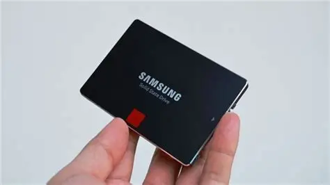

在 2010 年之后，一块 M.2 规格的 SSD，长度不过一根手指，容量轻松达到 1 TB——相当于 500 台 IBM 3380 合在一起，塞进一块口香糖大小的电路板上。GB 在这一轮技术更迭中，变成了一个不再值得单独拿出来说的、默认标配式的数字。

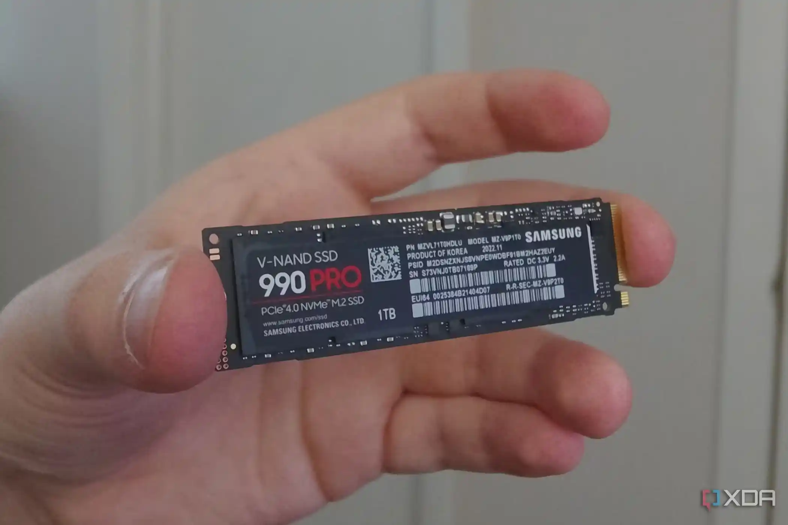

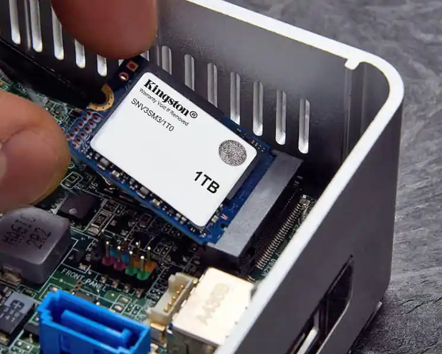

但这恰恰是 GB 最伟大的成就。当一个单位变得不再令人惊奇的时候，它才真正征服了世界。我们在 KB 篇和 MB 篇中反复讲述的那种“每往上跳一级都必须重新认识计算机能力”的震撼体验，在 GB 这里画上了一个阶段性的休止符。

## 七、1 GB 能装下什么？

在进入下一个量级之前，让我们最后来一次换算。1 GB 是一个能让人第一次感受到“丰富”的单位——它不再是“只能装一首歌”或“只能存一张表”，而是忽然间可以把生活里一整个完整的场景打包装进数字容器里的“宽裕感”。

1 GB 大约等于：

- **约 250 首 MP3 歌曲**——以每首 4 分钟、128 kbps 码率计算，差不多是你通勤路上听一个月的量。
- **约 200 到 500 张数码照片**（取决于像素和压缩率）——一次短途旅行的全部回忆。
- **约 1 小时的标准画质视频**——或者半部压缩过的电影。
- **一部《战争与和平》的纯文本，可以装下一千多遍。**
- **一整张 CD-ROM 容量的约 1.4 倍**。

但在 1980 年，要装下这些，你需要一台叉车和 4 万美元。

今天的你，手机里至少有 128 个这样的单位。你把四十年前能压垮地板的存储能力揣在牛仔裤口袋里，毫无感觉，甚至每天都在抱怨不够用。

然而，就在你觉得“GB 已经大到令人生厌却又在日常中微不足道”的时候，信息尺度的车轮已经转到了下一个台阶。在那个台阶上，1 GB 不过是计量大海的第一瓢水——接下来，我们将进入一个硬盘不仅比冰箱大，而且大到不得不动用一整套全新的思维来理解它有多大的领域。

下一个单位：**1 TB**。如果你以为自己已经对数字麻木了，那么你最好系紧安全带——因为从 TB 开始，你过去每一篇积累下来的所有容量直觉，都将被重新格式化。
