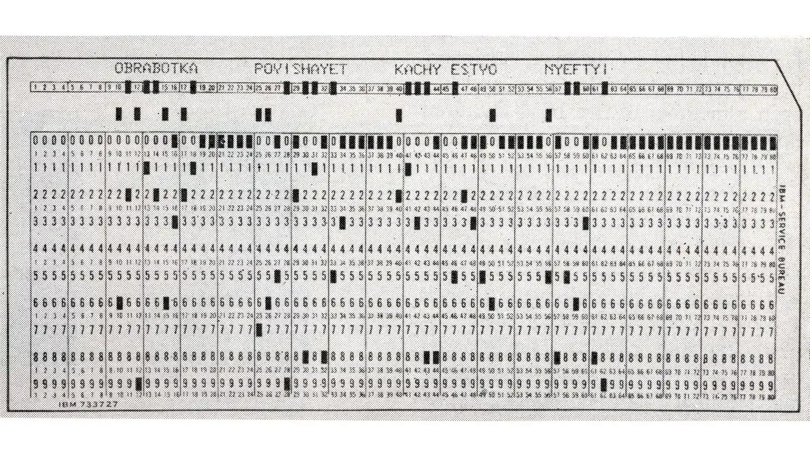
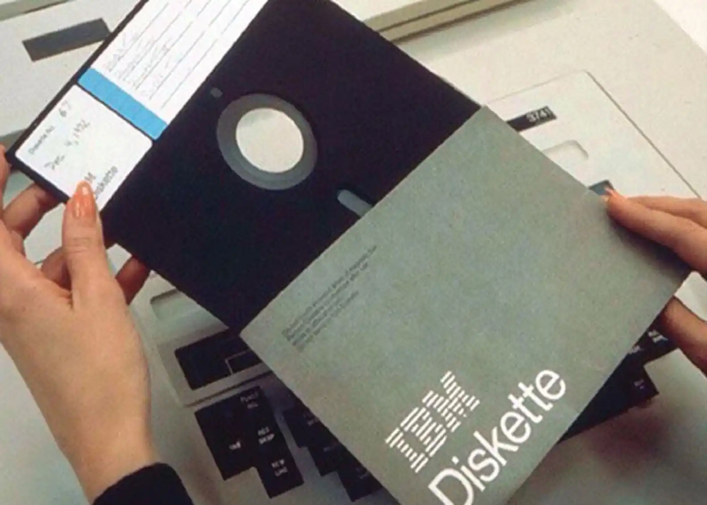
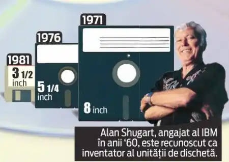
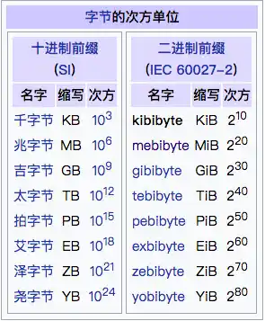
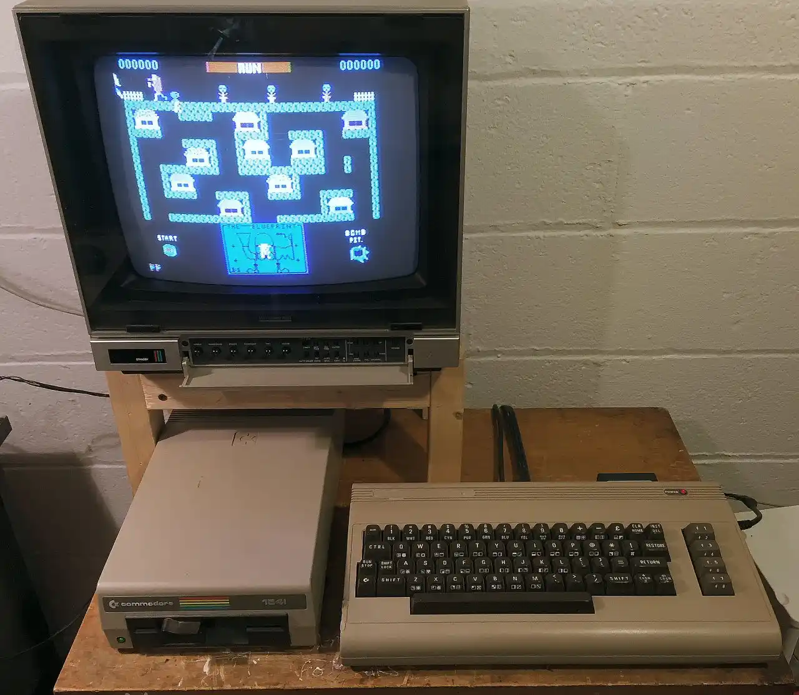

假设你现在穿越回 1970 年，坐在一台电传打字机前，准备把你写的程序输入计算机。你不是在敲键盘——你手里捏着 13 张打孔卡，每一张有 80 列，每一列打好孔就是一个字符。你要敲完一整屏代码，得打出小一摞卡，抱着它们走到机器前，一张一张喂进去。

而这一整摞卡片加起来，差不多刚好是今天的主角——1 **KiloByte**，译作 1 **千字节**。

你大概又在心里默念了：1 KB = 1024 Bytes。没错，每个用过电脑的人都见过这个数字——下载一张旧式低清表情包差不多就是这个尺寸，80 年代一张软盘的容量也得从这个单位开始算。

但你有没有想过一个问题：为什么是 1024？为什么不是整整齐齐的 1000？

这个问题的答案，牵扯出一桩计算机世界最持久的"度量衡丑闻"——一个连硬盘厂商和操作系统至今都在互相甩锅的罗生门。

---

## 一、不是 1000，是 1024

人类喜欢 10 的倍数。我们有十个手指头，十进制是我们刻进基因里的直觉。一千米、一公斤、一毫升，全世界都没异议。

但计算机不一样。计算机没有手指头，它只有铜线和晶体管——要么通电，要么断电，1 或者 0。对计算机来说，最自然的计数方式是以 2 的幂次来工作的：2、4、8、16、32、64、128、256、512……

到了 512 之后，下一个 2 的幂次是 1024。这个数字刚好和人类的 1000 非常接近——早期那些写代码的工程师低头一看，2^10 = 1024，差不多就是一千嘛。于是他们把希腊语里表示"一千"的词根 _kilo-_ 借过来按在了 1024 头上，还互相递了个眼神："差那么 24 个字节，无伤大雅。"

就这样，1 KB 还没出生，就欠了 24 个字节的"糊涂债"。

要说这个糊涂债是怎么来的，得回到计算机最底层的硬逻辑。因为计算机用二进制编址，每根地址线可以表达 0 或 1——两根线能寻址 4 个位置，三根线能寻址 8 个，以此类推。当工程师设计内存系统时，他们需要地址总线的数量一定是整数。最优解就是用 10 根地址线——恰好能寻址 1024 个位置。你没法用 9.97 根地址线去寻址正好 1000 个位置，物理定律不跟你谈凑整。

所以在硬件层面，1024 不是计算出来的，是"长出来"的——它是被内存地址总线的物理架构天然锁定的数字。每个字节需要一个唯一的地址才能被精准读写，而地址线的数量决定了寻址范围——这是镌刻在芯片骨子里的物理规律。

但也就因为这额外附送的 24，为后来的一切争吵埋下了引信。

---

## 二、打孔卡、软盘与传说中的"过飞机安检"

既然已经有了 KB 这个单位，让我们看看在它诞生之初，一张软盘和一叠打孔卡之间发生过怎样的世代交替。

早期的数据存储手段，凡是经历过那个年代的人都知道，长这样：打孔卡。一张标准的 IBM 打孔卡，有 80 列，每列 12 个可能的孔位——也就是说，一张卡最多能存 960 位数据，换算过来就是 120 个字节。

120 个字节。存不下一行稍长的代码注释。

那要存够 1 KB（也就是 1024 字节），需要多少张打孔卡？一千多字节，听起来好像不多，但一算就让人头皮发麻：标准 IBM 打孔卡有 80 列，按每列存一个字符来算，一张卡只能存 80 个字节。填满 1 KB 需要整整 13 张卡——你辛辛苦苦敲完一屏代码，得打出一小摞卡片才能带走。

13 张只是起步价。正是在这种"打孔卡之痛"的背景下，1971 年，IBM 亮出了第一张 8 英寸软盘。它的设计初衷朴实到令人心酸：只是为了给 IBM System/370 大型机当启动盘用，省得系统管理员每次都费劲地手动加载微码。它只有只读功能，容量——80 KB。按一张打孔卡在日常使用中平均能装下的有效数据来算，这一张巴掌大的塑料片子，能顶得上将近 **3000 张打孔卡**。

三千张。你把这三千张卡摞在地上，得用一整张办公桌才铺得下。但在一张巴掌大的塑料片面前，它们全被装进了历史的回收站。80 KB，这串数字在当时看来是一种降维打击。

最妙的是，IBM 对这款产品真正的历史地位几乎毫无察觉。他们只是在解决一个大型机运维上的小痛处，根本没想过这东西会变成未来三十年整个个人电脑产业标配的数据交换媒介。这就好比那个在喝下午茶时顺手开启了工业革命的工人——自己全然不知自己到底干了件什么事。一个为了少搬几趟打孔卡而发明的小玩意儿，最终掀翻了整个打孔卡帝国，这大概就是技术史上最优雅的一种"顺便"。

而初代软盘之父，**Alan Shugart**，后来离开 IBM，加盟了 Memorex。在那里，他的团队于 1972 年推出了可读写的 8 英寸软盘——容量一下提到了 **175 KB**。后来 Shugart 又自己创办了公司，把软盘的规格一路缩小到 5.25 英寸，成为早期家用电脑的主力驱动器。直到他再次跳出来创立 Seagate，去做了硬盘——不过这些已经属于 MB 乃至 GB 的领域了。

---

## 三、K 和 k，大小写之争——混乱从这一刻开始

这场混乱最为人熟知的战场是：你买了标称 1 TB 的硬盘，回家插上电脑一看，只有 931 GB。硬盘厂商说我们的 1 TB 是 1000^4 字节，操作系统说我们的 1 TB 是 1024^4 字节。两边谁都没说错，两边也谁都不愿让步。

但这个问题的根源，比硬盘大战要早得多。

早到什么时候？在打孔卡还当道的 1970 年代，当不同公司的计算机用着不同字长、通信全靠纸带和磁带的时候，工程师群体中就逐渐分裂出两条路线。一批人觉得 kilo 就该老老实实按国际单位制来，1000 就是 1000。另一批人认为既然写代码的时候 2 的幂次是默认值，那 1024 才是程序员眼中的"kilo"。

这听起来只是技术细节的差异，但在实际工作中可以引发灾难性的后果。最具警示性的案例发生在 1999 年——美国宇航局的"火星气候轨道器"在即将进入火星轨道时突然失联，事后调查发现，这颗造价 1.25 亿美元的探测器竟然毁于一个单位换算错误：洛克希德·马丁公司设计的飞行软件使用英制单位"磅力"来计算推进器推力，而 NASA 喷气推进实验室的导航团队则默认所有输入数据都以公制单位"牛顿"为准。一个以为对方给的是磅，一个默认对方给的是牛顿，两个系统之间的推力数据就这样在同一个数字标签下发生了 4.45 倍的偏差。整个飞行过程中，这种微小但持续的"单位分歧"不断累积，最终使探测器以比预定轨道低了足足 170 公里的高度一头扎进火星大气层，焚毁解体。

同样的剧本，落在数据世界里就是磁盘分区错位、数据库索引塌方、存储配额全线崩盘。于是工程师们想了个临时的土办法：用小写 **k** 表示 1000，大写 **K** 表示 1024。kB 是按国际单位制的规矩来（1000 字节），KB 才是计算机世界的黑话（1024 字节）。这个约定在当年那个"写程序的人彼此都认识"的小圈子里，行得通——大家都心照不宣。

但问题是，个人电脑时代来了。

从 1980 年代开始，计算机不再是少数技术精英的玩具，数以百万计的普通人涌入这个圈子。他们不懂"程序员之间心照不宣的约定"，他们只知道一公斤是一千克，一公里是一千米。硬盘厂商嗅到了商机：如果把 KB 按 1000 来算，包装盒上的数字就能写得更大——消费者总觉得数字越大越划算。内存厂商则继续坚守 1024 的路线——因为内存芯片的物理寻址本来就是以 2 的幂次来设计的。两边的分歧——硬盘厂商叫它 1000，内存厂商叫它 1024，而那时还没有任何国际组织愿意出面一锤定音。

混乱就此失控。

这件事最讽刺的地方在于：**1024 不是某个权威拍板定的标准，它是一个"大家都这么用了所以就这么用了"的行业惯性。** 没有哪个牛人写过一篇划时代的论文来规定它，也没有哪次会议投过票。它就是早期几个写汇编的程序员贪图方便，把一个 2 的幂次随手叫成了 kilo。等后来的人想纠正的时候，发现已经纠正不动了。

这大概是计算机史上规模最大的一个"不小心说漏嘴"。

---

## 四、1998 年，IEC 终于看不下去了

这场混乱持续了几十年。

整个 1980 和 1990 年代，消费者买硬盘被“缺斤少两”是常事，程序员写文档得在注释里解释“我用的 KB 是指 1024”，而教科书里两种写法并行。这期间最令人肃然起敬的一次努力，来自那位写出《计算机程序设计艺术》这部“计算机圣经”的巨擘 **Donald Knuth**。早在 1990 年代末，他就敏锐地察觉到了这个“度量衡”隐患，并提议把 1024 字节称为“大千字节”（large kilobyte），甚至编了缩写符号 **KKB**——大写的 K 加一个正常的 KB。

如果你觉得 KKB 看起来很眼熟，那是因为你肯定没在任何地方见过它。一个天才数学家的命名直觉撞上了一堵叫"用户习惯"的墙——全世界的程序员异口同声：太丑了，不用。这大概就是高德纳一生中唯一没能成功的命名提案。

到了 1998 年，国际电工委员会（IEC）终于拍案而起：受够了。

他们出台了一套全新的二进制前缀标准——在原有的 kilo、mega、giga 后面分别插入 bi（代表 binary），造出一组看上去像某种神秘咒语的词：**kibi-、mebi-、gibi-、tebi-**……

于是：

- 1 kilobyte (KB) = 1000 bytes（按国际单位制）
- 1 kibibyte (KiB) = 1024 bytes（按二进制，专门给计算机用）
- 1 megabyte (MB) = 1000² bytes
- 1 mebibyte (MiB) = 1024² bytes

逻辑完美，定义清晰，从此天下太平——

才怪。

这套名字推出来二十多年了，普通用户至今还在问"KiB 是什么鬼"。硬盘厂商继续用 1000 来标容量（因为这样数字好看），内存厂商继续用 1024（因为物理寻址天生就是这个数），而操作系统为了同时兼容两边，把两种体系都塞进了同一个下拉菜单，留用户一个人面对 KB/KiB 的排列组合原地迷路。

但你要是问一个硬件工程师：KiB 好不好？他会毫不犹豫告诉你——**好，非常好，太好了。** 因为直到今天，当你和他讨论内存颗粒规格的时候，每一个 KiB 都不容歧义，这是硬件的铁律，不是营销。

所以，当你下次看到电脑上硬盘容量"缩水"的时候，请想起这场始于 1970 年代、至今未分胜负的度量衡战争——你正在亲身见证计算机史上所存不多的法理死结之一。KB 和 KiB 之间的 24 字节鸿沟，是一条从晶体管物理层一直裂到人类认知层的断层线。只要计算机还在用二进制，只要硬盘还在用十进制包装盒，这条裂缝就不会愈合。

---

## 五、当 KB 成为身份证：Commodore 64 的故事

让我们把目光从标准之争转向一个更具体的故事——一家公司如何把"64 KB"这四个字直接焊在了品牌名字上。

1982 年 8 月，一家由奥斯维辛幸存者创办的公司 Commodore，发布了一款注定要写进史册的家用电脑。它的名字简单粗暴到不像一个商品，更像一张配置单：**Commodore 64**，名字里的 64 指的是它配备 **64 千字节（Kilobytes）** 的 RAM。售价 595 美元，远低于同时期的 Apple II 和 IBM PC。

你没看错，整台机器只有 64 KB 的内存。今天你右击一下微信缓存文件夹，看到的占用都比这大几千倍。

64 KB——今天它连一个微信表情包都不够装，却装下了一个时代几千万人的整个童年：金黄色的 Commodore BASIC 命令行、滚动着方块的横向射击游戏、用磁带加载程序时那长达好几分钟的刺耳滋滋声。1982 年到 1993 年间，超过 1700 万台 Commodore 64 被售出，成为史上最畅销的单款计算机之一。

这也是"Kilobyte"第一次从工程术语变成大众消费品上的铭牌——就像今天说"买台 1 TB 的手机"一样自然。回头再看，在这台机器诞生时，"KB"已经从那个差了 24 的"假千"摇身一变，成了家用电脑能用实感丈量的体验单位。它不再是一个只属于打孔卡和尚在战壕里撕扯标准的工程师们的暗语，它在客厅里插着电视、跑着游戏，第一次真正走进了千家万户的日常词汇。

---

## 六、KB 到底能装下什么？

让我们从历史故事里跳出来，回到这个单位本身。

1 KB = 1024 字节（如果你坚持二进制），或者 1000 字节（如果你卖硬盘）。不管是哪种口径，1 KB 到底能装什么？

- **约 1024 个英文字母**——相当于上面这句话的两倍长。
- **约 512 个常用中文字**（每个汉字通常占 2 到 3 个字节，在 GBK/GB2312 编码中是 2 字节/字，UTF-8 中则是 3 字节/字）——差不多就是你发一条微博的极限。
- **一条 DOS 命令行指令。**
- **16 世纪出版的金陵世德堂本《西游记》，全书约 86 万字**——以当时的双字节编码来算，用纯文本存储大概在一兆多不到两兆字节之间，也就是大约一千多 KB。换句话说，一部完整的、明清时期被刻印成几十卷的中国古典小说巅峰之作，用最朴素的双字节文本形式存进计算机，占据的空间还比不上今天你用手机随手拍的一张废片缩略图。

这种容量在今天的标准看来简直是个笑话。但在 1970 年代，已经是令人震撼的数字了。

不过，KB 真正的意义，不在于它能存下多少东西，而在于它确立了一个范式：**从 KB 开始，计算机存储不再是一个一个字节地数，而是一千一千地跳。** 你后面要见的 MB、GB、TB，本质上都在重复 KB 的故事——只不过每次乘以 1024，把规模再往上抬一个数量级，而抬着抬着，大家就会习惯性地把前一级单位蔑称为"那个根本不值一提的老古董"。

如果把信息尺度的递进比作盖一座通天塔，1 Byte 是奠基石——它定义了文字如何在机器里安身。而 1 Kilobyte，是第一级可以让人站上去望得远一点的台阶。它是第一个真正"有用"的存储单位：从它开始，计算机能做的事情不再是"Yes"或"No"、不再是一个"A"、不再是串行地读穿孔纸带上的一个个窟窿眼——而是同时对上千字节的数据进行寻址、计算和编程。真正的个人运算史，从这里出发。

至此，一个程序员终于能写出他的第一行稍有意义的代码了。

下一个单位：1 MB。当软盘的故事结束时，硬盘才刚刚登场。
