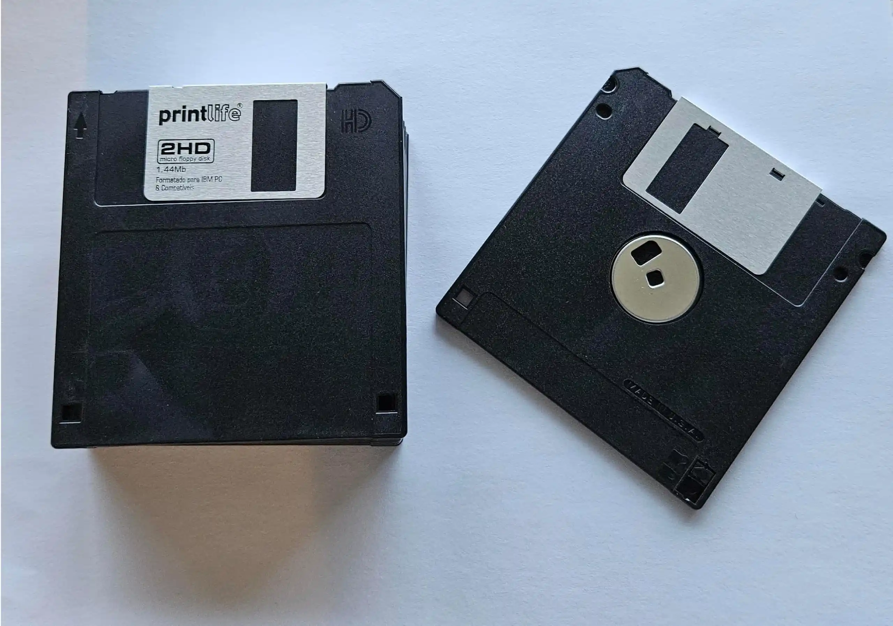
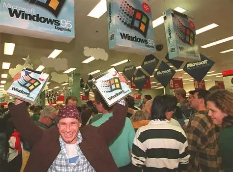
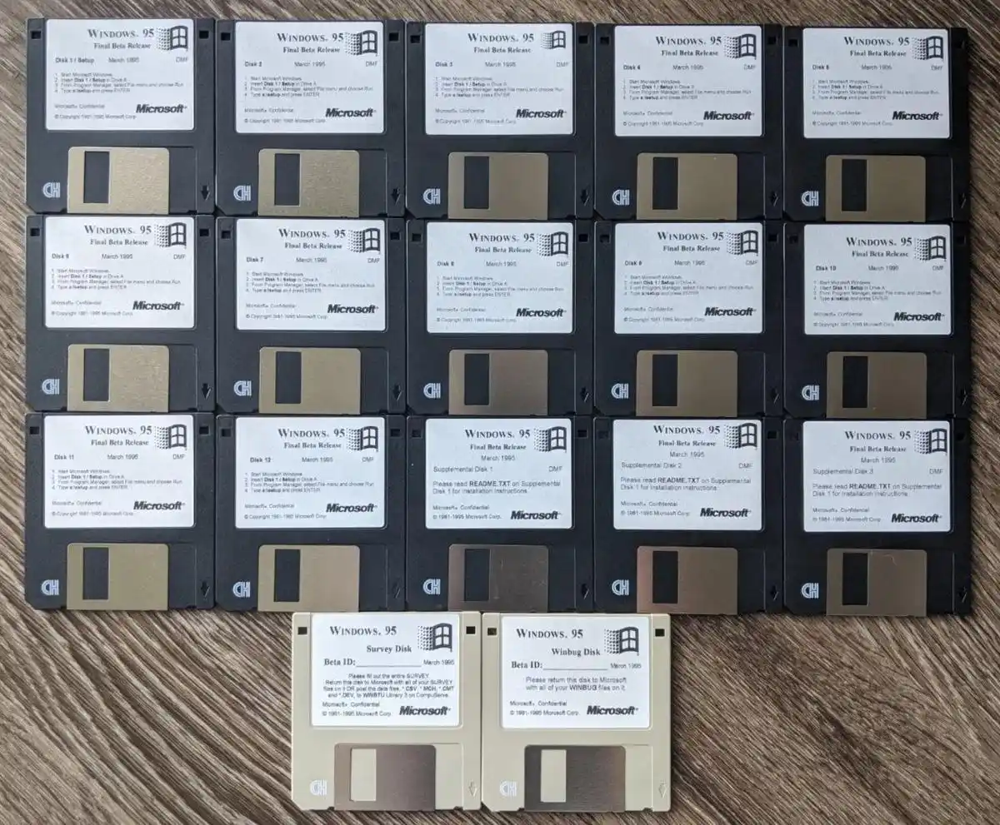
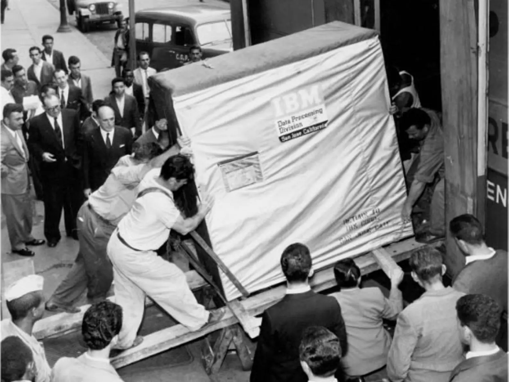
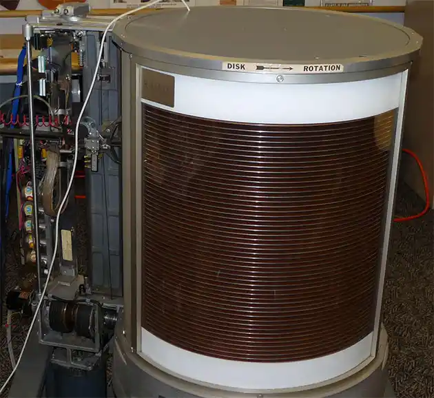
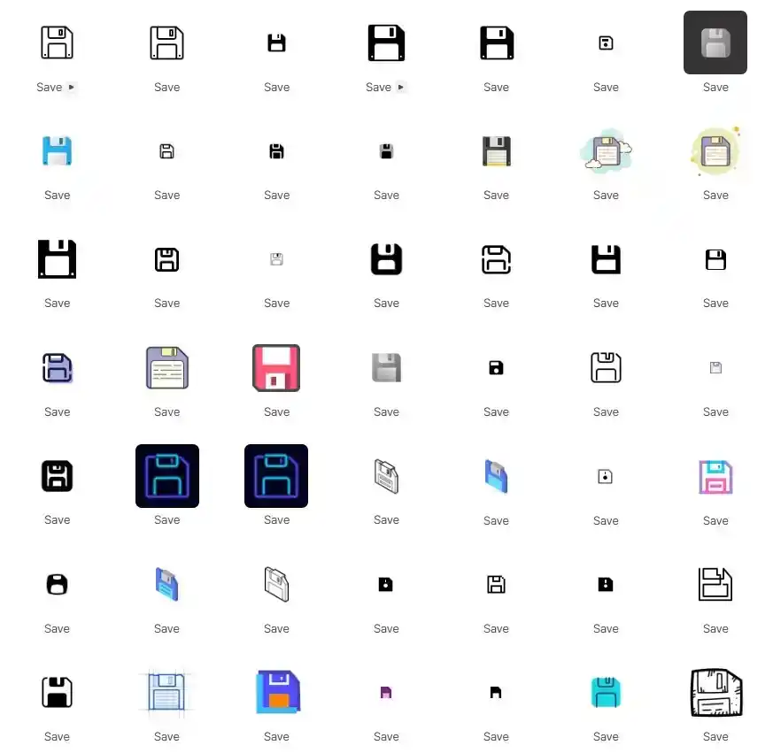

上一回我们聊到了 1 KB。13 张打孔卡摞起来的一小叠，刚好够存一小段程序。从那个起点出发，计算机开始在“一千个字节”的级别上初试啼声。

但 KB 终究是个小家子气的单位。你无法用它丈量一张彩色照片，无法用它装下一首 MP3，更无法用它跑一个图形操作系统。人类需要更大的箩筐——一个能在日常生活里触手可及的、能装住“一整件东西”的存储单位。

这个单位叫 **Megabyte**，中文 **兆字节**。

1 MB = 1024 KB = 1,048,576 字节。

一百万个字节。这个数字在今天是个人尽可欺的计量单位——你手机拍一张照片就得吃掉好几个 MB，你微信群里一个略长的短视频轻轻松松几十 MB。但在 1980 年代，“MB”是一个能让人心跳加速的词，它意味着你的计算机终于拥有了某种类似“大脑皮层”的东西——能装下整个操作系统、一整套办公软件，甚至还能塞进一个游戏。

而 MB 走进千家万户的载体，是一个你已经至少十五年没见过的物件：**3.5 英寸软盘。**

## 一、1.44 MB——那个被印在全世界软盘上的魔法数字

让我们先把时间拨回 1984 年。这一年，苹果发布了第一代 Macintosh，迈克尔·戴尔在宿舍里创办了 Dell，而计算机世界的一颗石子，其实在三年前就已经被扔下了。

1981 年，索尼推出了一种全新的存储介质——一块 3.5 英寸的塑料方片，里面夹着一张涂满磁性材料的圆形碟片。但真正让这颗石子激起涟漪的，是 1984 年。这一年，苹果决定在全新的 Macintosh 电脑上采用这种 3.5 英寸软盘。以特丽珑电视和随身听闻名于世的索尼负责制造，乔布斯拍板把它塞进了 Mac 的机身侧面。从这一刻起，3.5 英寸软盘开始走向全世界的桌面，它的容量标注得明明白白：**1.44 MB**。

今天来看，1.44 MB 大概连一首 MP3 都装不下，但当时这个容量已经大到令人窒息。一张 3.5 英寸软盘能干什么？它能装下整整一套 DOS 操作系统，配上完整的命令行工具，外带一个小游戏。一个学生拎着一张软盘去学校机房，插进去、开机——整台电脑就变成了他自己的私人设备。在没有网络、没有 U 盘、没有云存储的年代，一张软盘就是你的随身硬盘，你的电子邮件，你的网盘账号和你的数据生命线。

但这里面有一个经典的“度量衡笑话”，你大概率中过招。我问你：一张标准的 3.5 英寸软盘，容量到底是多少？

你肯定会脱口而出——**1.44 MB**。包装盒上就是这么印的，全世界都这么写。

答案是：严格来说，既不是 1.44 MB，也不是 1.44 MiB。它是一个诡异的混血儿。

索尼在设计软盘时采用了双重标准的奇怪组合：格式化后的容量是 1440 KiB，也就是 1440 × 1024 = 1,474,560 字节。但写包装盒的时候，他们把“1440 KiB”除以 1000 而不是 1024，于是得到了 1.44 MB 这个不伦不类的数字。它既不是正经的二进制兆（1 MiB = 1,048,576 字节，1.44 MB 已经超了），也不是严谨的十进制兆（1 MB = 1,000,000 字节，1.44 MB 说的又远不止这么多）。

一张小小的软盘，用 1.44 MB 这个看似精确实则荒诞的标签，把 KB 篇里我们花了大半章才讲清楚的那笔糊涂账全部浓缩在了自己身上。

## 二、当微软需要 7 张软盘：Windows 95 的分发炼狱

如果说软盘是 MB 时代的标志性载体，那么 1995 年 8 月 24 日的那个夜晚，就是 MB 时代最盛大的告别典礼——只是当时所有人都没意识到。

这天，微软发布了 Windows 95。发布会选在了华盛顿州雷德蒙德总部，现场搭起了巨大的帐篷，滚石乐队的《Start Me Up》被买来当广告曲，全球各地的电脑城门口排起了午夜长队。这是操作系统历史上第一次出现堪比摇滚演唱会级别的发布盛况。

但对于真正经历过那个年代的人来说，记忆里最刻骨铭心的不是发布会，而是那个沉甸甸的纸盒子。Windows 95 的完整安装大约需要 **40 MB** 空间。今天看来这连半分钟的微信小视频都算不上，但在 1995 年，普通人家根本没有宽带。你的选择只有两种：要么买一张安装光盘（前提是你得先有一台光驱，而光驱在 1995 年还不是标配），要么老老实实领回一摞软盘，逐个插入、读取、换盘、再插入——重复 13 到 21 遍。

标准版 Windows 95 分发在 **13 张** 3.5 英寸软盘上。

13 张。你小心翼翼地按编号排好，跪在机箱前一张一张往里喂。喂到第 5 张，系统提示“请插入第 6 张磁盘并按回车”。喂到第 8 张，风扇呼呼地转，你开始紧张。喂到第 12 张，读盘声突然刺耳——磁盘读取失败。安装中断，你必须从头再来。

这种体验在今天可以被归入某种酷刑艺术，但那个年代的人就是这么装操作系统的。最早几批从 OTA 系统更新切换到全量包刷机的安卓发烧友，大概能体会那种一半期待一半祷告的心情。世界上第一代真正的图形界面大众操作系统，就是从这些摞起来不到两厘米厚的软盘里，一张一张地爬进硬盘，然后展开成一场改变了整个个人电脑产业格局的图形革命。

## 三、一个来自 1990 年代的脑筋急转弯：1 MB 到底能干什么？

从软盘上抬起头来，让我们回到 1 MB 本身。不必纠缠它究竟是 1000² 还是 1024²，我们只问一个最朴素的问题：当计算机业界第一次拥有整整一百万字节的时候，他们拿它干了什么？

答案是：他们造出了一个至今仍在运行的存储装置，而且你一星期滑屏幕的次数，比它每个月的读写次数少好几个数量级。

这个装置，叫 **计算机硬盘**。

1956 年，IBM 发布了 RAMAC 305——人类历史上第一台搭载硬盘的计算机。它的硬盘单元是四个巨大的铁柜子，里面装着 50 片直径 24 英寸的铝制磁性盘片，摞起来足足有一台冰箱那么高，总重量超过一吨。全体盘片一起疯狂旋转，伸出机械臂在一块盘面上来回划动——整套系统的总容量是 **5 MB**。

5 MB。你手机现在拍半张高清照片，就把这堆一吨重的铁家伙的全部存稿给塞满了。就这 5 MB，需要一间专门的空调机房来伺候，月租金 3200 美元（按今天的币值折算大约三万美元）。请注意，是月租金——因为 IBM 根本不卖这个东西，只租不售。

这就是 MB 最初的物理形态：它不是一个你随用随取的便利工具，而是一座需要恒温空调和专业工程师供着的小型神龛。

但也是从 RAMAC 开始，人类第一次体会到随机存取的震撼。在此之前，所有的数据读取都是顺序的——磁带必须从头卷到尾，打孔卡必须一摞一摞喂进去。有了硬盘，磁头可以瞬间飞到盘面上的任意位置，直接读写任意一块数据。这看上去只是一个操作模式的改变，但实质上是人类操作信息方式的一次范式跃迁。今天我们默认“打开任何一个文件都能瞬间到达”——这个流畅的操作感，是 1956 年那组一吨重的铁柜子第一次向世界做出的承诺。

## 四、一张照片与“MB 体验”的诞生

如果说软盘让 MB 成为了分发单位，硬盘让 MB 成为了运行单位，那么真正让“MB”这个概念长进普通用户肉里的，是另一件东西：**数码照片**。

1980 年代末到 1990 年代初，JPEG 图像压缩标准成熟并普及。一张彩色照片经过 JPEG 压缩后，大小刚好落在几百 KB 到几个 MB 的区间。这就是“MB 体验”的诞生时刻——你第一次能在电脑屏幕上看到一张照片，属性栏里清清楚楚写着“1.2 MB”。那不是一串抽象的数字，它对应着你上次旅行时站在海边的那个笑容。1.44 MB 的软盘能装一张到两张这种照片，你的硬盘能装几百张这种照片。这种“数字对应实物”的直接映射，是 KB 时代从未有过的体验。

也是从这个时期开始，MB 完成了它在大众心理上的身份转换：它不再是一个冰冷的技术规格，而是一个可以触摸的生活计量单位。你知道一张照片是几个 MB，一首 MP3 是几个 MB，一段视频——那可就大了，那得几十个 MB，甚至几百个。但你隐约感到那扇通往 GB 的大门已经开始松动了。

## 五、MB 时代的告别

1 MB 的价值，并不只是多存一点字或者一帧模糊的画面。它是信息世界从小巧的“文本殖民地”迈向多媒体帝国的第一个登陆点。从 1 MB 开始，计算机学会了处理和存储图片、声音和动画——也就是从这一刻起，它不再是一台仅供工程师和打字员使用的运算机器，而是一台能存住你的面庞与歌谣的情感空间。

1 MB 也并非单独停留在软盘或硬盘的技术符号上。那个时期，**MP3**、**数码相机**、**个人硬盘**和**图形操作系统**，通通都围绕着“几 MB”这个量级发生化学反应，自然而然地撞开了 PC 走向家庭的大门。

在它之前的 KB，只能装下指令和字符。在它之后的 GB，将容下一个时代的电影、音乐和整个互联网的毛细血管。而 MB，是站在二者之间的那道门槛——当你把一张软盘插进驱动器，听着里面发出咔嗒一声轻响，然后看到屏幕上跳出 14 个安装步骤时，你已经活在这个门槛上了。

有趣的是，软盘早就死了，但它的墓碑却无处不在。直到今天，你打开 Word 写文档、点开 Photoshop 修图，甚至在你手机 App 里随手点一下——那个代表"保存"的图标，依然是一张 3.5 英寸软盘的形状。全世界每天有几亿人下意识地点击着一张二十年前就淘汰了的塑料片子，却几乎没有人意识到自己在向一个 MB 时代的遗物行注目礼。这大概是一个技术符号所能获得的最高待遇：它已经退役，但从未退场。

至于硬盘是怎样从一个一吨重的怪物瘦身成笔记本里的一片掌中薄铁，MP3 又是如何在几 MB 的压缩里杀死 CD 帝国的——那是我们下一篇要讲的故事。

下一个单位：1 GB。欢迎来到硬盘的殖民地。
