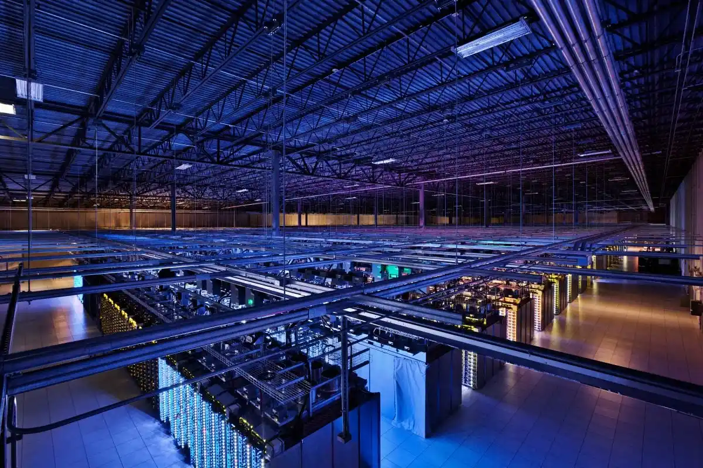
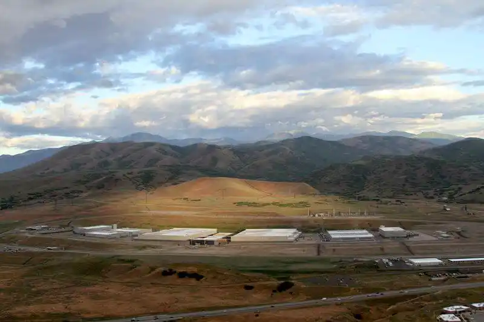
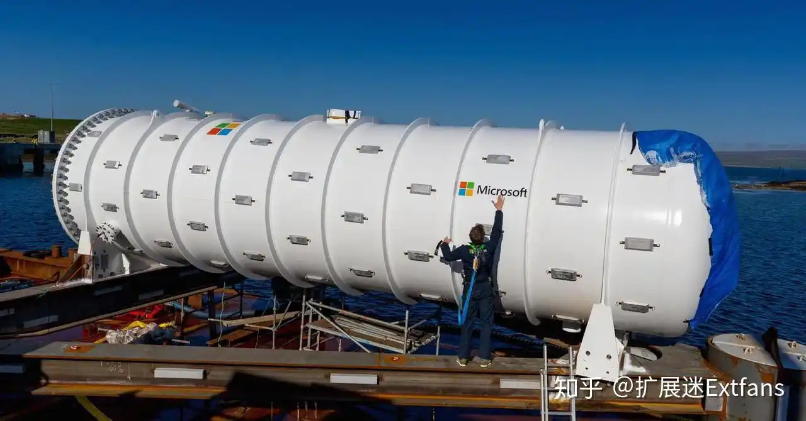
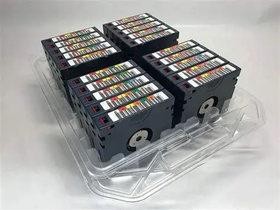
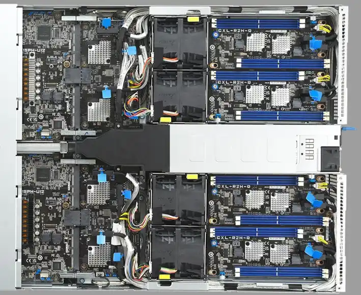

湿冷的空气，持续的低频嗡鸣，日光灯下永不停歇的灰色长廊。一排排机柜整齐列队，每一格都嵌满密密麻麻的硬盘，指示灯像无数只不眠的眼睛，在无人注视的角落里飞快明灭。闻起来，是金属、塑料、制冷剂和微量臭氧的混合：金属来自机壳，塑料来自线缆绝缘层，制冷剂从空调管路里逃逸出微不可查的一丝甜腻，臭氧是高压放电留下的隐晦签名。有些老旧的机房里还混杂着灰尘被电热烤过之后特有的焦腥味。

电子电路在长期通电后，会释放出一种极微量的溴化阻燃剂挥发物，常年累积在机柜的死角里，形成淡淡的化学涩味。只有偶尔更换滤网、擦拭热交换器翅片时，那种气味才会格外明显。这不是一间让人觉得舒服的屋子，这是一台超大型精密仪器的内脏。人类在这里是访客，真正的常住居民是数据。

在 TB 时代，数据还住在你桌子下面的铁盒子里，嗡嗡转动，温驯可触。但到了 PB 时代，数据搬进了这些灰色建筑，从此隐没于一片永不休眠的机架汪洋。在这里，存储不再是一块你能握在掌心的硬盘，而是一整个需要冷水机组、柴油发电机和消防气体灭火系统层层包裹的工业系统。

你上一次感觉到“我在保存数据”，大概还是把文件拖进某个文件夹的下午。而在数据中心里，数据从未停止过保存自己——每分每秒，冗余副本在不同的机架之间自动同步，损坏的块被静默修复，老化的硬盘在预测到故障前就被踢出阵列。这一切都不需要你动手，甚至不需要你知道。存储，从 PB 时代开始，变成了一种像呼吸一样自动运转的基础设施。

---

2012 年 6 月，美国犹他州荒漠深处，一座不起眼的灰色建筑悄然通电。它没有窗户，没有招牌，只有密密麻麻的空调外机在沙漠热浪中嗡嗡作响。开车路过的人可能会以为那是一座普通仓库，但这座“仓库”造价 15 亿美元，里面住着一个单位——**Petabyte**。

它的主人是美国国家安全局（NSA），也被称为 Bumblehive。这座犹他数据中心的设计容量至今被严格保密，但多方分析师估计它在 3 到 12 艾字节（Exabyte）之间。而它的第一阶段上线目标，业界普遍认为是 **1 PB**。_（注：NSA 从未正式公布设计容量，媒体估算范围差异极大，从若干 EB 一直到 yottabyte 级别，此处取 Forbes 基于泄露蓝图的保守估算）_

从这一刻起，人类对存储的理解彻底变了。在此之前，你用 TB 来衡量一块硬盘、一台笔记本、一个家庭的数字资产。但 PB 的出现，意味着存储不再是一个人、一个家庭的事——它是一个国家、一个平台、一整个互联网的事。

**Petabyte**，中文 **拍字节**，或者 **1 个 P**。

1 PB = 1024 TB = 1,048,576 GB = 1,125,899,906,842,624 字节。一千兆个字节。这个数字太大了——大到我已经没办法用“你手机里的歌曲数量”来打比方了。一千兆到底是多少？我们稍后会做换算。

但在此之前，让我们回答一个更迫切的问题：人类到底是先造出了 PB 级存储，还是先造出了 PB 级的数据——而这个问题，又反过来重新定义了我们整个数字文明的底层逻辑。

---

## 一、谷歌的“乐高机柜”：PB 是怎么被一块块拼出来的

1998 年，两个斯坦福大学的研究生——拉里·佩奇和谢尔盖·布林——在加州门洛帕克一间车库里创办了一家小公司。这家公司的使命是“整合全球信息”。它的名字叫 Google。

但实现“整合全球信息”的雄心里卡着一个现实到令人窒息的瓶颈：你要爬取全世界的网页，你要把它们的副本全部存下来，你还要在上面建索引——这需要多大的存储？

在 1998 年，一块企业级硬盘的容量不过几 GB，价格贵得让人牙酸。而 Google 是一家连租厂房的钱都紧张的初创公司。它买不起 EMC 和 IBM 的高端存储阵列，也请不起专业设备维护团队。于是 Google 的工程师们做了一个在整个 IT 史上都堪称“离经叛道”的决定：**自己造。**

他们从电脑城买来最便宜的消费级硬盘，塞进用廉价主板搭起来的服务器里，然后把这些五花八门、没有任何容错保障的机器塞进机柜。坏一个算一个，坏了就拔掉换新的，重要的是便宜——而且要多。

这就是 **Google File System（GFS）** 的诞生背景——一个运行在不可靠硬件上的高可靠分布式文件系统。而基于 GFS，Google 建立起世界上第一套真正意义上的 PB 级数据基础设施，并因此迈出了“自家服务器只买最便宜硬盘”的存储民主化第一步。

在早期，Google 的这些服务器长得一点都不像你想象中那种科幻感十足的数据中心。它们被装在开放的机架上，甚至会因为振动过大而导致全部读写性能大幅下降。为了解决这个问题，他们不得不给硬盘加装减震垫、调整机架排布。在同行眼中，Google 的机房更接近于一个被放大了一百倍的大学生宿舍——到处是乱糟糟的网线、随手拼装的硬件，但它确实跑起来了，而且跑得出奇地稳。

Google 大概是最早一批面对“PB 级存储焦虑”的公司。到了 2006 年左右，它的数据中心已经在 EB 级别上规划未来，但日常活跃管理的索引与数据，总是在 PB 的尺度上反复磨合。这种早早被 PB 级规模顶到的阵痛，让 Google 比大多数公司提前十年交了一份《PB 操行手册》。

---

## 二、犹他州那座没有窗户的建筑

让我们回到犹他州沙漠里那座灰色建筑。

NSA 犹他数据中心的选址绝非偶然。犹他州地广人稀，电费相对低廉，地质结构稳定，几乎没有地震风险。最关键的是——它能就近获取大量电力。据估算，这座数据中心满负荷运行时消耗约 65 兆瓦电力，足以供应一个数万人的小镇。

65 兆瓦是什么概念？其中相当一部分不是花在计算上，而是花在冷却上。数以万计硬盘昼夜旋转，CPU 和内存全速运转，产生的热量足以让整座建筑变成一个巨型烤箱——如果不加冷却，它会在几个小时内烧毁自己。这也是为什么你在这类数据中心附近总能听到那种持续不断的低频嗡鸣声——那是制冷系统在日以继夜地和物理定律搏斗。

不仅是 NSA，Google、Amazon、微软、Facebook……每一家科技巨头都在全球各地建造着这样的数据中心。在距离凤凰城约两个半小时车程的亚利桑那州梅萨市，灰白色的 Google 数据中心几乎嵌进了沙漠景观——门外挂着不起眼的监控标识，而里面正运行着一部分你明天会在搜索引擎里键入的世界的索引。Facebook 则在瑞典吕勒奥——北极圈边上一座常年低温的小镇——建起了一座数据中心，用北极圈的冷空气给服务器自然降温。微软把数据中心沉进了苏格兰海底，验证水下数据中心是否能靠海水降温、并减少对陆地空间的依赖。

这些巨型数据中心的共同点是：它们之间的主要互动不再是“人和机器”，而是“机器和机器”。你大概从未真正走进过一座 PB 级数据中心，但你每天发的每一条微信、搜的每一个关键词、拍的每一段短视频，最终都会在某个灰色建筑里占据几纳米的磁畴，从此成为一个不会腐烂的数字比特尸体。即使你死了，它大概还在。

---

## 三、PB 级别到底在“存”什么？

在 TB 时代，我们要用一块实体硬盘去装照片、装视频，存储对象是一个个具体的文件。在 PB 时代，文件名逐渐变得不重要了——数据被拆碎、被打散、被复制成三份丢进不同的机架，由调度系统统一管理。

这就是 **分布式文件系统** 和 **对象存储** 统治 PB 级数据的秘密：你不再直接操作文件，你操作的是一个抽象的“存储池”。

而存储在这个池子里的，是那些我们天天用却几乎从来看不到的东西：

**搜索引擎的索引。** Google 爬取全球数百亿个网页，并对每个网页建立正排和倒排索引。你以为你搜“天气”只需要查一个数据库——实际上每一次查询都会命中分布在上千台服务器上的索引碎片，在零点几秒内完成合并、排序、返回。支撑这一切的，是 PB 级的索引数据。

**社交平台的图片与视频。** Instagram 每天上传的照片超过数亿张，YouTube 每分钟上传的视频超过 500 小时。这些数据中绝大多数你永远看不到——它们被存在某个 PB 级的存储集群里，靠自动温度分层系统来管理。热数据放在 SSD 上供即时访问，温数据留在硬盘阵列里，冷数据被打包写入磁带库，几年无人访问就自动归档沉入离线深库。这就是 PB 时代独有的数据生老病死。

**云存储的快照与冗余。** 当你把文件存进云盘时，你以为只有一份副本吗？事实上，一个标准的商用云存储系统，会为你的数据自动维护 3 到 6 份冗余副本，分布在不同的机架、不同的楼层，甚至不同的城市。这一切自动运行、无人感知——但代价是，存储消耗被乘以 3 到 6 倍。一块 1 PB 的原始硬盘空间，实际可用可能只有 300 TB 出头。冗余吞噬了 PB，但也正是它为 PB 撑起了安全穹顶。

**科学计算的数据集。** 欧洲核子研究中心（CERN）的大型强子对撞机每年产生的数据超过 30 PB，全球射电望远镜项目（平方公里阵列，SKA）建成后每年会产生约 1000 PB 的数据——比当前整个互联网的日流量还要高。人类基因组测序成本从 2000 年代的数十亿美元降到现在的几百美元，单次测序原始数据在几百 GB 到 TB 之间，全球基因组数据集的规模已稳稳进入 PB 俱乐部。从最后一个冰河纪的遗存到遥远星系的脉冲信号，整个宇宙都可以被提取成几列数字塞进 PB。

---

## 四、PB 时代的“怪问题”：硬盘还没坏，但你永远读不到数据了

当你日常和几百个 TB 打交道时，只会关注两个指标：速度和容量。但当规模达到几百 PB 时，一个全新的、令人不安的问题出现了：**硬盘还没坏，但你装在里面的数据可能再也读不出来了。**

这不是技术故障，而是静默数据损坏在 PB 规模下的概率学惩罚。

这种现象在存储行业有一个听起来更科幻的名字：**比特衰变（Bit Rot）**。存储介质中的电荷会缓慢泄漏，磁畴的取向会逐渐漂移，导致写入时还是 1 的比特，在几年后悄无声息地变成了 0，而硬盘自身的错误校正码（ECC）甚至来不及报告这个错误。这在几百 GB 的硬盘上无关紧要；在几 PB 的系统里，它变成了不得不直面的问题。

更隐蔽的风险在于版本迁移。你今天把十万张照片存进某个云服务，二十年后，制造商可能已经更换了三四代硬盘接口标准，你再想把这些数据转存到新的设备上，还得找到一个能同时兼容老版本 API、旧文件系统元数据格式和当时授权协议的工具链。PB 尺度下的“长期保存”不是买更多硬盘，而是持续为格式与协议的更迭付费。

这也是为什么磁带——一个在消费市场消失已久的东西——至今仍然活跃在 PB 级冷存储的王座上。LTO 磁带的容量已达单卷 18 TB，稳定性可达三十年，不耗电、不怕振动，只需放进恒温恒湿的柜子里就比绝大多数机械硬盘更省心。冷数据归档的最佳伴侣（也是最朴素的选择），依然是 1980 年代那盘你放进录像机里会卷带的磁带的后代。CERN 把每年产生的 EB 级数据打包成离线磁带库运走；云厂商把可能再也不会有人调用的老备份按打捆塞进机器人磁带库。

---

## 五、1 PB 能装下什么？

在进入下一个量级之前，让我们来一次 1 PB 的换算。以下换算基本按二进制前缀（1 PB = 1024 TB）计算，小数点后取整：

1 PB 大约等于：

- **约 2.5 亿首 MP3 歌曲**（每首 4 MB）——如果连续播放，需要约 1,900 年。从东汉刘秀建立东汉开始播，播到今天晚上才播完。
- **约 3.4 亿张手机照片**（每张 3 MB）——如果你每天拍 100 张，够你拍九千三百年。一万年前人类刚开始驯化小麦的时候你拍了一张照片，今天还剩一半没拍完。
- **约 1,700 小时**的 4K 超高清视频（H.264，典型码率约 15 Mbps），约 500 小时的无压缩 4K 原始素材。如果你把一个人的一生——从出生到八十岁——全部用 1080p 视频不间断录下来，大概需要 3 到 5 PB。1 PB 大概是一个人的整个童年和青少年。
- **整个美国国会图书馆所有纸质藏书的纯文本数字化版本**的约 50 到 100 倍——1 PB 大概能装下人类有史以来出版过的所有书籍的纯文本内容，还可能剩下半箱子的地方。
- **谷歌搜索引擎原始网页库的一小部分。** 虽然谷歌不公开具体数字，但据 2008 年前后的一篇官方博文透露，谷歌处理的网页总量早已突破 1 万亿——即使只存索引，也远不止 1 PB 能装下的量级。

而在现实世界里，一台标准 1U 机架式服务器可以塞进 12 到 24 块企业级大容量硬盘。如果每块 20 TB，一台 1U 机器的容量便能轻松突破 200 TB，这意味着只要 5 台 1U 机器就能凑出一个 1 PB 的存储集群。五台机器，一只标准机柜都还没装满。把 2012 年 NSA 犹他数据中心最初上线的那 1 PB 平移到现在，大概只能在数据中心的一个角落占掉半个机架。

---

## 六、PB 的公共面孔：从电网到你的指尖

PB 虽然是一个数据中心级别的单位，但它并没有完全藏在地下。有两个你每天都在用、却从不觉得它和 PB 有关系的产品，它们的背后有着浓重的 PB 味道。

**第一件：你的 Gmail。** Gmail 在刚推出时给每个用户免费提供了 1 GB 空间，这在当时被看作一个不可理喻的慷慨。但 1 GB 背后，必须有一个敢接下“为用户兜底所有邮件”的存储架构，而这个架构从一开始就建立在 Google 的那个“从乐高机柜拼出来的”PB 级分布式文件系统之上。你邮箱里十年不删的邮件，正安安静静地躺在某个 PB 集群的第三份冗余副本里。

**第二件：生成式 AI。** 2022 年 ChatGPT 上线，背后的大型语言模型需要海量文本语料来训练。例如，Common Crawl 的一个 PB 级训练语料子集，就包含了数万亿 token 的训练数据。而模型训练本身产生的中间数据，也时常在几百 TB 到 PB 级别徘徊。你每次和 AI 聊天，背后是一整座 PB 级存储大库在为你的每一次会话默默供数。

PB 正在从后台走向前台。你可能不认识它，但你已经用身体在消费它。

---

## 七、PB 的告别：一座看不见的城市

1 PB 最值得记住的不是它有多大，而是它完成了一个存储单位最有价值的一次身份转变。从这个人造单位出现之后，“存储”在人类生活里的角色，就已经彻底地重新洗牌了。

PB 之后，数据不再以“文件”为单位，不再以“硬盘”为单位，甚至不再以“机房”为单位，而是一种建筑在地基以下的无形公用设施——就和自来水、医院、电网一样，平时你感受不到它的存在，只有断电那一下你才意识到：原来它是我每天的命运底座。

我们每个人都是 PB 时代的普通居民。你活在由无数个 PB 搭建的数字城市里，你看不见它——但你有朝一日如果突然搬到一座没有 PB 的世界里，你会窒息。

而在这座看不见的城市上面，信息尺度还在继续膨胀。在下一个单位面前，连“PB”这个刚刚还让人觉得大到窒息的量级，都将被压缩成一粒微不足道的沙子。

下一个单位：**1 EB**。在那里，1 PB 已经不再是数据中心的主角。它会变成一个你过去曾为之震撼、而转瞬就再也排不上号的历史小单位——就像前几个时代里我们不断告别过的那些老朋友一样。
