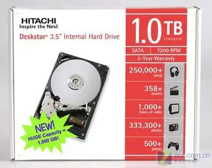
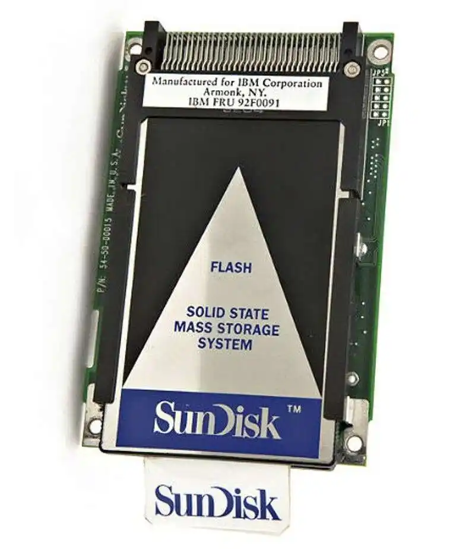

2007 年 1 月 5 日，一项纪录被打破了。日立环球存储（HGST）宣布了业界首款 1 TB 硬盘——Deskstar 7K1000。这是一块 3.5 英寸、7200 RPM 的硬盘，采用垂直磁记录技术，建议零售价 399 美元，折合每 GB 成本约 40 美分。HGST 同时发布了面向数字录像机市场的 CinemaStar 1 TB 版本，声称一块 TB 级硬盘可以轻松存储近 250 小时的高清节目。

从这一刻起，人类正式进入了 TB 时代——一个和 GB 时代截然不同的新纪元。如果说 GB 时代是在问“我能存多少”，那么 TB 时代要回答的问题是：“我存完以后，还能再存多少，才会开始觉得不够？”

**Terabyte**，中文 **太字节**，俗称 **1 个 T**。

1 TB = 1024 GB = 1,048,576 MB = 1,099,511,627,776 字节。一万亿个字节。这个数字今天已经爬满了全世界的电商页面——你买一台笔记本，配置单上写着 512 GB 或 1 TB 的 SSD；你装一块移动硬盘，包装盒印着 2 TB、4 TB 乃至 5 TB。TB 早已不是一个让人一惊一乍的单位，它已经变成了你日常掏钱购买的“默认套餐”。

但如果你把日历翻回 2007 年，你会发现：人类为了跨过 TB 这道门槛，用了整整五十年。从 1956 年 IBM RAMAC 的 5 MB 到 2007 年 Deskstar 的 1 TB，容量膨胀了约 200,000 倍。而接下来，从 1 TB 走到 20 TB，只用了不到十五年。如果计算机信息史是一部电影，TB 就是那段突然按下了四倍快进的疯狂蒙太奇。

---

## 一、1 TB 刚来的时候，我们根本填不满它

2007 年，1 TB 硬盘的出现给全世界带来了一个问题：**这么大，拿来干什么？**

不是开玩笑。在那个年代，绝大多数家庭的数字资产加起来可能还装不满一个 80 GB 的硬盘。MP3 码率普遍只有 128 kbps，一部电影压缩到 700 MB 刚好刻进一张 CD-R，照片刚从两三百万像素起步，一张 JPEG 不过几百 KB。你辛苦收集了好几年的数据，腾挪到新买的 1 TB 硬盘上，进度条一闪而过——只占了不到十分之一的空间。

这种感觉是历史性的：**人类第一次拥有了一个“花不完”的容量。** 在 KB 时代，你每存一个文件都要精打细算，多余的空格都得删掉。在 MB 时代，一张软盘刚好装下一两张照片，你需要一个文件柜来管理一摞盘片。在 GB 时代，一块硬盘能装下一个音乐库或者十几部电影，你开始觉得容量够用了。但到了 TB 时代，你发现自己根本不知道该如何填满它——这种感觉在计算机史上从未出现过。

当然，这种感觉并没有持续太久。没过几年，高清视频、大型游戏和手机拍照的像素军备竞赛联手把 TB 从“奢侈”变成了“刚需”。但那个短暂的“花不完”的窗口期，是 TB 时代送给全人类的一份独特礼物——它是一个短暂地超越了人类贪婪的存储单位，在人类物欲的大地上划开了一条只闪耀了几年的光带，便重新被数据洪流吞没了。

---

## 二、日立打响了第一枪，然后呢？

2007 年日立抢占 1 TB 先机之后，希捷很快在当年 6 月推出了自家的 1 TB 产品——Barracuda 7200.11，单碟容量 250 GB，4 碟封装。西数紧随其后，1 TB 硬盘迅速从新闻头条变成了电脑城里的常规商品。短短一年间，TB 从神话落地为标价签上的一个数字——这种急速的“商品化”，是此前任何一个存储量级都未曾经历过的速度。

然后，故事急转直下。

2008 年，希捷 Barracuda 7200.11 系列曝出了著名的“固件门”事件——我们在上一篇 GB 的故事里详细追溯过这场灾难。30 多款产品、数以万计的用户、硬盘里拿不出来的数据——这场危机之所以刻骨铭心，恰恰是因为它发生在 TB 门槛刚刚被跨越的时刻。当一块硬盘大到能装下你半辈子照片和全部工作文档的时候，它就不再是一个技术参数，而是一个装满人生的保险柜。保险柜突然打不开了——这种感觉，是人类在迈入 TB 时代的那一刻，付出的第一笔学费。

但希捷的翻车并没有阻止历史的脚步。比机械硬盘内部的厮杀更值得关注的，是另一个赛道上传来的蜂鸣声——它正在悄然改写 TB 时代的全部规则。

---

## 三、SSD 的逆袭：当 TB 不再需要旋转

在机械硬盘三巨头为 TB 王座打得头破血流的同时，一场静悄悄的革命正在另一个赛道上酝酿。

闪存技术的历史其实远比你想象的早。1988 年，英特尔正式推出商用闪存芯片。1989 年，世界上第一款固态硬盘诞生。但在接下来的近二十年里，SSD 一直是一个价格昂贵的边缘角色——容量小、价格高，仅供军用和工业场景。

真正的转折发生在 2008 年。这一年，英特尔发布了 X25-M 固态硬盘，以相对亲民的价格和远超机械硬盘的读写速度打开了消费级 SSD 的市场大门。此后几年，SSD 容量一路飙升，价格一路走低。2013 年，第一块 1 TB 消费级 SSD 上市，零售价约 500 美元——虽然还是比同等容量的机械硬盘贵不少，但 SSD 已经不再是一个只供发烧友氪金的奢侈品。同年，TLC NAND 闪存颗粒的普及进一步降低了制造成本。2014 年，NVMe 协议进入商用，让 SSD 的读写速度直接起飞——一块 NVMe SSD 的顺序读取轻松突破 3000 MB/s，而同时代最快的机械硬盘还在一两百 MB/s 上挣扎。

2015 年，M.2 接口的 SSD 开始普及。这个接口的硬盘有多小？大概相当于一块口香糖。1 TB 的容量，从 1980 年那台 250 公斤的双开门冰箱，变成了一块可以夹在两指之间的电路板。

SSD 对机械硬盘的降维打击是全方位的：它没有旋转的盘片，没有来回滑动的磁头臂，不怕震动，几乎不产生噪音，读写延迟以微秒计。唯一曾经吃亏的是容量和价格——而到了 2020 年代，这项优势也在迅速蒸发。今天，1 TB M.2 NVMe SSD 的价格已经跌到几百元人民币，成为了新装机器的绝对标配。机械硬盘被挤到了 NAS、监控和冷备份的小角落，在一片自己曾独霸过的领土上，沦为了更低成本的次要选项。

而站在那张口香糖大小的 M.2 SSD 面前，你再回头看 1980 年那张 IBM 3380 的照片——重 250 公斤，售价数万美元——大概会感到一阵时空错乱的眩晕。

---

## 四、1 TB 既大又小——一场关于“矛盾体”的奇妙自洽

1 TB 是一个矛盾的奇迹。它是历史上第一个让人同时觉得“太大了”和“太小了”的存储单位。

**它太大了。** 如果你不存视频、不玩游戏、不下电影，只用来码字办公，一块 1 TB 硬盘可以用到你退休。1 TB 大约能装下 17,000 小时的标准音质 MP3（按每首 4 分钟、128 kbps 计算），或者约 310,000 张高质量数码照片（以每张 3.5 MB 计算），或者约 500 小时的高清视频。如果你只存《战争与和平》这样的纯文本文档（全书约 3.2 MB），1 TB 能装下大约 320,000 部。全部读完，大概需要几百辈子。

**它又太小了。** 今天一款《使命召唤》轻松 200 GB，《原神》手机版 30 GB。你的手机拍 4K 视频，每分钟吞掉 400 MB——半小时就超过 10 GB。你手机里 1 TB 的存储，在半年前还让你觉得“这辈子用不完了”，现在突然就弹出了“存储空间不足”的提示。而 Windows 11 系统需要 64 GB 以上存储空间才能流畅运行，基础安装就会占掉约 30 GB——你甚至还没开始装软件、存文件，系统自己就已经吃掉了十分之一的容量储备。

这种“又大又小”的撕裂感，恰恰是 TB 最迷人的特质。它不是一个让你安稳停靠的港湾，而是一道分水岭。在这个分水岭的一侧，“存储”还是一个需要省着用的稀缺资源；在另一侧，“存储”变成了一个可以被随手挥霍的空气。你拍完照片再也不删了，你聊天记录再也不清了，你下载的电影看完也不删——因为“反正也就占那么一点”。这种心理模式的转变，正是在 TB 时代完成的。

而 TB 的另一重身份，是它把单位混淆的地雷重新埋到了操作系统和硬盘厂商的边界线上。1 TB 的硬盘买回来，Windows 上显示约 931 GB——那“蒸发”掉的 69 个 G 是硬盘厂商按十进制（1 TB = 1000^4 字节）标注容量，而操作系统坚持用二进制（1 TiB = 1024^4 字节）读取，双方永远谈不拢。这道裂缝我们之前在 KB 篇、MB 篇中反复提及，到了 TB 量级，裂口的绝对规模终于大到了能被肉眼直接感觉到，而且不再只属于发烧友之间的争吵——它成了所有消费品评价里绕不开的一句抱怨。

---

## 五、1 TB 能装下什么？

让我们停下来，给 1 TB 做一次体面的换算。

1 TB 大约等于：

- **约 17,000 小时的标准音质 MP3**——以每首 4 分钟、128 kbps 计算，可以连续播放约 700 天不停歇。
- **约 310,000 张高质量数码照片**（以每张 3.5 MB 计算）——如果你每天拍 100 张照片，1 TB 够你拍八年半。
- **约 500 小时的高清视频**（1080p，H.264 压缩）——或者约 150 小时的 4K 超高清视频。
- **约 1,000 部压缩后的电影**——你可以在黑屋子里连看 40 天不出门。
- **一整座图书馆的纯文本**——美国国会图书馆的纸质藏书如果用纯文本数字化，大约需要 10 到 20 TB。1 TB 大概是一栋小城市图书馆。

但更直观的对比是：你手机里那块 1 TB 的闪存芯片，相当于 5000 台 IBM RAMAC（1956 年，5 MB/台），或者 400 台 IBM 3380（1980 年，2.52 GB/台）。如果把它们全部搬进一间机房，光是电费和空调，就够你在北京三环内租半层写字楼。

而在 2026 年的今天，一台 1 TB 的 M.2 SSD 大概只要五百块钱，重量不到十克，插在主板上就像插一张口香糖大小的名片。你用指甲盖大小的东西，装下了人类五十年心血的跃迁。

---

## 六、TB 的告别：当它变成默认单位

2007 年，日立把第一块 1 TB 硬盘搬进市场的时候，全球科技媒体给了它显赫的头条。但在不到二十年的时间里，1 TB 从“天花板”变成了“起点”。

今天你买一台笔记本，基础配置大多已经来到 512 GB 或 1 TB。你在电商平台的存储产品筛选栏里，2 TB、4 TB 的移动硬盘一眼望不到头。你甚至不需要专门买一块硬盘来凑足 TB——你新手机的配置单上，1 TB 版本就在那儿挂着，贵不了多少钱。

当一个单位不再令人惊奇的时候，它才真正征服了世界。我们在 KB 篇、MB 篇、GB 篇中反复讲述的那种“每往上跳一级就必须重新认识计算机能力”的震撼体验，在 TB 这里悄然退潮了。TB 变成了一个默认的、温暖的、不再引起任何技术敬畏的舒适区。

但这恰恰是它的成就——它已经把“万亿字节”融进了人类日常生活的背景音里，变成了一种数字时代的基础生存资料。你是伴随着这种背景音长大的，却对它曾经高昂到不可一世的过去毫无所知。

而就在你觉得 1 TB 已经够大了的时候，信息尺度的车轮已经碾过了下一个刻度。在那个刻度上，你不再是一个人在管理存储——你的硬盘也不再需要你操心，因为数据早已溢出你的桌面，流向你看不见的地方。

下一个单位：**1 PB**。我们在机房里再见。
