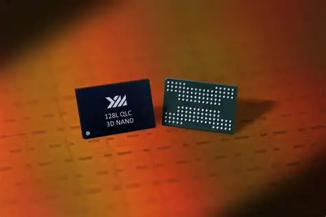
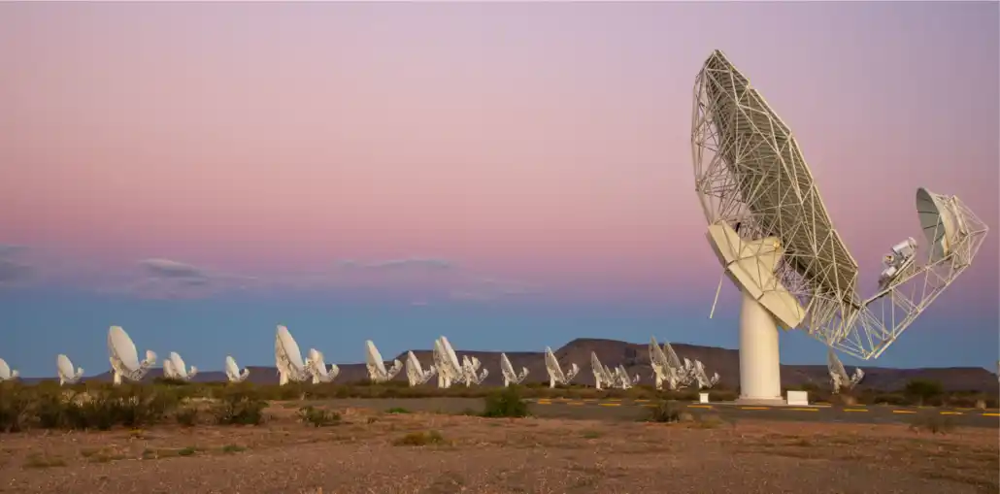

这篇故事的开场，需要你放下手机，找一张纸和一支笔。

在纸上画一个边长大约 40.9 厘米的正方形。如果你手边没有尺子，这个长度大概是从指尖到肘弯的距离——你小臂的长度。画好之后，盯着这个正方形看五秒。根据 NTT 在 2012 年前后的理论估算，如果以当时最先进的 9.5 纳米制程工艺制造闪存芯片，要存储 1 Yottabyte 的数据，大约需要 0.167 平方米的芯片面积——刚巧一张边长约 40.9 厘米的正方形。

当然，这个思想实验充满了理论的理想化。它假设完美的晶圆良率、零冗余副本、无压缩、无校验位开销，更没有考虑控制电路、封装、冷却系统和电源所占的体积。在现实中，由于 EC 纠删码产生的冗余副本以及整个存储系统多层校验、网络和供电带来的额外物理开销，存储 1 YB 的数据所需的总硅片面积很可能是这个数字的 2 到 3 倍。但这恰恰是它最奇妙的地方——在所有已知的存储单位里，**Yottabyte 是唯一一个还能被一张小小的正方形图纸绑住的尺度**。你用人类身体的一部分就能画下它的疆域，圈出整个信息宇宙最后的物理边界。

如果你回到我们这个系列的第一篇，回到 1948 年香农把"信息"定义为"消除不确定性"的那个下午——他大概永远不会想到，人类有一天会需要在自己的手臂两侧画一个微不足道的正方形，来丈量全文明跨过几百世纪积攒起来的数字记忆。

**Yottabyte**，中文 **尧字节**，简称 **1 YB**。

1 YB = 1024 ZB = 1,048,576 EB = 1,208,925,819,614,629,174,706,176 字节。约 1.21×10^24 字节。如果 1 TB 是一滴雨水，1 EB 是一座西湖，1 ZB 是长江——那 1 YB 就是太平洋加北冰洋再加半个大西洋。

不过这也不重要了。这篇系列连载已快走到尽头，比起任何数字上的精准换算，有一个更应该被问出来的问题是——当人类的手终于触到这个词的边缘时，我们究竟宣告了怎样一个宇宙？

在进入最后的叙事之前，让我们完成最后一轮数字校验。在本系列前 9 篇的换算中，原文多数采用二进制前缀（1 KB = 1024 Bytes），仅在涉及 IDC 的全球数据圈预测时注明了十进制口径（1 ZB = 1000 EB）。下文的所有 YB 级换算，如无特别标注，均沿用二进制前缀，以保证系列统一。涉及外部机构预测的部分——比如 IDC、NetApp 的"全球数据圈 2030 年左右触及 1 YB"——原文中的数据引用按来源的十进制口径直接呈现，不再额外转换，以避免因口径不一致造成数据矛盾。

---

## 一、Yotta-：八。世界上最后一个 SI 前缀

1991 年，国际度量衡委员会（CGPM）做了一件大事。

他们在国际单位制里一口气增加了四个新前缀，把 10^15 到 10^24 这段巨大的数学空档一次性填满，并正式设定了十进制前缀 zetta-（10^21）和 yotta-（10^24）。其中 peta- 和 exa- 在 1975 年 CGPM 的第 15 次大会上已经获得通过，而 zetta- 和 yotta- 则是在 1991 年的第 19 次大会上首次正式落地。从此，十进制世界的度量衡前缀头一次爬到了 10^24 这个数字量级。

"Yotta-"的词根是什么？不是拉丁文，也不是意大利——它的词根来自古希腊语的 **οκτώ（októ）**，意为"八"。为什么是八？因为 10^24 = (10^3)^8，也就是"1000 的八次方"。CGPM 在给 zetta-（来自拉丁文 septem，"七"）找到搭档之后，顺势从希腊语里挖出了这个代表"八"的词根，再加上 a 后缀以保持与所有其他 SI 前缀一致的尾音美感——于是 **yotta-** 诞生了。

在 ZB 篇我们说过，zetta- 的词根是拉丁文的"七"。而 yotta- 是希腊文的"八"。一个来自罗马，一个来自雅典——这两个文明在两千年前划分了地中海，又在 1991 年的同一个修辞维度里重遇。来自拉丁文的 finalis 和来自希腊文的 tele-、meta- 在 ZB 和 YB 的天空下再次毗邻而居——它们合在一起，为人类词汇表钉上了目前唯一被敲定为官方前缀的封顶之作。

而在 yotta- 被正式写入 SI 标准的同时，早已置身于二进制世界的计算机工程师们也为这份官方封顶备妥了一件自己的"制服"。早在我们 KB 篇就详细记述过的 IEC 二进制前缀体系——也就是 1998 年国际电工委员会为对抗"Kilo 到底是 1000 还是 1024"这一度量衡混战而推出的那套 kibi-、mebi-、gibi- 命名方案——同样为 yotta- 生成了一个胞兄：**yobi-**。

从 1991 年 CGPM 敲定 yotta- 那天起，1 YB 的二进制版本——**yobibyte（YiB）**——就已经被预留在 IEC 标准扩容草案的列表里，像一个等待远方宿主抵达的空名。1 YiB = 2^80 字节 ≈ 1.209 YB。在 2026 年的今天，没有任何消费级产品需要用到 YiB 这个单位——但它已经在那里了。只要人类的数据量再膨胀 21%，这个预留了几十年的空名就会被征召服役。

但更有意思的是——在 yotta- 之后，CGPM 没有再批准过任何更大的 SI 前缀。

2022 年，CGPM 又新增了四个前缀——ronna-（10^27）和 quetta-（10^30），以及它们的分数对应 ronto-（10^-27）和 quecto-（10^-30）。但这次扩展出现在 yotta- 命名 31 年之后，且至今仍然没有正式的二进制等价物被 IEC 采纳。yotta- 独自占据 SI 最大前缀王座三十一年——它大概是有史以来孤独得最久的一个度量衡封顶词。

---

## 二、1 YB 能装什么？

在进入真正的叙事之前，让我们把 1 YB 拆解成人类可以触摸的东西。以下换算主要沿用整个系列一致的二进制前缀体系（1 YB = 1024 ZB），对来自 IDC 等研究机构的预测数据保留其原始十进制口径：

- **全人类所有书籍的纯文本 × 10 亿倍。** 美国国会图书馆约 180 TB 纯文本，1 YB 大约相当于 60 亿座美国国会图书馆——这个数字比银河系里的恒星总数还大好几倍。
- **约 30 万亿部高清电影（每部 4 GB）。** 如果从宇宙大爆炸开始全天滚动播放，到今天大概还没看完一个零头。
- **大约 33 万年不间断的 8K 超高清视频（H.265，典型码率 ≈ 80 Mbps）**——从尼安德特人在地球上消失开始录，刚好能录到今天。
- **地球上的沙粒。** 据地质学家估算，地球上所有海滩和沙漠的沙粒总数在 7.5×10^18 到 10^19 之间——也就是大约 100 ZB 到 1 YB 的量级区间。1 YB 的数据量，相当于给地球上的每一粒沙子都存至少 1 个字节。如果换成星星——整个可观测宇宙的恒星总数大约在 10^22 到 10^23 颗，1 YB 的字节数大约是恒星总数的 10 到 100 倍。给可观测宇宙里的每一颗恒星分 1 个字节，只需要 10 到 100 ZB——勉强够用，但也不宽裕。沙子极少，恒星极多，而 1 YB 刚好卡在这两种宇宙级尺度之间。
- **一个从人类文明诞生到 21 世纪初的全部文化产出**——包括所有书籍、所有录音、所有影像、所有软件——保守估计，大概在 1 YB 以内。一个脆弱的塑料盒子里，安放下文明几千年来所有的信息生产与精神冲动。

而在现实世界里，要存下 1 YB——假设使用当今最大容量的 30 TB 企业级硬盘，你需要大约 **370 亿块**这样的硬盘。如果把它们平铺摆放在地面上，每一块 3.5 英寸硬盘占地约 0.01 平方米，370 亿块硬盘的总面积大约是 370 平方公里——相当于把整个巴黎市区全部铺满硬盘，还有富余。而所有这些硬盘背后惊人的供应链总重——超过 **2.5 亿吨**——大约相当于 40 座吉萨大金字塔的石头总重量。光是生产这些硬盘，就能吞噬掉地球全年硬盘出货量的将近一百倍。

但上面这些数字游戏，其实并不重要。它不过是我们在 PB 篇、EB 篇、ZB 篇反复做过的同一道数学题的放大版——把单位往上挪一位，数字后面多二十四个零。真正让 YB 与众不同的，是下面这个数字。

---

## 三、2030 年左右，人类将跨过 1 YB

2018 年，IDC 发布了《Data Age 2025》白皮书，预测全球数据圈到 2025 年将达到 175 ZB。一年后，这个数字被上修到 181 ZB。到 2024 年，IDC 把 2026 年的全球数据圈预测从 221 ZB 大幅上调至约 237 ZB，理由是生成式 AI 的爆发远超预期。

而在这一切嘈杂的数据更迭背后，有一个预测自始至终几乎没有变过：**到 2030 年左右，全球数据圈将跨过 1 YB。** 这一预测先后被 IDC、NetApp 等多家机构引用，成为业界对 YB 时代降临时间窗口的普遍共识。按照目前约 20% 的年复合增长率推算，全球数据圈从 2026 年的约 237 ZB 增长到 2030 年的 1 YB 仅仅只需要 4 年多——而从 ZB 到 YB 的这一次跨越，比此前任何一个量级跨越都快。

这意味着什么？

我们在这个系列里反复讲过一个故事：从 KB 到 MB，人类跨越了十几年。从 MB 到 GB，花了不到十年。从 GB 到 TB，用了七年。从 TB 到 PB，大概是五到六年。从 PB 到 EB，四年。从 EB 到 ZB，三到四年。

而从 ZB 到 YB——大概也是四年。

这是一条令人窒息的加速曲线。但更令人窒息的，是它的终点。这大概是人类最后一次还能用自己发明的度量衡前缀去标注全球数据总量了。在 **yotta-** 之后，CGPM 虽然在 2022 年新推出了 ronna-（10^27）和 quetta-（10^30），但这些前缀至今尚未被计算机行业采纳为二进制等价标准，也还没有任何机构用它们来预测全球数据圈。YB 是目前已知的最后一个有实际对应事物、有明确到达时间线的存储单位。

这整趟从 1 bit 到 1 YB 的旅程，其实都是在赶一个时间节点——赶在"全球数据圈"这个词还勉强能被一个人类语言里早早就预备好的单位装下之前。而 YB，就是这座庙宇的最后一级台阶。在这级台阶之上，只剩一片连前缀都没有预备的空白。

---

## 四、YB 时代的荒诞：存得下整个地球，却读不完一分钟

在 ZB 篇里我们说过，ZB 时代最残酷的现实是"生成远超存储能力"。十几年后，这句话在 YB 尺度下变得更尖锐、也更荒诞了：**存得下，但读不完。**

假设你有一套完整的 1 YB 存储系统。你现在想从里面检出所有包含“Hello World”这两个词的文件。如果你的存储阵列能维持每秒 1 TB 的读取速率——这大概是一块中端 NVMe SSD 的极限顺序读取带宽——那么检完 1 YB 的数据需要超过 1 万亿秒，也就是大约 **35,000 年**。换句话说，你需要从最后一次冰河时期结束就开始以这个速度不停地读，读到今天才刚刚读完。

这不是技术瓶颈，这是宇宙法则——1 YB 已经大到了连"遍历"本身都变成了不可承受之重。人类历史上第一次，存储容量的膨胀让数据检索本身变成了一个需要几代人的意志去完成的事业。

而这种"存得下，读不完"的荒诞，在科学计算领域已经有一个活生生的例子在等着了。

**平方公里阵列（SKA）**——人类在建的最大射电望远镜，预计在 2020 年代末到 2030 年代初全面投入运行。它的天线阵列分布在澳大利亚和南非的荒漠里，总接收面积达到一平方公里。一旦满负荷运转，SKA 每天产生的原始数据量将达到大约 10 EB——每一天。

10 EB，一天。

把日历翻到 2030 年。假设 SKA 已经运行了三年。仅这一台设备，三年累积的原始数据量就超过 10 ZB——相当于 2026 年全球数据圈总量的约二十五分之一。而 SKA 每天的观测时间可以覆盖多个频段和多个目标，粗略估算三年跑出来的数据就可以站稳数百 ZB 的基线。如果未来升级到全阵列最大吞吐量运行，仅这一套望远镜，就能直接碰到 YB 的门槛。一片荒漠里的一台射电望远镜，站在 YB 的门槛上往宇宙里看。

而这些数据意味着什么？——在 SKA 十年的原始观测数据里，真正能被天文学家手工筛选和分析的，可能不到 1% 的 1%。绝大部分数据只被"听过"一次——被自动化分类管道扫描一圈，打上标签，然后就沉入了冷数据深库。它们从来没有被人类的视网膜凝视过哪怕一毫秒。

一个射电望远镜每天写出的几 EB 宇宙日志，写进了一个几万盘磁带的冷数据归档库，被一个自动化脚本读一次，就再也没有醒来。

这大概就是 YB 时代的核心困境，我们早在前几篇就反复预演过：**数据已经大到不再是人类主动创造的结果，而是机器无休止排放的物理副产品。到了 YB 量级，我们甚至无法通过算法全部筛洗这些信息废气，也无法通过任何物理直觉去感受它们的总质量。** 200+ ZB 的数据圈已经让"遗忘"变成了需要专门设计的技术手段；而在 1 YB 的尺度上，连"记起来"都变得奢侈——不是硬盘买不起，是时间不够、意志不够、注意力不够。人类把信息塞进了一个自己永远无法再完整打开的黑箱。

---

## 五、YB 离我们有多远？——一座正在合围的数据中心环

大多数人以为 YB 还很远。但它其实比你想象得更近——近到它的一部分已经在沙漠和北极圈的灰白色楼群里运行了好几年。

截至 2025 年底，全球超大规模数据中心的数量已达到约 1,300 座。其中亚马逊云科技、谷歌和微软三家拥有的数据中心容量占了全球一半以上。这些数据中心分布在亚利桑那的沙漠、内蒙古的草原、瑞典的北极圈、苏格兰的海床、智利的阿塔卡马高原——它们一片一片地合围，默默地把全球数据圈的每一滴增量收进自己那永远不肯休眠的存储池里。

业内估计，全球总存储保有量——不是"年生成量"，是截至某一时刻的全球总存储数据量——在 2024 年左右大约在 20 到 30 ZB 量级。而 2026 年全球数据圈的生成量已经超过 230 ZB。这意味着我们每年制造的"新数据"，已经远远大于人类历史上所有"已存储数据"的总和。这中间仍然存在着一道鸿沟——绝大多数数据根本没有被保存，它们在生成的几秒内就被冲刷进了物理法则的虚空。

而在所有这些合围中，最令人不安的合围可能不是云厂商，而是一个我们早在 PB 篇和 EB 篇就反复提过的名字。

**NSA 犹他数据中心。** 2013 年斯诺登披露的文件第一次让公众瞥见这座藏在犹他沙漠里的灰白色建筑。它的确切容量从未被官方公布——有媒体估计在 3 到 12 EB 之间，也有报道称它的设计目标是"yottabytes 级别"的规划容量。两者的差距，是五六个数量级。

五六个数量级——这大概就是 YB 在公共领域里最精确的定位：一个被人反复传说、却至今没有任何机构公开确认拥有的"神级容量"。如果犹他中心真的能在未来十年扩容到 YB 量级，如果它的设计蓝图里确实为 YB 预留了物理空间——那么 YB 就不只是一个字面意义上的"全球数据总和"，它同时也是一个主权国家可以独立掌控的"情报深度"。这是一个在之前的任何一个存储量级里都未曾出现过的命题：**当存储单位大到足以纳入一个国家的全部监控目标时，"数据量"就变成了"数据权"。**

距离 2030 年还有四年。在从 ZB 篇的结尾一路走到 YB 篇的这一章里，全球超大规模数据中心的增量仍在加速，而建设"YB 级智慧"所必需的专项预算、硅光互联与液冷基础设施，被云服务商以"数十亿美元"的规模逐月计入财报。

---

## 六、一个文明能承受多大的记忆？

让我们暂时离开数据中心，回一趟家。

想象你坐在家里的电脑前，打开一个文件夹。这个文件夹里有你从出生到现在的全部数字档案——所有照片、所有聊天记录、所有邮件、所有写过的文档、所有拍过的视频。算一下，大概几千 GB，撑死几十 TB。

然后你再想象，把这个文件夹乘以 80 亿。

这就是 1 YB——全人类的这种"人生文件夹"绑在一起。而在这些文件夹里，绝大多数内容根本没有什么史诗性的意义。它们是你周一中午和同事说了句"饭否"的聊天记录，是你两年前在地铁上拍的一片模糊的晚霞，是你妈问你什么时候回家的那通电话。这些无所不在的日常赘肉、信息尘埃和默认保存的营销邮件，一并构成了 1 YB 最根本的物质事实。

而一个文明能承载多少无意义的记忆，而不被压垮？这是一个完全陌生的问题——因为在 YB 之前，"记忆"还是一个可以被人类主动筛选的行为；到了 YB 之后，"记忆"成了一种物理性的废气沉降。

我们在 ZB 篇里讨论过"被遗忘权"和"删除在分布式系统里是否可能"——那是 ZB 级别的旧困惑。到了 YB 尺度，这个问题上升了一个维度：**当整个文明的全部日常排泄——每一声咳嗽、每一次犹豫、每一封未读邮件——都被装进一个边长 40.9 厘米的"正方形墓碑"里时，人类还有没有能力去"记忆"自己？**

一堆沙子不足以思索；但一整片撒哈拉，大概可以埋葬任何试图把它翻一遍的意志。

---

## 七、怎么存下它？一条 YB 的物理栈

到这里，我们还是得回到那个最基本的物理问题：用什么介质？

40 座吉萨大金字塔重量的企业级硬盘——这显然行不通，全球一年的硬盘出货量都不到这个数字的百分之一。LTO 磁带——依然是最传统的冷数据归档王者，最新的 LTO-10 磁带单卷容量预计在 36 TB，要凑满 1 YB 大约需要 300 亿卷，卷起来的物流本身就能耗尽整个云厂商的供应链预算。蓝光光盘——更不用提，全人类加起来都造不出那么多。

但这不是最关键的。在 EB 篇中我们郑重地讨论过"比特衰变"：存储介质里的电荷缓慢泄漏，磁畴取向逐渐漂移。在 EB 尺度上，这是一个需要端到端校验来对抗的概率问题。在 ZB 尺度上，它是一个不容商量的物理定律。在 YB 尺度上，它升级成了一个更根本的存在性问题——你的备份还没做完，第一部分的数据可能就已经开始衰变了。

这不是夸张。一个 1 YB 的存储系统如果全部建立在传统 HDD 介质上，每年大约有 1% 到 2% 的硬盘会因为机械磨损、磁畴退化和环境老化而直接报废。在 YB 级别，这个故障量就和你每年彻底倒掉几万个旧硬盘相当——维修人员这辈子大概没办法在同一个机房里把同一批硬盘全部摸过一圈。

云厂商对此的终极方案，我们在 EB 篇里已经讨论过——"永远在迁移"。数据从老旧硬件向新硬件持续流动，从不给任何一个平台安静老去的时间窗口。这个循环一旦开启，就是永续的。唯一的代价是能源——在 YB 尺度下，"迁移"本身的耗电量可能比存储本身的耗电量更大。也许到了某一天，全球数据中心的碳排放将不再是用于计算，也不是用于制冷，而是用于"迁移"——数以亿计的硬盘和闪存颗粒在永无止境的复制任务中，把上一个四年存下的世界搬向下一个四年的载体上。

而在所有这些传统介质之上，有一种介质，大概是 YB 尺度下最遥远、却也最接近终局的形式——只有它能将这整个字节海洋安静地凝缩在一只手掌之内的体积里，只要文明在一万年以后还记得怎么去读它：

**DNA。**

2019 年，微软和华盛顿大学的研究团队成功将"Hello"这个词写入了合成 DNA 并完整读回。到 2023 年，DNA 存储的理论密度上限已经高达 1 EB/克——换句话说，1 YB 数据的物理存在量，大约只需要 **一吨** DNA。

一吨 DNA 存下整个文明的全部数字记忆。相比之下，用传统硬盘需要 2.5 亿吨。这种近乎魔幻的信息密度，本质上是生命体自行演化出来的一种压缩方案——DNA 用四个碱基（ATCG）编码信息，每个碱基对大约相当于 2 bit 的数据密度。在亿万年的演化压力下，自然选择已经将这种存储机制打磨到了接近物理学极限。

但在 2026 年的今天，DNA 存储的读写成本依然高到这个星球上没有任何一家机构能商业化量产它。一个字节写进 DNA 再读出来，成本大约在几美分到零点几美分——换算成一个 YB 的写入成本，大致是整个地球全年 GDP 的几千倍到几万倍。

目前最接近"永生"的 YB 存储介质，在成本上目前还完全不可能。

不过也许这才是对的。1 YB——这最后一粒沙子，本就不该被随便装进某个廉价容器里随便搬运。它应该被安静地凝缩进一吨看不见的 DNA 琼脂，沉入某个地壳深处的盐层，等一万年之后一个完全不同的文明来揭封。它应该在某个远离尘嚣的洞穴里，被一圈一圈地刻进石英玻璃的纳米光栅——2024 年，微软 Project Silica 已经完成了将 7 TB 数据写入石英玻璃的验证性实验，单片玻璃预计可稳定保存超过 1 万年。如果用这种介质来装 1 YB 的数据，大约需要 1.5 亿片这样的石英片。把这些石英玻璃片整齐摞起来，全部擦入一座中等岩洞的一侧石壁上，嵌成一面星光闪闪的"方舟墙"——那一整面洞壁，就是文明临终前写给时间最长的一封遗书。

---

## 八、回到 1 bit

这篇系列的名字叫《从 1 bit 到 1 YB》。

我们聊了 1 bit——烽火台上的狼烟，一枚晶体管的开关，一个人说"是"或"否"的权利。聊了 1 Byte——一个德裔工程师的灵机一动，八个排队站好的比特，一台价值 50 亿美元赌注的 System/360 大型机。聊了 KB、MB、GB、TB——从 13 张打孔卡到 1.44 MB 的软盘墓碑，从一千首歌的 iPod 到 200 小时高清视频的 Deskstar。聊了 PB——一座没有窗户的数据中心，一张低沉的灰色建筑被嵌入沙漠；EB——一块大陆级的数位储库，装满人类自己无法阅读的数据废气；ZB——全文明笼罩头顶的数字大气层，让所有记忆全部默认保存，也让真正致命的沉默从此不再可能被从磁带深处铲除。

而到了 YB，故事的方向彻底变了。

YB 不再是一个"更大的盒子"。YB 是这整个文明的最后一道数据防线——在它之下，人类还能用一个已命名、已校准、已被写入标准文件的度量衡前缀来圈住自己；而在它之上，连语言本身都还没有准备好。YB 之后的那些数字边界，暂时仍然属于一种只存在于论文储备板块、被称为"ronna-"和"quetta-"的语法边荒——它们至今没有对应的二进制等价物被 IEC 敲定，也还没有任何分析师去严肃地预测"全球数据圈将在哪一天首次突破 1 ronnabyte"。

每一个量级，都是一种存世的体温。KB 是匠人的手温——你每存一个文件都要精打细算，多余的空格都得删掉。MB 是少年的心跳——一张软盘刚好装下一两张照片，你需要一个文件柜来管理一摞盘片。GB 是青年沸腾的血液——一块硬盘能装下一个音乐库或者十几部电影，你开始觉得容量够用了。TB 是中年的从容——存储不再是一个需要精打细算的稀缺品，而是一种可以随手挥霍的空气。PB、EB 和 ZB 是整座文明的脉搏——你看不见它，但它断了，整个数字世界就会窒息。

而 YB——YB 大概是一座神庙的最后一柱香。

在没有新的前缀正式被接受之前，这个来自希腊语"八"的词，就是这座信息尺度的金字塔在最后一块台基上刻下的最后一画。而在这支香燃尽之后，人类的数据膨胀可能永无止境——但可以确定的是，这个文明已经用完了所有已知的、被正式批准过的词汇，来命名自己的记忆。

1948 年，克劳德·香农在贝尔实验室给"信息"的数学定义写完最后一笔时，随口把最小的那个单元叫成了 bit——历史上一个著名的起名事故由此诞生。他大概不会想到，在他写完那篇论文的八十年后，这列从 1 bit 出发的火车会一路轰隆隆地穿过所有度量衡的界限，撞进一个连语言本身都装不住它的终极车站。

从 1 bit 到 1 YB。一粒沙的独白，变成一片宇宙的回声。

从你的指尖，到一条银河。

本系列正文至此结束。如果你还想多听一个故事，接下来是番外篇——献给那些在这个系列的叙事中被遗漏、被跳过、被沉默吞没的**被遗忘的单位**。它们从未住进你的电脑，但也许，它们比我们在正文里聊过的任何数字都更为感人。
