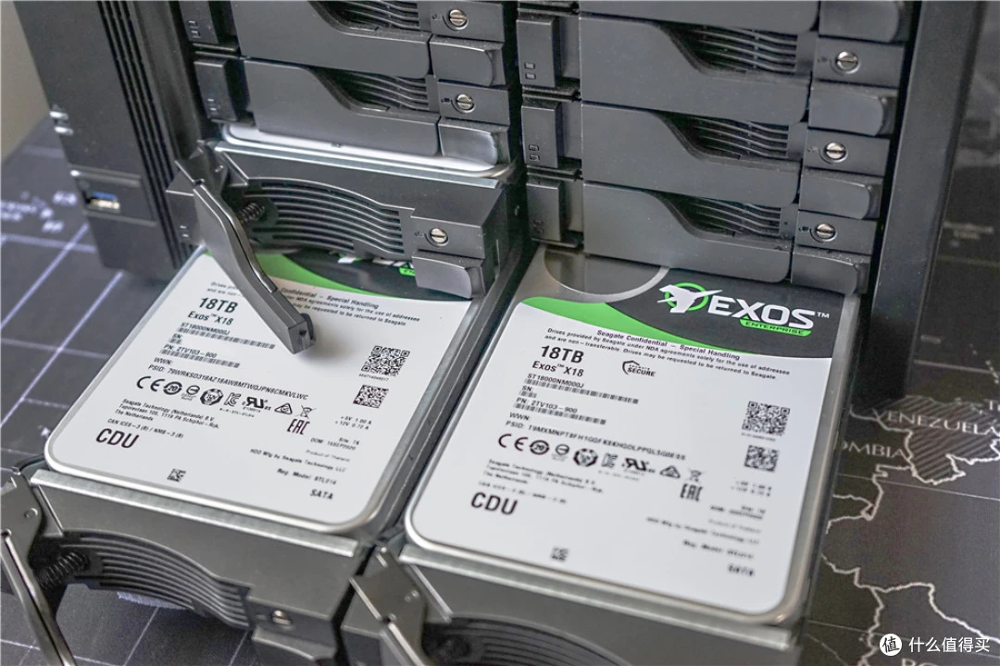
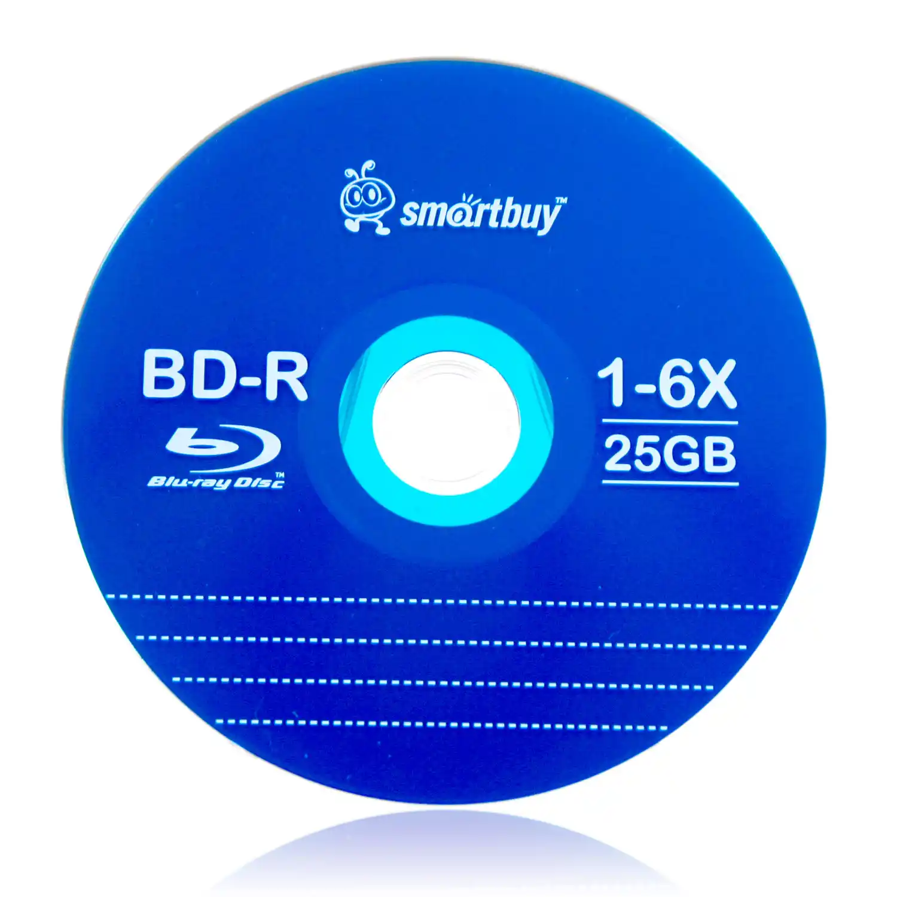

西班牙塞维利亚，一座 16 世纪建成的石头建筑里，藏着人类最早的“数据饥渴”——西印度群岛综合档案馆。西班牙帝国用三百年时间，把殖民地的每一笔交易记录、每一份航海日志、每一封总督密信，塞进了这里约 9 公里长的书架上——共 43,000 余卷，约 80 亿页。

1990 年代，西班牙文化部联合 IBM 西班牙公司和 Ramón Areces 基金会，启动了一项在当时堪称先锋的档案数字化工程。到 1998 年，他们已经扫描了超过 1100 万页原始文献——相当于馆藏的沧海一粟，但这些高精度图像所占用的存储空间，已大幅超越当年主流硬盘的容量极限。

而今天，人类每天生成的数据有多少？

大约 **650,000 TB**。也就是 **0.65 ZB**。每天。

三百年的帝国档案，今天的人类只用不到两分钟就超越了。

这不是技术参数的比拼，这是一种文明存在方式的彻底改写。在 KB、MB 时代，数据是稀缺品——你攒了好几年的照片，一块硬盘就能全部兜住。到了 PB、EB 时代，数据变成了公用设施——它藏在你脚下的数据中心里，像水电暖一样沉默运转。而在 ZB 时代，数据正在变成这个星球上最普遍的"工业废气"——它不再被人特意制造，而是被机器无休无止地排放出来。

**Zettabyte**，中文 **泽字节**，简称 **1 ZB**。

1 ZB = 1024 EB = 1,048,576 PB = 1,180,591,620,717,411,303,424 字节。约 1.18×10^21 字节，或者说 **一万亿 GB**，或者 **十亿 TB**。如果 1 TB 是一滴雨水，1 ZB 就是一条长江。

但比起数字换算，有一个更有意思的问题值得先问：这个词到底从哪儿来的？为什么它偏偏叫"Zetta"？

---

## 一、Zetta-：一场来自 1991 年的末日预言

1991 年，国际度量衡委员会（CGPM）正式通过了一组新的 SI 前缀：**zetta-** 表示 10^21，**yotta-** 表示 10^24。

"Zetta-"到底是什么意思？它的词根来自拉丁文 **septem**，意为"七"。为什么是七？因为 10^21 = (10^3)^7，也就是"1000 的七次方"。当初命名时，委员会把 septem 的首字母改成 z，加上意大利语常见的指小后缀 -etta，组合成了"zetta-"。

一个来自拉丁文的词根，被一个意大利式的后缀包裹，放进了一台以二进制为母语的计算机里——就诞生了“泽字节”。不过，这个名字引入中国时，翻译家选了“泽”字——“泽”在中文里不仅有“光泽、恩泽”之意，也暗合“水聚为泽”的汇集意象，用来命名人类所能触及的最大数据度量衡，倒也贴切。

但有意思的是，在 1991 年，没有任何人真的需要“zetta”这个词。

那时候全球一年的数据量还以 TB 计，你能买到的最大硬盘不过几百 MB。CGPM 通过这两个前缀，不是因为“已经需要用了”，而是因为“迟早有一天需要用”——这大概是人类历史上最早的一次“存储末日预言”，比任何一家市场调研机构的预测都早。

预言押中了。

2010 年，根据 IDC 的数据，全球每年创建、捕获、复制和消耗的数据总量首次突破 1 ZB，达到 1.2 ZB。从 1991 年命名到 2010 年第一次用上，十九年。十九年里，人类从“哪有那么多数据？”走到了“啧，数据多得没地方放了。”

而思科的一则旧预测，至今读来仍有意义——早在 2012 年，思科 Visual Networking Index（VNI）预测 2016 年全球 IP 流量将达到每年 1.3 ZB，这是网络流量第一次迈过"泽字节"门槛。存储的"泽字节时代"始于 2010 年，而**流量的"泽字节时代"比存储晚了整整六年**——因为 ZB 级的数据，首先要能生成出来，然后才谈得上存。而到了 2020 年代，生成早已甩开存储好几条街。

到这里，你已经看到了 ZB 的故事的第一个关键矛盾：**数据是被"制造"出来的，还是被"排放"出来的？** 这个问题，把人类对信息的理解推到了一个全新的维度——在 ZB 之前，数据是人类主动书写、主动留存的行为痕迹；到了 ZB 时代，数据成了被机器无休无止、无论你需不需要都会喷涌而出的**数字工业废气**。

---

## 二、30 EB 的塞维利亚：当数据不再需要人来写

让我们回到塞维利亚——但不是 16 世纪那座西印度群岛档案馆，而是 2000 年代全球数字档案的一个不太被人提及的转折：谷歌图书计划。

2004 年，Google 宣布了一项在当时看来近乎狂妄的计划：扫描全世界所有书籍。密歇根大学、哈佛大学、牛津大学、斯坦福大学、纽约公共图书馆——世界上最大的几座图书馆，把藏书一车一车运进谷歌的扫描中心。到 2019 年，谷歌已经扫描了超过 4000 万册图书，覆盖 400 多种语言。

如果把这 4000 万册图书全部数字化成纯文本，总数据量是多少？

大概在 30 EB 左右——连 1 ZB 的三十分之一都不到。

这是人类文明几千年写下的所有"书"，用严格的文字形式、经过挑选、经过编排、经过印刷、经过图书馆编目——所有这一切加起来，放在一块 2026 年的 30 TB 企业级硬盘旁边，也就是一万块硬盘的量。一个中型机柜就能装下全人类所有纸书的纯文本副本。

但今天全球一年生成 220 ZB 数据。剩下的 200+ ZB 是什么？

不是任何一个人"写下"的。它们是被机器自动生成的。

- **IoT 传感器**：一台工业涡轮机上的数百个传感器，每秒产生几十万条状态读数。一个中等规模的智能工厂，每天排放数 TB 的振动、温度、压力日志。全球数十亿台物联网设备，每分每秒在无人注视的情况下向数据中心倾倒数据流。
- **自动驾驶测试车**：我们在 EB 篇已详细讨论过——每辆车每天实测数据量可达 4 到 20 TB，一个 100 辆的测试车队月产出超过 30 PB。行业头部玩家的累计数据量，到 2020 年代已稳稳跨过 ZB 门槛。
- **短视频平台**：YouTube 在 2026 年每分钟上传超过 500 小时的新视频内容，日上传量超过 720,000 小时。TikTok 和抖音全球日活超过 15 亿，每天产生的视频原始数据量在 PB 至数十 PB 级别，月度数据量轻松突破 EB，年度数据量已进入 ZB 尺度。你刷过的每一个 15 秒视频，背后是一次内容的编码分发，也是一次永久的排放性数据沉淀。
- **日志与监控**：每一台服务器、每一个网络交换机、每一个云函数调用——都在疯狂写日志。这些日志绝大多数在被写入磁盘的那一刻起，就再也没有被人类阅读过。它们像一种数字化的“背景辐射”，填满了 ZB 空间的绝大部分。

换言之，人类文明花了几千年积攒下来的"文化数据"——书、档案、艺术、音乐、电影——在 ZB 时代全部加起来，可能只占数据总量的不到 1%。剩下的 99%，是机器写给机器的"内部备忘录"。

一位科技作家在《纽约时报》上写过一句被反复引用的话："我们正在用一个文明的全部文化数据当钱，去给五个世纪的监视视频和消费推荐系统做零钱。"这并不是为了贩卖焦虑，而是提示一种物质事实：**我们永远不可能像在海滩捡贝壳那样，从 ZB 的海洋中挑出所有"有意义的数据"再度回顾。数据，凭本能捡不完，凭算力筛不净，凭物理直觉也装不住了。**

而谷歌的那 30 EB 书，提醒我们一件更微妙的事：**人类曾经以为"记录一切"是文明最高的野心——西班牙帝国为此花了三百年。而现在，"记录一切"不再需要野心，它成了一种被动的物理后果。**

而下一个问题就是——用什么东西把这 220 ZB 的数据装进去？

---

## 三、38 万块硬盘与机器人光驱：ZB 时代的物理体面

在 PB 篇和 EB 篇里，我们还在津津乐道地对比 IBM 3380 那台 250 公斤的冰箱巨兽和今天口香糖大小的 M.2 SSD。到了 ZB 这个量级，这种对比失去了意义——不是因为硬盘不够轻，而是因为根本没有人会把 1 ZB 的数据装在同一类介质里。

但我们可以做一道数学题。

一块当前主流企业级大容量硬盘，容量约 30 TB，重量约 690 克。要凑满 1 ZB 的原始容量，你需要大约 **38,000 块**这样的硬盘。总重量约 26 吨——相当于一辆满载的重型卡车。加上服务器机箱、电源、网络交换机、制冷系统和配电设备，一整套 1 ZB 的存储阵列大概需要一个中小型数据中心的大厅来容纳，耗电量够一个小镇使用。

这还不是全部。如果你把 1 ZB 的数据存进 LTO-9 磁带——一卷 18 TB 的磁带大约需要 61,000 卷。IBM 的 Spectra Logic TFinity 磁带库是当下市面上最大的商用磁带系统，一台满配约能容纳 2 到 3 EB。要装下 1 ZB，你得买约 400 到 500 台这个级别的磁带库——这已经是一个超大规模数据中心的配置量级了。

但真正的挑战从来不在于"单体的极限"，而是这些数据的**存储周期分层**。云厂商并不是平等对待所有数据。ZB 级存储架构的灵魂，是一套自动化的数据生命周期管理系统：

- **热数据**（最近被频繁访问的数据）：停留在全闪存 NVMe 阵列上，延迟微秒级，单位存储成本极高。它们占据总量的 5%-10%，却消耗掉近一半的存储预算。
- **温数据**（偶尔被调用的数据）：从 NVMe 向大容量 HDD 阵列迁移。这部分占 ZB 的主要份额，通常是半年内被访问过，但已经不够"热"的文件。
- **冷数据**（几乎不再被访问的数据）：被打包写入 LTO 磁带库，或者直接归档进低速高密度的冷存储集群，等待它的可能只是合规审计或算法训练时的一次意外召回。

一个标准大型互联网公司的 ZB 级存储池，热数据可能只有几十 PB——但它们占据了系统绝大部分的 IOPS 和运维成本。而那些在磁带库深处安静吃灰的几百 EB 冷数据，每年唯一被完整读取的时刻，就是做年度数据完整性校验的时候。

如果愿意，你当然也可以把 1 ZB 的数据全部刻成蓝光光盘。2026 年初一张标准蓝光双层盘容量为 50 GB，一千万张 50 GB 蓝光盘才能凑满 1 ZB。如果把这些光盘摞起来，高度大约相当于 12,000 座珠穆朗玛峰——或者地球到月球距离的 1.5 倍。当然，地球上根本造不出那么多蓝光光盘——全球年产量都不到这个数字的零头。

需要强调的是，以上这些并不是一个科学的部署方案，而仅仅是一些"思想实验"。它们想说明的只有一件事：**ZB 数据正在把人类推进一个"生成能力远超存储能力"的时代。** 在 KB、MB 时代，你有多少数据，你就买多大的硬盘。到了 ZB 时代，这句话反过来才更接近现实：你有多少硬盘，直接决定了你能留下多少数据。剩下的，丢进虚空——不是被刻意删除，而是根本没有物理介质来接住它。

IDC 预测，到 2026 年，全球数据圈将增长到约 237 ZB，仅 2026 年一年新增的数据量就超过 40 ZB。而全球硬盘和 SSD 的年出货总量折算成存储容量，仅约 3 到 4 ZB。这中间的缺口——每年几十 ZB 的数据被生成出来，却从未被任何人保存——直接揭示了一个事实：**我们活在数据洪流里，但绝大多数数据从未被目击，就被物理法则撕碎又冲走了。**

这就是 ZB 时代最残酷、也最迷人的现实：**数据已经不再是人类需要费力保存的稀缺品，而是人类根本来不及保存、也根本不知道如何放弃的物理事实。**

---

## 四、一条狗的"记住所有气味"，还是神的"忘记一切"？

2013 年，美国国家安全局（NSA）犹他数据中心的容量在科技媒体上被反复猜测。我们在 EB 篇和 PB 篇都提到过它——1.5 亿美元的造价，65 兆瓦的耗电量，荒无人烟的犹他沙漠。进入 ZB 时代，全球类似的大型超大规模存储设施已不再稀缺——从 Azure 的亚利桑那到华为云的乌兰察布，它们的逻辑如出一辙：用廉价的沙漠、北极圈或废弃矿坑，换取海量数据的长期低成本储存。

但 NSA 犹他中心的真正遗产，不在于它存了多少数据，而在于它第一次让公众严肃地追问一个前所未有的问题：当存储的欲望膨胀到 ZB 级别时，**"永远记住一切"会不会从技术承诺变成道德困境？**

在 2014 年的一起欧洲案例中，一位西班牙公民援引"被遗忘权"，起诉 Google 并最终迫使谷歌从搜索结果中删除其十年前的个人债务拍卖公告。欧洲法院裁定，搜索引擎有权拒绝删除"过时但合法"的信息，但前提是它必须证明该项信息对公共利益仍有价值。这个在 EB 年代尚且能以"逐年审查"来勉强维系的旧版隐私规则，在 ZB 时代彻底脱了节。面对每年数十 ZB 的增量，没有任何信用机构或云厂商能逐条判断哪些信息值得留、哪些信息早该丢了。于是，所有平台不约而同地采取同一个策略：**默认保存一切。**

但这带来一个问题——如果一个人十年前在社交网络上发了一条不当言论，十年后这条数据被 AI 训练模型爬取，嵌入了某个大语言模型的权重里，它还能被删除吗？传统意义上的"删除"——找到那条记录、销毁它——在 ZB 级别的分布式存储系统里几乎不现实，因为数据被切碎成无数校验分片，塞进了不同机架、不同楼层甚至不同国家的硬盘里。你删了原文，校验分片还在。你清空了备份，磁带库里的冷归档还在。你甚至不确定这个"被删掉"的数据是不是已经在哪个 checkpoint 里被冻结进了某个模型的训练快照。

这就是 ZB 时代的"存储悖论"：**技术给了人类"记住所有气味"的能力，但人类并没有与之匹配的遗忘机制。** 过去，人会死，文件会发霉，硬盘会坏，纸会腐烂——遗忘是默认状态，记住才是例外。但在 ZB 时代，记住是默认状态，遗忘才需要专门的技术手段和制度设计。欧洲《通用数据保护条例》（GDPR）规定的"被遗忘权"，在 ZB 级的存储系统面前，与其说是一项法律权利，不如说是一种对物理现实的无奈妥协——如果当事人不主动发现并要求删除，那份十年前的债务记录就将在冷冻磁道中永生不死。

这让人想起博尔赫斯在短篇小说《博闻强记的富内斯》里创造的那个悲剧角色：伊雷内奥·富内斯因为一次事故获得了完美的记忆力，他能记住每一天每一片树叶的形状、每一秒钟的触感和每一次心跳的节奏。但他也因此崩溃了——因为他无法进行任何思考，他的意识被无差别的记忆完全填满。博尔赫斯写道："**思考就是遗忘差异，就是概括，就是抽象。** "

人类花了漫长的时间才学会遗忘的艺术——从最初的结绳记事到文字的发明，每一步都是对信息的选择性抽象。文字的发明本身，就是人类第一次主动选择"记住什么、遗忘什么"。而 ZB 时代对"记住一切"的执着，正在让这种能力陷入前所未有的退化危机。当机器把人类从"遗忘"的劳动中解放出来时，人类失去的不是负担，而是**思考最本质的前提**——一段毫无遗忘的文明，还是一段懂得释怀的文明——这个问题的答案，大概比"1 ZB 等于多少 GB"重要得多。

---

## 五、1 ZB 能装什么？

在进入下一个量级之前，让我们来做一次 1 ZB 的换算。由于 1 ZB 太大，这次我们用十进制和国际单位制口径（1 ZB = 1000 EB），因为目前所有公开发表的 IDC 全球数据圈预测均基于十进制，但误差不影响直觉感受：

- **约 2500 亿部高清电影**（每部 4 GB）——假设公元前 3000 年埃及第一王朝建立开始全天滚动播放，到 2026 年的今天大概放完了不到千分之一。
- **约 3 万亿首 MP3 歌曲**（每首 4 MB）——把这些歌曲从头到尾播一遍需要大约 2.2 亿年，比恐龙灭绝到现在的时间还长 3 倍。
- **相当于约 1 千亿人一生所说的全部话语**——按每人一生平均说约 10 亿句话，存储为 10 GB 纯文本计算，1 ZB 约等于 1000 亿人的一生话语量。
- **相当于大约 7000 个美国国会图书馆的全部藏书数字化纯文本**——以美国国会图书馆约 180 TB 纯文本馆藏量估算。
- **大约 100 万辆自动驾驶汽车连续 24 小时运行产生的全部传感器原始数据——存满整整一年。** 每辆 L4 级测试车在极端高配传感器全开的测试状态下，每天最多可产生约 30 TB 数据；如果考虑大多数真实路测场景中的传感器按需触发和实时压缩，一辆主流自动驾驶公司在 2025 年实际每天产生的高精度日志和关键帧，通常在 4 到 12 TB 之间。这里取保守常态。\*\*
- **全球在 2026 年每 1.5 天产生的全部数据**——以 2026 年全球数据圈约 237 ZB 的年生成量计算。

在物理世界里，要装下 1 ZB 的数据，你大约需要：

- 一个占地约 200 平方米的中型数据中心机房；
- 数万台服务器和存储设备 24 小时运行；
- 电力消耗功率超过 1 兆瓦——足够一个数千人小镇的全部生活用电。

而在 1991 年，"Zetta-"这个词被写入 SI 标准的时候，全世界最大的硬盘不过 1 GB。命名者不会想到，三十五年后，人类每 1.5 天就能把这 1 ZB 填满。

---

## 六、ZB 的公共面孔：当你已经住在 ZB 时代里，却以为自己还在 MB 时代

在 PB 篇和 EB 篇里，我们说了，PB 是数据中心的语言，EB 是互联网脊梁的语言。到了 ZB，语言已经不是"技术行话"了——它变成了日常生活的底层物理常数。你可能从来没说过"泽字节"这个词，但你每天都活在它铺成的地基上。

**搜索引擎。** Google 每天处理的搜索量超过 85 亿次，每次搜索命中分布在数千台服务器上的 PB 级索引碎片，在零点几秒内完成合并、排序和返回。据 Google 在 2020 年司法部反垄断案中披露的数据，其全球网页索引约 4000 亿文档，此后未再公开更新。虽然网页索引本身的规模难以精确估算，但 Google 在其数据中心内存储、处理和分析的数据总量——包括网页库、索引、知识图谱、AI 训练语料和日志数据——在 2020 年代已进入 ZB 级别。你用 Google 搜"天气预报"，大约有数十台服务器在 ZB 级别的数据池里为你翻腾一遍。

**大语言模型。** GPT-4 和类似规模的大模型训练需要 PB 到 ZB 级的高质量文本语料。Common Crawl 一个月爬取的全球网页数据量约为 344 到 363 TiB，而它的整个开源语料库规模在 2025 年已达到 PB 至 EB 级。从这些原始数据中清洗、去重、筛选出的训练数据集背后，站着一个人工标注与自动化管道共同维持的 ZB 级别治理体系。每一次你向 ChatGPT 提问，背后的权重是从一整座 ZB 级数据垃圾山里蒸馏出来的——这句"好像没什么技术含量"的闲聊背后，是人类历史上规模最大的数字工业综合体之一。

**视频流。** Netflix 在 2024 年全球订阅用户突破 2.8 亿。YouTube 月活用户超过 29 亿，用户每天观看约 12 亿小时的内容。Netflix 在 2024 年下半年的全球流媒体播放总时长达到 940 亿小时，全年合计接近 1900 亿小时。把这些视频流量加起来，每年的数据吞吐量足以填满数百 ZB 的传输带宽——虽然实际存储量远小于此（视频分发依赖 CDN 缓存而非全量长期存储），但 ZB 是这个系统的"计量单位"，不是它的"库存量"。

**照片。** 2026 年，全球每天上传到各社交平台的图片总量超过 50 亿张。以每张手机照片 3 到 5 MB 计算，每天仅社交图片就超过 20 PB 的新增数据。再加上原始文件、编辑副本、各分辨率转码版本——仅图片这一项，每年就能轻松占据几 ZB 的存储空间。你在 Instagram 上传一张自拍，它会被自动转码成 6 种分辨率、复制到 3 个地理区域的数据中心、塞进内容审核的 AI 队列、生成多种视觉特征索引——你只按了一下快门，后台默默复制了超过 8 份副本。

**被永远删不掉的记忆。** 即使你删除了社交账号，由于第三方爬虫、AI 模型对旧有数据的阶段性备份、以及广告网络的受众画像残留，你的痕迹很可能依然驻留在几十个跨国运营的 ZB 级存储孤岛里，直到磁带过期、云商割接或被下一波安全法规强制擦除。这些并非你我主动上传的数据，却构成了 ZB 世界中一块极其沉重的灰色主权领土。

你每天起床，拿起手机，刷了 15 分钟短视频，搜了一下天气，发了一张照片。这套动作你做了十年，觉得稀松平常。但如果你突然搬到一座没有 ZB 存储系统的世界里——你什么都打不开。

ZB 就是这样一种东西：它不是给你用的，它是给你活着的。

---

## 七、ZB 的告别：从建筑到天空

我们在 PB 篇说，PB 之后的存储不再以"硬盘"为单位，而是以"数据中心"为单位。在 EB 篇说，EB 是把互联网变成了一整座沉默运转的工业记忆系统。

到了 ZB 时代，连"数据中心"这个单位都要被改写了。

2010 年，人类用了几千年累积的数据才跨过 1 ZB 的门槛。但到了 2026 年，人类每隔大约 1.5 天就能生成 1 ZB 的新数据。从"几千年"到"1.5 天"——这不是一条渐进的曲线，而是一场文明的相位跃迁。

如果把信息尺度的递进比作一部文明扩张史：1 bit 是第一个烽火台上的狼烟，1 GB 是你口袋里的一千首歌，1 PB 是一座没有窗户的数据中心，1 EB 是一整片沉默运转的数字大陆。而 1 ZB——它不再是一座建筑，不再是几排机架，甚至不再是一片沙漠里的数据中心集群。它是笼罩在整个文明头顶的数字大气层。你看不见它，但它决定了你在数字世界里能不能呼吸。数据不再是人类主动书写的文化产品，而是被机器无差别排放的物理副产品——而我们永远无法把一条河的流动装进一个水桶慢慢品尝。

而在 ZB 之上，只剩最后一个量级。在那个量级上，人类的语言本身可能已经不够用了。

下一个单位：**1 YB**。在那里，我们不再说"数据圈"，我们得说"信息宇宙"。而这一整个宇宙，能不能被完整的备份在某个地方——甚至永远不损坏、不被遗忘——那是最后一篇要回答的问题。
