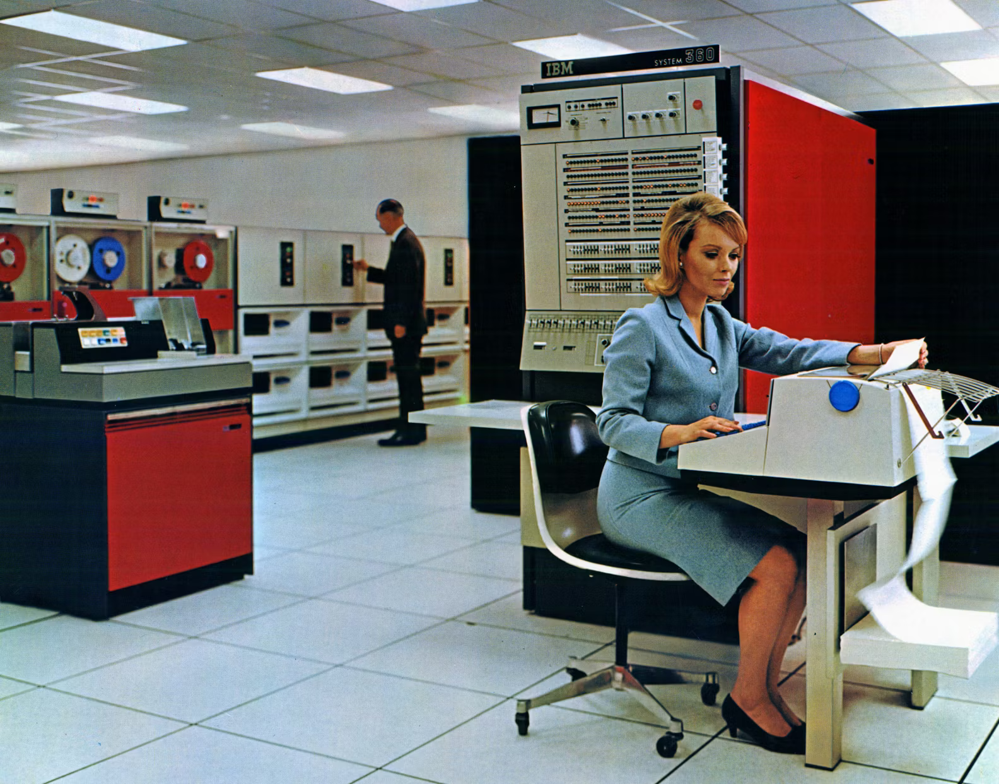
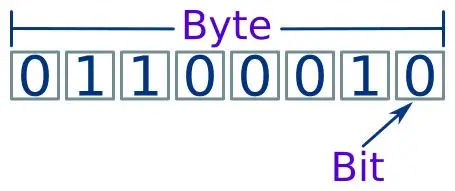

上一回我们聊了1 bit。一个开关，一瞬脉冲，一根导线里时有时无的电流。彼时，人类教会机器吞吐信息的本领才刚刚入门——是的，输出一个 yes-or-no，分辨一段黑白，这便是比特的全部世界。这的确很了不起，但实话说：若机器只能存储一个 0 或 1，它永远无法写出“Hello World”，更无法绘出蒙娜丽莎。它需要一个更大的单位。

它的名字是 **Byte**，中文名 **字节**。“字节跳动”的那个“字节”。

你或许早已听过：1 Byte = 8 bits = 256 种可能的排列组合。这个等式刻在每个程序员的骨子里。但我要告诉你的是，在计算机的史前时代，这个等式**完全不存在**。字节是多少位？这得看是哪一台计算机、哪一个厂商，甚至看那个程序员当天的心情。

字节的来历，是一出充满了偶然、巧合、大国博弈，乃至语言学幽默的滑稽剧。

## 一、“比特”太小了，“咬”一口吧

在那个芯片都是电子管、编程还在打孔纸的年代，计算机有一条不成文的行规：**一次只能处理一个字符**。

彼时的计算机需要处理的是文字——字母、数字、标点符号。你给机器输入“A”，机器内部得有一个二进制序列来代表这个“A”。这套序列需要多长？4 位只能表达 16 种可能，给英文字母都不够；5 位能表达 32 种，连数字带大写字母勉强凑合，但一旦要区分大小写立马歇菜。于是早期的计算机设计师们各自为政：有的用 6 位，有的用 7 位，还有的用上了 9 位甚至 12 位的奇葩配置（这个我们稍后会聊）。

时间来到 1956 年，地点是 IBM 的实验室。彼时的 IBM 正全力以赴打造一台野心勃勃的机器——IBM 7030 “Stretch”超级计算机。这台铁家伙被寄予厚望，要成为世界上速度最快的计算机（虽然这个 flag 后来以一种颇为尴尬的方式倒下了，但那是另一桩公案）。项目设计团队里有一个名叫 **Werner Buchholz** 的德裔美国工程师。他当时正在纠结一个看似不起眼、实则影响深远的问题：**输入输出设备上那一组连续的比特，究竟该怎么称呼？**

叫“a group of bits”？太啰嗦。叫“a chunk”？太随意。叫“a block”？已经在别处用了，容易混淆。Buchholz 翻来覆去地想，最终盯上了一个英文单词——**bite**。没错，就是“咬”那个 bite。一组比特，就像计算机从数据流里咬下来的一小口，形象、好记。唯一的麻烦是，**bite** 跟 **bit** 太像了，手写体一潦草，谁分得清哪个是哪个？于是 Buchholz 灵机一动，把 i 换成了 y——**byte**。这样，一个大写的 B 也能把它和 bit 区分开。

这就是字节名字的由来。这个“为避混淆而刻意改拼写”的命名方式，后来被写进各种技术词典，成为计算机史上一段小而精致的掌故。Buchholz 本人也因此在 1990 年获得了 IEEE 计算机先驱奖。有意思的是，Buchholz 晚年接受采访时说，他从未觉得起了这个名字有什么了不起——他只是在做一个工程师该做的日常工作。历史的幽默感大概就是如此：真正改变世界的人，往往自己浑然不觉。

Buchholz 虽然发明了“byte”这个名字，但我们今天所理解的“1 byte = 8 bits”在当时并不成立。Buchholz 最初定义的字节其实是一个**可变长度**的概念：它可以是 1 到 6 个比特，具体取决于输入输出设备每次传送多少位数据。IBM 内部的讨论在 1956 年晚些时候才逐渐收敛到 8 位。但此时距离 8 位字节成为全球通行标准，还差一场真正的商业豪赌。

## 二、混乱的史前时代：字节的大小一度各说各话

今天的我们习惯了整齐划一的世界：内存按 8 位编址，CPU 寄存器是 8 位的整数倍，网络协议里的 octet 八位一组明明白白。但在 1950 年代到 1960 年代早期的计算机世界，那简直是一锅大杂烩。

字长（word size）是那个时代的计算机最核心的参数之一，而“字节”不过是字长体系里的一个附属物。彼时流行过多种不同的字长体系：

- **12位**：DEC 公司的 PDP-8 小型机就是这个规格，便宜、皮实，实验室的最爱。
- **18位**：PDP-1 等早期小型机采用。
- **36位**：IBM 704/709 系列、Honeywell 6000 系列、PDP-10 等大型机的主流字长——为什么是 36？因为 36 位可以精确表达 10 位十进制数，非常适合早期的科学计算。

这些不同的字长催生了对应的字节体系：36 位机上流行 6 位字节（36 正好是 6 的 6 倍，用一个字表达 6 个字符，高效又优雅），也有的系统采用 9 位字节。这个时代的字节不是独立存在的单元，而是字内部的“子字段”（bitfield）。最夸张的是 PDP-10：它支持的“byte”可以是 1 到 36 位之间的任意比特序列。你可以在同一台机器上定义一个 7 位的 byte 去存 ASCII 字符，又定义一个 6 位的 byte 去兼容旧的打孔卡数据——计算机就像一块万能橡皮泥，程序员随心所欲地捏出自己想要的东西。

这里有一个有趣的细节：为什么 36 位体系在 1960 年代一度占据统治地位？答案藏在那个年代计算机最吃香的业务里——**数值计算**。军方算弹道、NASA 算轨道、气象局算天气……这些任务对十进制精度要求极高。36 位恰好能在二进制世界里优雅地表达 10 位十进制数（2^36 约等于 6.87×10^10），不像 32 位那样捉襟见肘。在当时的科学家和工程师眼中，36 位才是“严肃计算”的入场券。

然而，科学计算再高端，它赚不来大钱。真正的大钱在商业数据处理领域——银行的账本、保险公司的保单、航空公司的订票系统。而商业需要的是什么？是区分大小写字母的能力，是丰富的标点符号，是跨系统的兼容性。36 位体系在数值精度上登峰造极，但在字符处理上却显得笨重而昂贵。6 位字节只能容纳 64 个字符，连 26 个小写字母都塞不进去——于是当年的计算机输出清一色全大写，就像在对你咆哮。

**一场关于字节大小的战争，悄然在两个阵营之间打响：一方支持 6 位字节与 36 位字长，另一方支持 8 位字节与 32 位字长**。这不是一个技术优劣的问题，而是两条截然不同的技术路线的对决——前者是科学计算的精密仪器，后者是商业计算的通用平台。最终，改变战局的不是某个天才的论文，也不是某场学术会议的决议，而是一场价值 50 亿美元的豪赌。

## 三、一场价值 50 亿美元的豪赌：System/360 如何一刀定乾坤

1964 年 4 月 7 日，IBM 向世界揭开了 System/360 的面纱。

用今天的语言来描述这次发布，大概相当于苹果同时发布了 MacBook Air、Mac Studio 和 Mac Pro，五款 CPU、五十四种外设，而且它们全部运行同一套架构、同一套软件——插上就能用，升级不用重写程序。在 1964 年那个每台计算机都有自己一套独立操作规范、连同一家公司的不同机型都无法兼容的年代，这种想法本身就近乎疯狂。

IBM 内部把这套系统称为“50 亿美元的赌博”——折算到今天大约是 340 亿美元，比当时 IBM 全年的营收还高。事实上，整个计划一度被质疑为“技术自杀”：如果失败了，IBM 将陷入财务深渊；如果成功了，它将彻底重塑计算机产业的游戏规则。

结果我们都知道了：它押中了。发布首月订单就超过一千台，到 1966 年月销量突破千台，每台售价 250 万到 300 万美元。System/360 成为了大型主机的性能基准，和福特 T 型车、波音 707一起被《Wired》杂志评为史上三大商业创新。

但对于我们这篇文章来说，System/360 真正关键的影响是一个被嵌入底层架构的设计决定。这个决定来自一个人：**Frederick P. Brooks Jr.**——后来写出软件工程圣经《人月神话》的那位布鲁克斯。在设计 System/360 时，他拍板了一个决定：**将 IBM 360 系列从 6 位字节改为 8 位字节，从而允许使用小写字母**。后来布鲁克斯回顾自己的职业生涯时说了这么一句话：

> **“我做出的最重要的决定，是将 IBM 360 系列从 6 位更改为 8 位字节，从而允许使用小写字母。这种变化传播到了所有地方。”** 

一个 6 位的字节能表达 64 种可能，够装下 26 个大写字母、10 个数字、若干标点符号和少量控制字符——唯独装不下 26 个小写字母。在这个架构的约束下，全世界的计算机输出都是用大写在咆哮。Brooks 决定把字节拓宽到 8 位，一下子把空间翻到了 256 种可能。大写字母、小写字母、数字、符号，全都塞进去之后还有富余——那多出来的一位后来被用作奇偶校验位来检测传输错误。自此，计算机终于可以“轻声细语”地输出大小写混合的文字了。

当 System/360 以摧枯拉朽之势席卷企业市场时，它的配套编码方案 **EBCDIC** 也顺势成为了事实标准——这是一个 8 位字符编码体系，涵盖了数字、大小写字母和大部分常用符号。尽管 EBCDIC 在技术美感上远不如后来更为优雅的 ASCII，但商业的力量就是这样：谁卖得多，谁制定标准。36 位大型机和 6 位字节体系，在一夜之间从主流变成了遗产。这跟后来 VHS 击败 Betamax、Windows 称霸桌面市场是同一类故事——赢家靠的往往不是技术最优解，而是生态最强势。

**1 Byte = 8 bits**——这个你现在觉得天经地义的等式，就是在这一场商业豪赌里被焊死在计算机史上了。

## 四、当我们聊一个字节时，到底在聊什么？

现在让我们停下来，好好看看一个真正的8位字节到底长什么样。

一个字节，由 8 个比特构成。想象你面前有 8 个并排摆着的开关，每个开关只有两种状态：开（1）或关（0）。这就意味着一个字节一共可以排列出 2^8 = **256 种不同的组合**。如果用来表达不带符号的整数，范围是 00000000 到 11111111，也就是十进制 **0 到 255**。如果你在玩老式 8 位红白机，一个字节恰好可以表达游戏里一个格子里的道具数量——255 发子弹，多一发就溢出归零，这就是被无数80后玩家诅咒过的“255 上限”。

一个字节不仅能代表数字，也能代表文字。在最基础的表层语义里，**1 Byte = 1个英文字母**。与此同时，字节也是**计算机内存寻址的最小单位**——你的处理器在内存里找一个数据，绝不能对比特说“我要第 137 位”，而只能说“我要第 18 号字节”。内存在最底层被划分成一个个编号的字节格子，每个格子里有 8 个比特安静地待着。正因为有了这种统一的寻址体系，程序才能高效而精确地读写数据，而不是在一堆无标号比特中迷失方向。

这种“刚好 256 种组合”的魔力，配合2的幂次对硬件寻址的天然亲近感，就像 **“上帝为程序员预留的完美隙缝”**——不大不小，恰好够用。也正因如此，字节成了此后一切信息尺度递进的基石，我们后面每一篇要聊的 KB、MB、GB……都不过是在这个基数上乘以 1024 而已。

你可以把它理解为计算机世界的 **“最小语素”**——正如一门语言文字用于表达意义的“最小单位”，字节就是这个数字文明的元语言。八个无声的开关，让人类的字母和符号得以从纸上跃入电子回路，并最终在屏幕中破壳而出。

## 五、法国的倔强：当“Byte”被拒绝入境

讲到这里，一个顺理成章的问题浮出水面：既然 1 byte = 8 bits 已经是事实上的全球标准，为什么网络协议里还充斥着另一个词——**octet**？

理由出人意料：**因为法语。**

在法语里，“bit”和“byte”是一对让人头疼的**同音异义词**。想象一个法国工程师在电话会议上跟同事讨论网络协议：“我们需要在这个字段里塞 4 个 byte。”同事反问：“你说是 4 个 byte 还是 4 个 bit？”——在法语发音里，这两句话听上去完全一样。要是在对接金融数据或者医疗信息的时候出现这类歧义，损失就要按亿来算了。

于是，法语世界另辟蹊径，选用了一个泾渭分明的新词：**octet**。oct-前缀源自拉丁文“八”，octet 就是“8个一组的比特”，不存在任何解释余地。在法国、法属加拿大和罗马尼亚，人们不说 megabyte，而说 **megaoctet**。

由于早期互联网协议（比如 TCP/IP）的好些关键工作是在法语区或拥有多国工程师的跨国环境中展开的，**octet** 这个不带歧义的术语顺势进入了网络标准的正式规范。直到今天，IPv4 地址用 4 个 octet 表达（每个 octet 值域0～255），IPv6 地址用 16 个 octet，HTTP 协议里有个特别重要的 MIME 类型叫“application/octet-stream”——之所以不用“byte”，正是为了在任何国家、任何语言、任何不同字长定义的旧式设备之间通信时，彻底消除歧义。

所以，当你下次在某个技术文档中看到 octet 一词，请肃然起敬：这不仅仅是 8 个比特，这是一个计算机法语单词在英语技术圈里杀出了一条血路的尊严勋章。

## 六、字节的未竟之旅：从8位到无限

故事到 System/360 似乎可以画上句号了。但字节真正的历险，其实才刚刚开始。

8 位 = 256 种组合，对英语世界来说绰绰有余——26 个大小写字母、10 个数字、标点符号，再加上一堆控制字符，256 个格子塞得满满当当但够用。然而，当计算机开始走向世界，麻烦接踵而至：汉字怎么办？阿拉伯字母怎么办？日语的假名和韩语的谚文怎么办？

答案是：**一个字节不够，就多来几个字节。**

在 Unicode 体系下，一个字符可以用 1 到 4 个字节来表达。UTF-8 是最优雅的设计之一：它向下完全兼容 ASCII（7 位 ASCII 恰好落在 UTF-8 单字节表达的范围内，那些年存下的英文文本不必做任何转换就能被新系统识别），同时又能把汉字、emoji、古埃及象形文字全部编码进多字节序列。一个英文字母占 1 个字节，一个常用汉字占 3 个字节，一个 emoji 占 4 个字节。你每天在微信里发的那些笑脸表情——每发出一个，就是 4 个字节流过光纤。

所以，1 Byte 不只是数字信息的单位，它也是一个文明基座：**它是英文的储存口袋，是计算机内存的编址灵魂，更是多语言世界的奠基砖块。** 当后来者继续以此乘 1024、乘 1024，逐级延展至 KB、MB 乃至 YB 时，请务必记得——所有的这一切，都始于这**8 个排队站好的比特**，始于计算机史上一场价值 50 亿美元的赌博和一个德裔工程师灵机一动的双关语。在那个混沌的黎明，有多少六位六位的往事湮没在历史的尘埃里，只有这一个大写的“B”，为我们标记了一切宏大叙事的源头。
