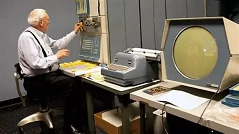
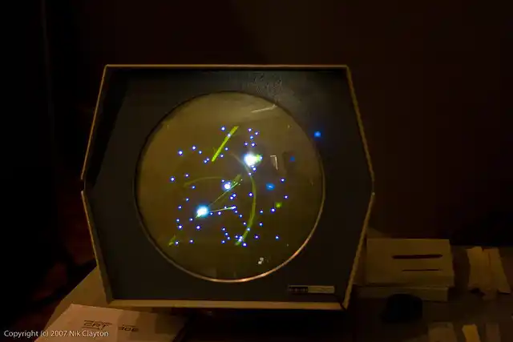
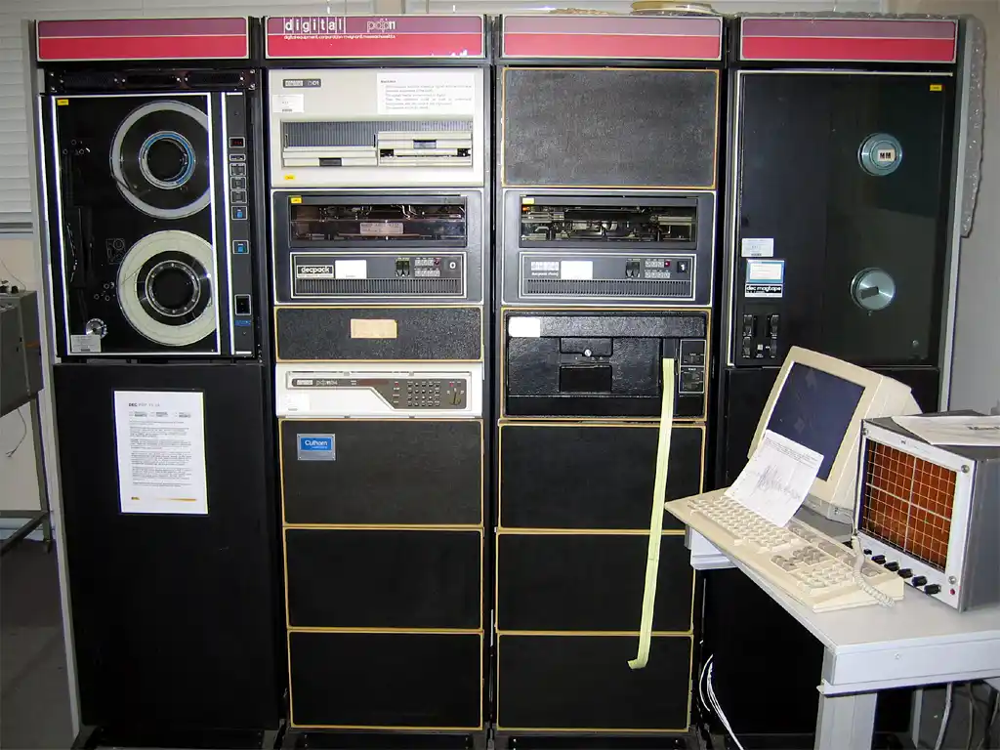
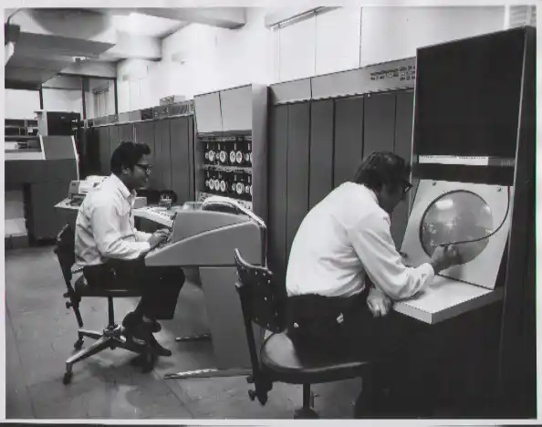
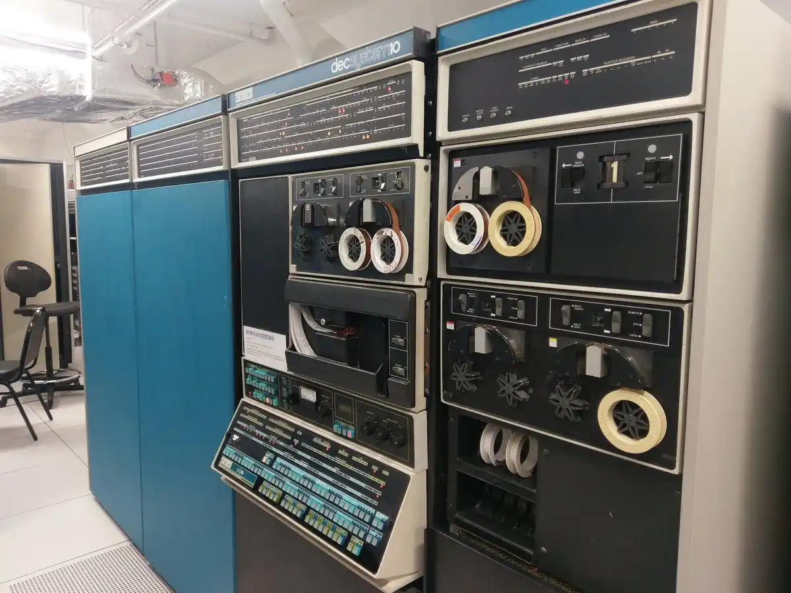
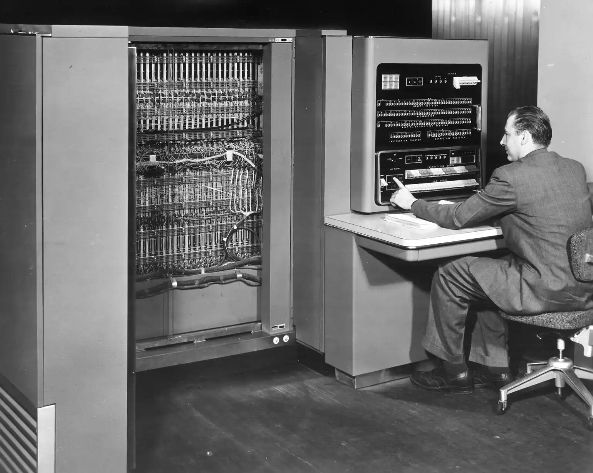
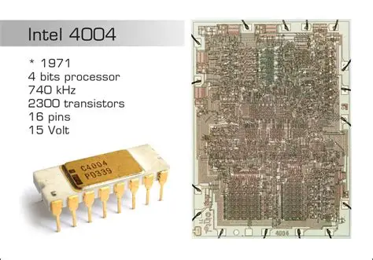
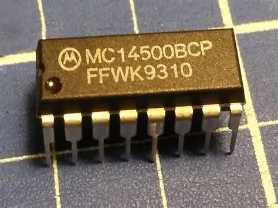

在正传里，我们规规矩矩走完了一条几乎像教科书划定的路线：从 1 bit 到 1 YB。每一个路标都指向同一个终点——8 位字节的绝对统治。

但历史不是一条直线。在我们踩过的那条明路底下，还埋着一张错综复杂的地下路网——那些曾经繁荣过、被一整代工程师当成物竞天择的理所当然、却最终被“字节”帝国车轮碾碎的单位。

它们没有墓碑。但你如果愿意掀开计算机史的井盖，那些名字还在下面幽幽地发光：**nibble**、**18-bit word**、**36-bit word**、**variable word length**。这一篇，我们就讲讲它们的遗言。

---

## 一、nibble：半个字节，一辈子的小弟

在所有被遗忘的单位里，nibble 大概是最憋屈的一个。它不是被淘汰的——它是压根没混到过上场机会。

nibble 是 4 个比特，半个字节。它的诞生几乎紧贴着“byte”这个词。按照 David B. Benson 的回忆，他早在 1958 年就在洛斯阿拉莫斯用上了“nibble”这个叫法，而“byte”正式诞生于 1956 年左右。也就是说，老大哥刚落地，这个小弟就紧跟着来了。

名字的来源透着一股五六十年代工程师特有的冷幽默。“Byte”是从“bite”改拼写来的，那半个 bite 叫什么？小口轻咬——nibble。这不是哪个标准委员会的官宣，这是几个写汇编的家伙在茶水间啃三明治时的即兴发挥。

但笑话讲完，悲剧就已经注定了。IBM System/360 把世界推进 8 位字节的轨道之后，nibble 就彻底成了“存在但没人需要”的东西。你不会用半个字节去寻址，寄存器里也读不进一个独立的 nibble。它确实活下来了——在十六进制编辑器里、在 BCD 编码的角落、在调试时偶尔蹦出来的 high nibble 和 low nibble 里——但它从来没当过主角，连配角都算不上。

如果说 nibble 只是一个生不逢时的小兄弟，那接下来这几个，可是真正当过帝王的。

---

## 二、18 位字：人类第一款电子游戏

1959 年，一家叫 DEC 的初创公司造出了自己的第一台计算机。他们不敢叫它“computer”——那个年代，“计算机”意味着几百万美元、一整个机房，还有 IBM 的维修合同。风险投资人明确警告：不许造计算机。于是 DEC 给它起了个温和无害的名字：Programmed Data Processor-1，简称 PDP-1。

PDP-1 的字长是 18 位。为什么是 18？因为在那个年代，“一个字该多长”还没有标准答案。DEC 的工程师同时在开发 12 位、18 位和 36 位的架构，每一种都在试探不同的市场角落。对比 IBM 那些昂贵到只有国防部才养得起的大家伙，18 位更短、更便宜、指令集只有 28 条——说白了，这是第一台大学和实验室买得起的“平民计算机”。

它没辜负这个定位。就是在 PDP-1 上，麻省理工的黑客文化开始萌芽。1962 年，Steve Russell 写出了人类历史上第一款电子游戏——《Spacewar!》。两个玩家各操纵一艘飞船在重力井附近缠斗，屏幕上每一条轨迹，都是 18 位指令在磁芯内存里翻飞的结果。

PDP-1 的主内存有 4096 个 18 位字，换算成 8 位字节大约相当于 9,216 字节——也就是我们俗称的 9 KB。九千个字节。你今天用手机随手拍一张糊到不行的照片，够塞下几百台 PDP-1 的全部记忆。

18 位字的后代——PDP-4、PDP-7、PDP-9、PDP-15——又硬撑了将近二十年。直到 1970 年，DEC 推出了 16 位的 PDP-11。那句老话怎么说来着？杀死你的往往不是更强的对手，而是更便宜、更多人用的对手。PDP-11 在全生命周期内卖出了超过 60 万台，18 位字长的旧世界，被标准化和规模化的成本优势无声地卷走了。

---

## 三、36 位字：当优雅撞上标准，优雅会输

在所有被遗忘的字长里，36 位是最不该被忘记的一个。它不光是统治过科学计算的江山，还留下了一堆让后人咋舌的传说。

DEC 阵营里，36 位的血脉始于 1963 年的 PDP-6。这台机器被当时的那帮极客公认为优雅到了极致——是真正程序员才配用的计算机。但商业上，它惨得一塌糊涂。全球只卖出 23 台，是 PDP 全系列最失败的型号。之所以卖不动，硬件可靠性是一个大坑：它有一些大型系统模块，在当年的印刷电路板技术下属于步子太大扯着蛋。

但 PDP-6 的架构并没有随商业失败进棺材。1968 年，DEC 推出了 PDP-10，保留 36 位字长和几乎相同的指令集，但硬件实现彻底翻新了，用了分立晶体管和 DEC 自家的 Flip-Chip 封装技术。PDP-10 从 1968 年一直卖到 1983 年，截至 1980 年末大约售出了 1500 台。

为什么是 36？这数字看着古怪，但其实是一个数学家才会欣赏的选择：36 恰好等于 2² × 3²，拥有极其丰富的因数分解结构。它既能塞下 6 个 6 位字符，也能精确表达 10 位十进制数——在当年的科学计算里，这种十进制精度是无可替代的硬通货。

斯坦福人工智能实验室（SAIL）的黄金岁月，就是在一台双处理器 PDP-10 上度过的，主内存有 262K 个 36 位字。后来 SAIL 还装了一台绰号叫“Moby”的 Fabri-Tek 大容量磁芯存储器，容量达到 256K 字，在当时被认为大得像白鲸，大到不真实。SAIL 那台机器不光跑 AI 论文——John McCarthy 和 Les Earnest 那帮人还拿它来生成音乐乐谱。更离谱的是，1965 年 11 月，有人通过一条电报线路，从波士顿远程操作了一台设在澳大利亚珀斯的 PDP-6，完成了可能是人类历史上最早的洲际远程计算连接。

当 System/360 用 8 位字节和 32 位字长横扫商业世界时，36 位社区的人怀抱着一种骄傲的鄙夷，管自己的地盘叫“真正的计算”。

但骄傲不能当饭吃。随着 1970 年代后期交互式分时系统被微型计算机取代，32 位架构在成本、生态和标准化上的优势织成了一张密不透风的网。1983 年，PDP-10 产品线被 DEC 叫停，被自家 32 位的 VAX 超小型机取代。1984 年，最后一台 PDP-10 走下产线。

36 位，卒。墓志铭上可以刻一行字：优雅撞上了标准，优雅输了。

---

## 四、可变字长：灵活是灵活，但兼容性的债迟早要还

如果说 36 位教会我们的是“标准的碾压之力”，那可变字长的故事，教的是另一堂课：生态兼容性的成本，从来不会消失，它只会迟到。

在 1950 到 1960 年代，IBM 的 700/7000 系列大型机内部同时跑着好几套完全不同的存储架构。其中专为商业数据处理打造的那条线——所谓的 Commercial 架构——用的就是可变字长。代表机型包括 IBM 702、705，以及 1961 年推出的晶体管升级版 IBM 7080。

在这些机器上，一个“字”有多长？没准。数据以字符为单位存储，指令可以操作任意连续的字符序列。你想想，银行户名长度不定，保险地址长度不定，交易备注长度不定——用固定字长去框这些数据纯属给自己找不痛快。可变字长在处理这类活计上简直就是量身定做。

但代价是什么呢？IBM 在同一个时期同时维护着好几条完全不同的产品线——加上 1400 系列就是五种——每一种都得单独写软件、配外设。在某个具体应用上，可变字长也许优雅极了。但当你需要让两台不同字长的机器交换数据时，程序员就变成了翻译官，而且是没有词典的那种。

这就是 System/360 为什么必须诞生。Fred Brooks 后来在回忆录里把 System/360 的统一架构称为“IBM 历史上最痛苦也最必要的决定”——痛苦是因为它要一刀砍掉多条产品线，必要是因为再这么各自为政下去，连 IBM 自己的工程师都维护不过来了。1964 年 System/360 发布，8 位字节成为帝国统一的度量衡。所有不能对齐到 8 位倍数的字长——包括可变字长——被一刀切出局。

---

## 五、1 位机和 4 位机：躲在历史角落里的活化石

除了字长，还有一些因为“太小了”而被遗忘的整台计算机。

1971 年，英特尔推出了 4004——全世界第一款商用微处理器。它是一颗 4 位 CPU。片内集成了约 2300 个晶体管，晶体管间距是今天听起来匪夷所思的 10 微米，时钟频率 740 kHz，每秒钟能运算约 6 万次。它原本是给日本 Busicom 公司的计算器定制的，英特尔后来花 6 万美元从 Busicom 手里买回了对外销售权——这是一个后来被证明极为明智的决定。4004 的裸片尺寸只有 3mm × 4mm，成本不到 100 美元，性能却相当于那个重达 30 吨、占地一整间房子的 ENIAC。

4 位 CPU 并不是设计错误。在那个年代的嵌入式场景里，你能让芯片干的活无非是控制几个数字、跑点简单逻辑。用 8 位 CPU 去驱动一台计算器或者微波炉当然能行，但那意味着更大的芯片、更高的功耗、更贵的售价。4 位是那个时代的最优经济解。而且这个最优解的生命力远比任何人预想的持久——直到 21 世纪，4 位微控制器还在某些超低功耗嵌入式领域的犄角旮旯里悄悄活着。

比 4 位更极端的，是 1 位机。对，你没看错——一台一次只处理一个比特的计算机。

Motorola MC14500B 是这类机器最著名的代表，全名叫“工业控制单元”，说人话就是一颗 1 位的工业控制芯片。一台由它驱动的机器不会做加减乘除——它的全部本事就是读入一个输入位，查表，输出一个结果位。它的设计目的就一个：替代继电器梯形逻辑，用于 PLC（可编程逻辑控制器）。你坐的电梯、家门口的自动门、工厂流水线上传送带的启停逻辑——在相当长的一段历史里，它们的大脑可能就是一颗以 1 位速率运行的芯片。

PDP-1 的 9,216 字节内存已经小到塞不满你一张照片了，但 1 位机至今没有完全消亡，这才是令人震撼的事实。在继电器逻辑和 FPGA 之间的那道夹缝里，在对可靠性要求苛刻到变态的工业现场，1 位逻辑仍然比任何跑着 Linux 的 ARM 芯片更能证明自己的价值。

道理也简单：一颗只会说“是”或“否”的芯片，能整出什么幺蛾子？

---

## 六、字节帝国的墓志铭

读到这里，你可能会问：为什么最终赢的是 8 位？

这个答案我们已经在正传里用数万字拆解过了。1964 年，IBM 用 System/360 下了 50 亿美元的豪赌，把 8 位字节焊死在了计算机史的标准方程式里。在那之前，全世界的计算机没有两台共享同一个“字节”定义；在那之后，所有的例外都要被清除。

但历史上那些被碾碎的、被遗忘的、被扫进垃圾桶的字长，并非没有留下任何痕迹。PDP-1 上跑出的《Spacewar!》，它的精神后裔至今还活在每一个电子游戏里。36 位社区那帮人坚持的“真正的计算”，如今改头换面出现在高性能计算的每个角落里。而 1 位机和 4 位机像蟑螂一样顽强地活着，在你看不到的地方维持着世界的运转。

耐人寻味的是，System/360 的继承者——IBM 自己的大型主机，在半个世纪之后也拥抱了 Linux，一个诞生在 PDP-7 和 PDP-11 上的操作系统。当年横扫一切的帝国，和它亲手杀死的对手，最后在某种意义下走进了一样的未来。

Alan Kay 说过一句话，放在这里刚好合适：“预测未来最好的方式，就是实现它。”但这帮被遗忘的字长教给我们的是另一课：**实现未来的方式有无数种，但只有一种会被写进教科书。** 18 位、36 位、可变字长、1 位机——它们不是错误答案，它们是计算机在青春期尝试过的每一种可能性。它们输掉的不是技术的较量，而是生态的赌局。

技术的进化论和生物的进化论有一个共同点：活下来的未必是最优解，只是最适应当时生态的那一个。但那些消失的物种——它们在化石里保留的每一种形态，都在提醒我们：**这条路曾经可以走向完全不同的地方。**

Werner Buchholz 给了我们 byte。Fred Brooks 给了我们 8。而那些没有留下名字的人——DEC 的工程师，36 位社区的守夜人，1 位机的设计者——他们们留下的，是计算机科学最宝贵的遗产：探索和尝试。

---

## 七、后记

这个系列，从 1 bit 写到 1 YB，横跨了 11 篇文章。写第一篇的时候，我以为自己只是在讲存储单位。写到第三篇，我发现我其实在讲商业史。写到第七篇，我终于反应过来——我写的从头到尾都是同一件事：**人类是怎么把混乱驯服成秩序的，以及每一次驯服背后，哪些东西被牺牲掉了。**

1 bit 是香农和图基在贝尔实验室的茶水间里随口定下来的。1 byte 是 Werner Buchholz 为了少写几个字硬造出来的。1 KB 欠了 24 个字节的糊涂债，从打孔卡时代一路滚到今天的硬盘包装盒上。1 MB 的墓碑刻在全世界每一个软件的保存图标上，每天被点击几十亿次，却没人停下来看一眼。1 GB 让乔布斯从牛仔裤口袋里掏出了一个白色盒子，然后把一千首歌和整个唱片工业的葬礼一起塞了进去。1 TB 第一次让人类拥有了一个“花不完”容量的窗口期。1 PB 之后，数据就再也不是个人的事了，它变成了城市的血液、国家的档案、文明的底稿。

而番外篇里那些被遗忘的单位——nibble、18 位字、36 位字、可变字长、1 位机和 4 位机——它们教会我的是：**计算机史不是一条从 A 到 B 的高速公路，而是一片曾经枝繁叶茂、如今只剩下几棵参天大树的森林。** 我们以为 8 位字节是唯一解，其实它只是一个幸存者。

写这个系列的过程中，我无数次发现，那些被广为流传的“常识”其实经不起推敲。1.44 MB 软盘既不是 1.44 MB 也不是 1.44 MiB，它是一个诡异的混血儿。1 TB 硬盘买回家变成 931 GB，不是硬盘厂商在骗你，而是他们在用十进制卖货，你的操作系统在用二进制读货——两边都没错，两边也都不让步。高德纳在 1990 年代末提议过 KKB，全世界程序员觉得太丑，没人用。这些细节让我意识到：**技术的世界里充满了人类特有的将就、妥协和将错就错。** 我们以为自己在和逻辑打交道，其实我们一直在和人的习惯打交道。

最后，谢谢 Werner Buchholz。谢谢 Fred Brooks。谢谢 Alan Shugart。谢谢高德纳。谢谢那些没有留下名字的 DEC 工程师、36 位社区的守夜人、1 位机的设计者。以及——谢谢读到这里的你。

这个系列到此结束。但关于计算机史，能聊的东西还多得很。

我们下个坑里见。
