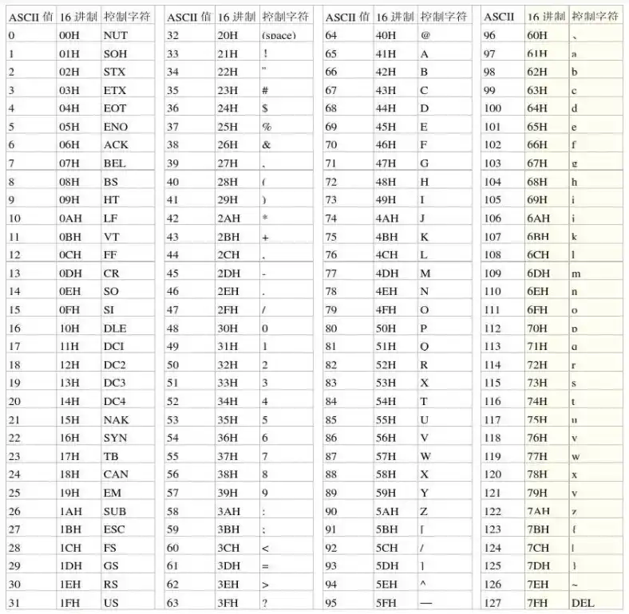
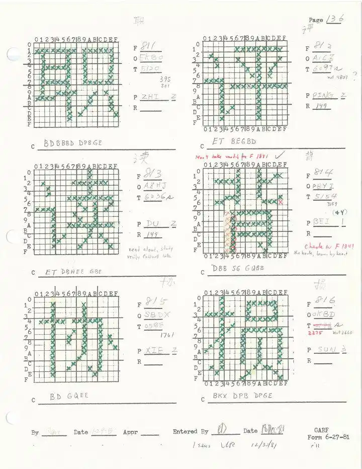
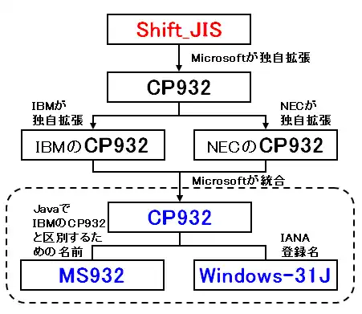
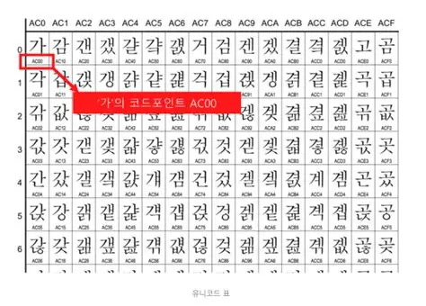
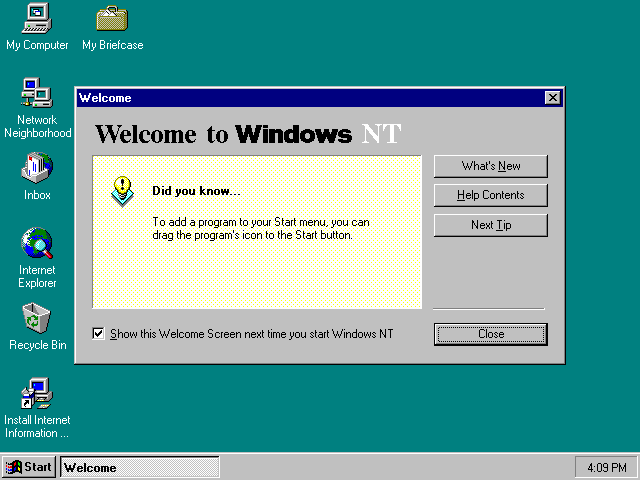
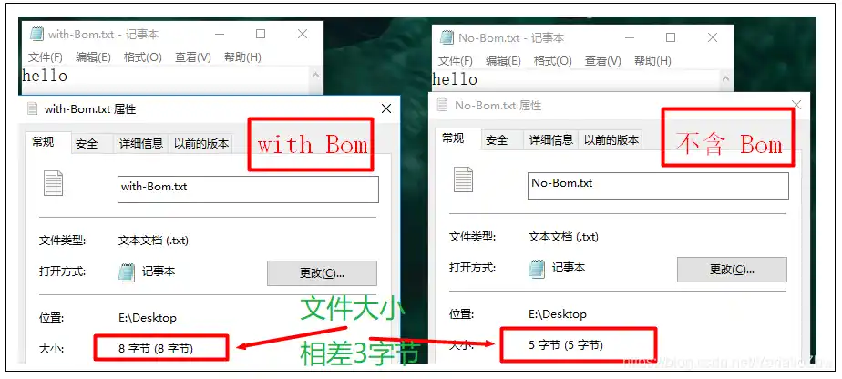
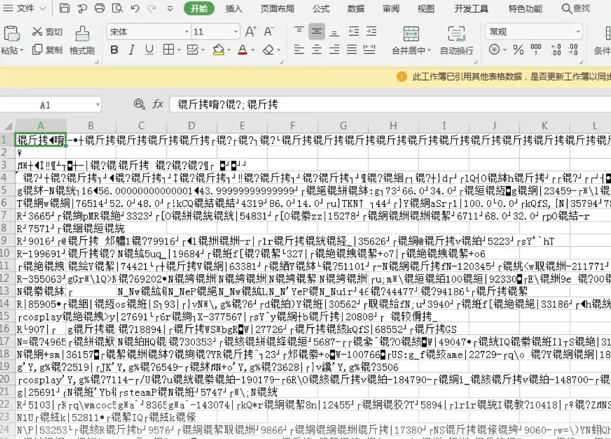
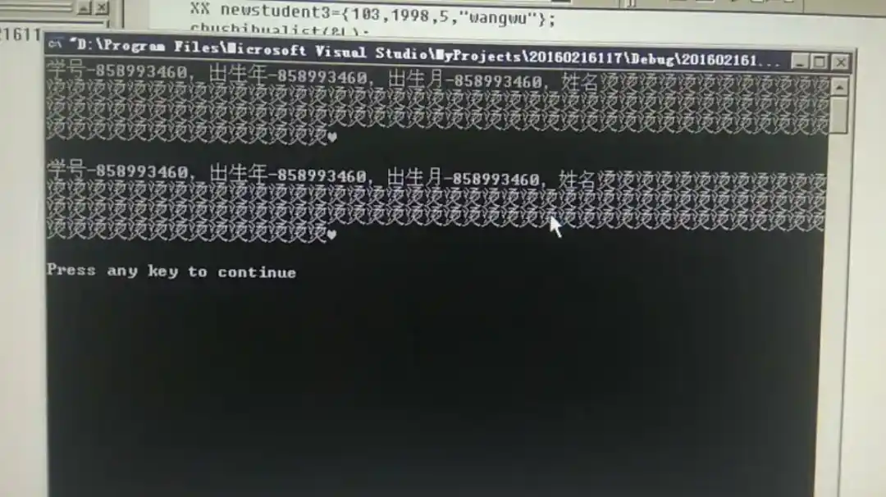
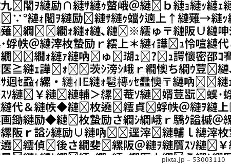

互联网的故纸堆里流传着两串神秘代码：

`锟斤拷锟斤拷锟斤拷`

`烫烫烫烫烫烫`

如果你看到这两串字笑了，说明你亲手跟编码问题搏斗过。如果你没笑，那恭喜你——要么你太年轻还没被社会毒打过，要么你用的编辑器自动帮你擦了屁股而你浑然不知。

这两串乱码，是字符编码战争留给现代程序员的墓碑。"锟斤拷"是 GBK 编码的文件被当成 Latin-1 读取后，再转回 GBK 时产生的永久性错乱；而"烫烫烫"是 VC++ 的 debug 模式在未初始化堆内存里填的 0xCC，被当作汉字解码后的结果。前者是编码猜错的恶果，后者是内存越界的警报——两行乱码，两个时代的噩梦。

一个 `.txt` 文件，本质上就是一堆字节。它没有告诉你它用的是什么编码，没有头部，没有元数据，没有自我声明。它就这么赤裸裸地把一堆二进制数甩给你，然后指望你能猜对它的心思。

你在中文 Windows 下存一个"联通"两个字，关掉再打开，变成了两个乱码符号。你把一个日文 Shift-JIS 的文本文件拖进英文系统，满屏都是问号和菱形。你从某个老系统里导出一份 CSV，用 Excel 打开，中文全成了上面那六个字。

你以为是电脑坏了？不，电脑没坏。它只是太老实了——它用你告诉它的方式去解读那堆字节，而你可能告诉错了。

这个故事从 1960 年代讲起，一直讲到 2024 年还有人因为编码问题炸毛。它涉及美国政府、IBM、日本通产省、中国国家标准局、Unix 极客、微软的桌面霸权，以及一个在酒吧里吃了个汉堡就改变世界命运的细节。

准备好了？我们从头说。

---

## 一、ASCII：美国人的"够用就好"

1960 年代初，美国的计算机产业面临一个尴尬的问题：每家厂商都有自己的字符编码标准，互不兼容。IBM 用 EBCDIC，其他公司用各种 6 位、7 位的私有编码。数据在不同机器之间交换，基本靠吼——或者靠人工重新打孔。

美国标准协会（ASA，后来的 ANSI）决定做点什么。1963 年 6 月 17 日，他们发布了一个叫 **ASCII** 的标准——American Standard Code for Information Interchange。名字很直白：美国信息交换标准码。注意"美国"这两个字。



ASCII 用 7 位二进制数表示一个字符，一共 128 个位置。0-31 是控制字符（回车、换行、响铃之类的），32 是空格，33-126 是可见字符——大小写英文字母、数字、标点符号。127 是 DEL。

7 位。不是 8 位。

这个决定有历史和技术的双重原因：ASCII 脱胎于 5 位博多码（Baudot code）和电传打字机的传统，7 位是当时电传设备的标准；同时，1960 年代的存储硬件确实昂贵，省一位是一位。而且 ASCII 的设计者们面对的主要问题是"美国本土的计算机之间怎么交换数据"，他们没怎么考虑法语里的 é、德语里的 ü，更没考虑汉字。

ASCII 的设计团队里有个关键人物叫 **Bob Bemer**，他在 IBM 工作，是 ASCII 标准的主要推动者之一。他发明了转义序列（escape sequence）和注册表（registry）概念，为 ASCII 未来的扩展埋下了伏笔。这个决定在当时被认为过度设计，但后来拯救了无数人的职业生涯。


ASCII 在 1967 年发布了修订版（USASI X3.4-1967），也就是我们今天熟知的 ASCII 标准。1968 年 3 月 11 日，美国总统林登·约翰逊要求所有联邦政府的计算机系统必须使用 ASCII。这是美国政府第一次，也可能是最后一次，在字符编码问题上行使中央集权。

然而 ASCII 只够美国人用。其他国家的计算机用户看着自己键盘上多出来的那些按键，陷入了沉思。

**ASCII 的 7 位设计，是它成功的理由，也是它失败的伏笔。** 成功是因为它简单到没有任何争议；失败是因为它根本解决不了非英语世界的问题。

---

## 二、第 8 位的战争：OEM 字符集与 Code Page

8 位字节是计算机的基本存储单位。ASCII 只用了 7 位，还剩 1 位——这就好比一套三居室你只住了一间，剩下的空间自然有人要往里塞东西。

1980 年代初，IBM PC 横空出世。IBM 的工程师们面临一个问题：ASCII 只有 128 个字符，但欧洲各国都需要自己的特殊字符。解决方案简单粗暴：**把 ASCII 的 7 位扩展到 8 位，高 128 个位置（128-255）留给各国自己定义。**

这就是所谓的"OEM 字符集"或"扩展 ASCII"。

IBM 给不同的国家/地区定义了不同的代码页（Code Page）。CP437 是美国的原始 OEM 字符集，里面包含了一些画框用的线框符号（就是你在 DOS 窗口里看到的那些 ┌ ┐ └ ┘）。CP850 是拉丁语系国家的，CP852 是东欧的，CP855 是西里尔字母的，CP857 是土耳其的，CP862 是希伯来文的，CP866 是俄语的——每一个代码页都把 128-255 这段空间塞满了各自需要的字符。

这个方案在 1980 年代看起来是合理的：内存贵，磁盘贵，网络带宽几乎为零。让每个字节都承载信息，是工程师的本能。而且当时大多数用户只在自己的国家内使用电脑，跨语言交流的需求没那么强烈。

但问题来了：**一段文本在哪个代码页下保存，就必须在同一个代码页下打开。**

你在中文 Windows 下用 CP936（GBK）存了一个文本文件，然后用邮件发给了法国的同事。他的 Windows 默认代码页是 CP850。他一打开——满屏的字符都变成了他看不懂的东西，甚至原本的英文字符都可能被错误解析。

这就是所谓的 **Mojibake**（日文"文字化け"，意为乱码），在中文世界里有个更亲切的名字：**乱码**。

这个阶段还没有统一的解决方案。用户只能靠猜——这个文件是哪个国家的人发给我的？我用对应的代码页打开试试。"换编码打开"这个操作，从 1980 年代一直折磨用户到今天。

**说白了，乱码不是 bug，是历史。** 它是一段文本在不同编码体系之间旅行时留下的伤痕。

---

## 三、东方的困境：汉字怎么塞进去？

如果说欧洲各国还能在 8 位空间里艰难地塞下自己的字母，那中日韩三国面对的问题就完全是另一个量级了。

常用汉字有多少？3500 个（中国国家标准 GB 2312 一级汉字）。日文的"当用汉字"也有 1945 个。韩文谚字理论上可以组合出上万个音节。

8 位，256 个位置，连零头都不够。

### 中国的方案：GB 2312



1980 年，中国国家标准总局发布了 **GB 2312-80**——《信息交换用汉字编码字符集·基本集》。这套编码采用双字节方案：每个汉字用两个字节表示，每个字节的高位都是 1（即值大于 127），这样就能与 ASCII 区分开。

GB 2312 收录了 6763 个汉字，分成两级：一级汉字 3755 个（按拼音排序），二级汉字 3008 个（按部首排序）。这 6763 个字覆盖了现代汉语 99% 以上的使用场景。

设计思路很清晰：ASCII 字符（0-127）保持原样，双字节字符（两个高位为 1 的字节）表示汉字。一个 ASCII 字节和一个汉字字节不会混淆，因为 ASCII 字节的高位是 0。

但 GB 2312 只覆盖了简体中文。台湾用的 Big5 编码收录了 13053 个繁体字，与 GB 2312 完全不兼容。一份简体中文的文本文件，用 Big5 打开，就是天书。

后来 GB 2312 扩展成了 GBK（1995 年），再扩展成了 GB 18030（2000 年，2001 年强制执行），增加了对全部 Unicode 字符的支持。但 GB 2312 作为基础，影响了中国计算机行业二十多年。

### 日本的方案：Shift-JIS

日本的处境比中国更复杂。日文有三种文字系统：汉字（表意）、平假名（表音）、片假名（表音）。再加上西文字母和数字，编码设计必须同时兼容所有这些东西。

1978 年，日本工业标准协会发布了 JIS X 0208（最初称为 JIS C 6226:1978），定义了包含 6355 个汉字的字符集。但 JIS X 0208 本身只是一个字符集，不是编码方案——它只定义了每个字符的编号，没有规定怎么存进计算机。

1982 年，一家名为 ASCII Corporation 的日本公司与微软合作，发明了一种将 JIS X 0208 字符集编码到字节流中的方案。次年，ASCII、三菱、日本 IBM 和微软达成协议，共同采用这套方案作为个人计算机上日文文本的内部表示标准。因为编码过程中字符的数值被“移位”（shifted）了，这套方案得名 Shift-JIS。

Shift-JIS 的设计思路是：单字节字符（0x00-0x7F）与 ASCII 基本兼容，双字节字符用来表示 JIS X 0208 中的汉字和全角假名。一个关键的设计目标是保持与 JIS X 0201（半角片假名标准）的向后兼容——半角片假名仍然用单字节表示。

看上去很巧妙，对吧？但它埋下了一个著名的隐患。

Shift-JIS 的前 128 个字符（0x00-0x7F）与 ASCII 几乎完全匹配——之所以说“几乎”，是因为有两个例外：0x5C 显示为日元符号（¥）而不是反斜杠（\），0x7E 显示为上划线（‾）而不是波浪号（~）。

这个设计源于一个朴素的决策：ASCII 中的反斜杠在日文环境中几乎用不到，而日元符号却是刚需。于是日本工程师干脆把 0x5C 这个码位重新定义成了日元符号。这个决策在当时看起来合理，却成了后来无数问题的源头。

问题出在双字节字符的第二字节上。Shift-JIS 的双字节字符，第二个字节的取值范围覆盖了 0x40-0x7E——也就是说，一个日文字符的第二字节可能是 0x5C。比如汉字“申”（U+7533）在 Shift-JIS 中的编码是 0x90 0x5C——第二个字节恰好是 0x5C。

如果一个不懂编码的程序试图从字符串中“剔除反斜杠”，它看到 0x5C 就动手删掉——结果“申”字被拦腰截断，变成了乱码。这类问题在日本被戏称为 “だめ文字” （不行字符），困扰了日本程序员十几年。文件路径、数据库查询、源代码解析——任何一个环节如果对 0x5C 做了“反斜杠假设”，就可能把日文文本撕成碎片。

1997 年，JIS X 0208 在附录 1 中正式将 Shift-JIS 标准化，明确其字符集为 JIS X 0201 + JIS X 0208:1997。与此同时，微软开发了自己的 Shift-JIS 变体——CP932（Windows-31J） ，在其中加入了 NEC 特殊字符和 IBM 扩展字符。苹果、DEC、NEC 等公司也各自推出了互不兼容的 Shift-JIS 变体。一台电脑上保存的日文文本，换一台电脑打开就可能面目全非——直到 2000 年代，日本的大多数网页仍在用 Shift-JIS 编码，而手机则使用各种 EUC 变体。



Shift-JIS 的设计反映了一个时代困境：你必须在兼容 ASCII 和容纳更多字符之间做选择，而任何选择都有代价。日本工程师选择了兼容，却把 0x5C 这个码位变成了一个定时炸弹——它既是日元符号，又是反斜杠，还是日文字符的第二字节。同一个 0x5C，在不同语境下扮演三种角色，而计算机根本不知道你此刻想要的是哪一个。

### 韩国的方案：EUC-KR

韩国的情况稍微好一些。韩文（谚文）是表音文字，理论上可以用字母组合出所有音节。EUC-KR 编码在 1991 年被标准化，同样采用双字节方案。



但韩国的问题在于：一份文本文件里可能混合了韩文、汉字（韩语中的汉字词）和英文。EUC-KR 的编码设计导致了一个尴尬的局面——韩文和汉字可以共存，但解码器需要足够聪明才能区分它们。

### 台湾的方案：Big5

台湾在 1984 年推出了 Big5 编码，支持 13053 个繁体汉字。Big5 的设计也是双字节，但与 GB 2312 完全不兼容。

大陆和台湾之间交换文本文件，在 1990 年代是一个噩梦。你发一个 `.txt` 文件过去，对方打开全是乱码。唯一的解决方案是：双方约定一个编码，或者用专门的转码工具。

**这就是 1990 年代东亚计算机用户的日常。** 你的电脑里可能同时装着 GB 2312、Big5、Shift-JIS、EUC-KR 四种编码的文本文件，每个文件都需要手动选择正确的编码才能打开。如果你猜错了——"锟斤拷"就来了。

---

## 四、Unicode 的野心：一个编码统治一切

1987 年，Xerox 的 **Joe Becker** 和 Apple 的 **Lee Collins** 开始构思一个大胆的方案：给全人类所有的文字系统里的每一个字符，分配一个全球唯一的编号。

这个方案后来被称为 **Unicode**。


Unicode 的核心思想并不复杂：不再让不同的国家和地区各自为政，而是建立一个统一的字符集。汉字就是汉字，不管它在简体中文、繁体中文、日文还是韩文中，只要字形相同（或足够相近），就给同一个编号。

1991 年 10 月，Unicode 1.0.0 正式发布。最初只包含了 7161 个字符（主要是 CJK 统一汉字和西文字母）。经过三十多年的发展，Unicode 15.0（2022 年发布）已经包含了超过 14.9 万个字符，涵盖了 161 种文字系统。

Unicode 的愿景很美好，但落地时遇到了一个现实问题：**存储空间。**

Unicode 1.0.0 设计成每个字符固定使用 2 字节（16 位），即 UCS-2。这意味着一个纯英文的文本文件，用 Unicode 存储会比用 ASCII 存储大一倍。在 1991 年，硬盘容量还在以 MB 为单位计算，大一倍是不可接受的。

于是 Unicode 社区内部出现了分裂：

- **微软阵营**：选择了 UCS-2（后来升级为 UTF-16），因为 Windows NT 的设计基于 16 位字符。
- **Unix/互联网阵营**：需要一个更节省空间、同时兼容 ASCII 的方案。

第二个阵营的解决方案，来自两个人在 1992 年某天晚上的一次头脑风暴。

---

## 五、一个晚上的作品：UTF-8 的诞生

1992 年 9 月 2 日的晚上，Plan 9 操作系统的开发者 Ken Thompson 和 Rob Pike 在 New Jersey 的一家晚餐店（diner）里，用了一个晚上设计出了 UTF-8。


当时 Unicode 已经发布，但 Plan 9 团队需要一个高效的编码方案。他们讨论了几种可能性，最后 Thompson 随手拿起桌上的餐垫（placemat），在背面画出了 UTF-8 的核心设计。这个在餐垫上诞生的编码方案，后来统治了整个互联网。

UTF-8 的精妙之处在于：

1. **兼容 ASCII**：0-127 的字节保持不变。这意味着所有 ASCII 文本都是合法的 UTF-8。
2. **自同步**：每个字符的第一个字节就能告诉你这个字符占几个字节。即使从字节流的中间开始读取，也能正确恢复。
3. **没有字节序问题**：不像 UTF-16 需要 BOM（Byte Order Mark）来区分大头和小头。
4. **紧凑**：对于英文文本，UTF-8 的存储大小与 ASCII 完全相同。

UTF-8 的编码规则：

- 1 字节：0xxxxxxx（ASCII，128 个字符）
- 2 字节：110xxxxx 10xxxxxx（1920 个字符，主要是拉丁语系字母和中东文字）
- 3 字节：1110xxxx 10xxxxxx 10xxxxxx（61440 个字符，包括 CJK 汉字）
- 4 字节：11110xxx 10xxxxxx 10xxxxxx 10xxxxxx（1048576 个字符，包括 emoji 和生僻字）

这个设计在今天看来是天才的，但在 1992 年，它只是 Plan 9 团队的一个内部工具。

UTF-8 的推广经历了一个漫长的过程：

- **1993 年**：Plan 9 开始使用 UTF-8。
- **1996 年**：UTF-8 被纳入 Unicode 标准的一部分（Unicode 2.0）。
- **2003 年**：RFC 3629 正式将 UTF-8 标准化。
- **2008 年**：Google 报告互联网上 UTF-8 的占比首次超过其他编码。
- **2020 年代**：超过 98% 的网页使用 UTF-8。

但有一个重要的角色一直对 UTF-8 不太热情：**微软**。

---

## 六、Windows 的 BOM 战争



Windows NT 从 1993 年发布起就原生支持 Unicode——但它用的是 **UCS-2**（后来演进为 UTF-16），不是 UTF-8。

这在当时是合理的选择：Windows NT 的核心是 16 位架构，UTF-16 可以原生地表示所有 BMP（基本多语言平面）字符，不需要像 UTF-8 那样做字节级别的编码转换。

但问题出在 **BOM（Byte Order Mark）** 上。

BOM 最初是为 UTF-16 设计的：UTF-16 在不同字节序的 CPU 上存储方式不同。大端序（Big Endian）先存高位字节，小端序（Little Endian）先存低位字节。为了区分，Unicode 标准规定在文件开头加一个 BOM 字符（U+FEFF），解码器读取 BOM 后就知道该用哪种字节序。

Windows 的记事本（Notepad）在保存 UTF-8 文件时，**也加了 BOM**——虽然 UTF-8 根本没有字节序问题。

这个 BOM 是三个字节：0xEF 0xBB 0xBF。在 UTF-8 解码器看来，它只是一个合法的（但不可见的）零宽空格。但在 ASCII 解码器看来，它是三个奇怪的字符。

于是经典场景出现了：

1. 你在 Windows 上用记事本写了一个文本，保存为 UTF-8（记事本的默认操作）。
2. 你把这个文件上传到 Linux 服务器。
3. 你在 Linux 上用 `cat` 查看——文件开头多了一行空白，或者显示为 ``。

这就是著名的 **UTF-8 BOM 问题**。它不是一个 bug，它是一个历史遗留设计，但它在 2024 年依然能浪费开发者半天时间。



**为什么 Windows 记事本要坚持加 BOM？** 原因很简单：为了让记事本能识别自己保存的文件。记事本打开一个文本文件时，会先检查文件开头有没有 BOM。如果有，就用对应的编码打开；如果没有，就用系统默认编码（在中文 Windows 上是 GBK）打开。这个逻辑在 Windows 95/98 年代是合理的，但在全球化的互联网时代就成了灾难。

微软后来在 Windows 10 (1903) 的记事本里做了改进：默认保存为不带 BOM 的 UTF-8。但数以亿计的旧文件依然带着 BOM 在互联网上流传。

**BOM 战争打了三十年，直到今天还没有完全结束。**

---

## 七、乱码的众生相：锟斤拷、烫烫烫、������

每个有一定资历的中国程序员，都见过一些"经典乱码"。

### "锟斤拷"的来历



"锟斤拷"是字符转换失败后产生连锁反应的经典产物，常见于 GBK/GB 18030 环境错误地解码了本该是 UTF-8 编码的字节流。

具体机制是这样的：

- 当一个 Unicode 字符在转换时无法被目标编码（如 GBK）表示，会被系统替换为占位符 U+FFFD（�）。
- 这个 � 在 UTF-8 编码中对应三个字节：0xEF 0xBF 0xBD。
- 如果这段 UTF-8 字节流随后被某个软件错误地当作 GBK 来解码，连续的 0xEF 0xBF 0xBD 字节序列会被 GBK 解码器解析为对应的汉字——“锟”（0xEF 0xBF）、“斤”（0xBD 0xEF）、“拷”（0xBF 0xBD）等，从而在屏幕上呈现出连绵不绝的“锟斤拷”。

这段文字在中国互联网上已经成了"编码错误"的代名词——就像西方程序员看到"’"就知道是 UTF-8 被当成 Latin-1 解码了一样。

### "烫烫烫"的来历



"烫烫烫"是 **Visual Studio 的调试堆栈填充** 导致的经典画面。

在 Visual C++ 的 Debug 模式下，编译器会用 0xCC 填充未初始化的栈内存。0xCC 在 GB 2312/GBK 编码中对应"烫"字。如果程序员忘记初始化局部变量，直接输出，就会在控制台看到满屏的"烫烫烫"。

类似的，用 0xCD 填充堆内存，对应"屯"字；0xDD 对应"淖"字。于是就有了"屯屯屯"和"淖淖淖"——不过"烫烫烫"因为视觉冲击力最强，成了最出名的那个。

这个现象在中文程序员圈子里成了一个梗：看到"烫烫烫"，就知道某人的代码里有未初始化的变量。

### 日本人的经典乱码



日本的经典乱码叫" **文字化け**"（Mojibake），字面意思就是"文字变身"。

最经典的一个例子：Shift-JIS 编码的文本被 EUC-JP 解码时，原本的意思完全变成了另一套字符。比如"日本語"（日本语）在 Shift-JIS 里是 0x93FA 0x967B 0x8CEA，被 EUC-JP 解码后变成了"ﾓｷ・ﾁｹ・"之类的无意义字符。

还有一个著名的编码问题：在 Shift-JIS 环境下，文件路径中的反斜杠（0x5C）与日文字符的第二字节冲突，导致包含特定汉字（如“申”“能”等）的文件名在某些系统中被错误截断。这个问题被日本程序员戏称为“だめ文字”（不行字符），困扰了日本计算机行业多年。

### 欧洲人的经典乱码

欧洲最常见的乱码是：**UTF-8 编码的文本被当作 Latin-1 或 Windows-1252 解码**。

比如，UTF-8 中的左花引号"（U+201C，编码为 0xE2 0x80 0x9C）被当作 Latin-1 解码后，显示为"“"三个字符。这个模式太常见了，以至于西方开发者一看到"â€"就知道发生了什么。

反过来，Latin-1 编码的文本被当作 UTF-8 解码，结果就是各种" � "（U+FFFD，替换字符）。

---

## 八、编码检测：一场永无止境的猜谜游戏

既然一个 `.txt` 文件不声明自己的编码，那计算机怎么知道该用哪种编码打开它？

答案是：**猜**。

现代文本编辑器都内置了编码检测功能。它们读取文件的前几个字节，根据字节模式推断编码。常用的启发式规则包括：

1. **检查 BOM**：如果文件开头是 0xEF 0xBB 0xBF，很可能是 UTF-8。如果是 0xFF 0xFE，是 UTF-16 LE。如果是 0xFE 0xFF，是 UTF-16 BE。
2. **检查 ASCII 兼容性**：如果所有字节都在 0x00-0x7F 范围内，那它是纯 ASCII——任何编码都能正确解读。
3. **统计字节分布**：UTF-8 有固定的字节模式规则，如果一个文件违反了这些规则，就不可能是 UTF-8。
4. **使用机器学习**：一些现代编辑器（如 VS Code）使用统计模型来推断编码——分析字节序列的频率分布，与已知编码的特征进行匹配。

但猜总是会猜错的。最经典的一个翻车案例：

在 Windows 98 年代，你用记事本新建一个文件，输入"联通"两个字，保存，关掉，再打开——"联通"变成了两个乱码字符。

因为GBK编码的 "联通"（C1 AA CD A8）在当时的编码检测器看来，可能被误判为某种 UTF-8 编码（尽管它并非合法的 UTF-8 序列），导致记事本用 UTF-8 去解码，从而产生乱码。

这个 bug 在 Windows 2000 以后被修复了（检测逻辑更加严格），但"联通乱码"作为一个经典案例，至今仍在编码教程中被反复提及。

---

## 九、Unix 的解决方案：file 命令与 magic number

在 Unix/Linux 的世界里，`.txt` 这个扩展名几乎没有任何意义。Unix 的设计哲学是**不信任扩展名，信任文件内容**。

1973 年，Unix Research Version 4 里诞生了 `file` 命令。它的工作原理是读取文件开头的几个字节（称为 magic number 或魔数），与一个已知文件类型的签名数据库进行比对。

比如：

- ELF 可执行文件开头是 0x7F 0x45 0x4C 0x46（即 `\x7FELF`）
- PNG 图片开头是 0x89 0x50 0x4E 0x47 0x0D 0x0A 0x1A 0x0A
- PDF 开头是 `%PDF`
- 一个纯文本文件——没有魔数。

这就是 `.txt` 的尴尬之处：**纯文本文件没有魔数。** `file` 命令只能通过排除法来判断：如果文件不是二进制、不是图片、不是压缩包、不是任何已知格式，那它"可能"是文本。具体是什么编码？`file` 会尝试检测，但它的检测能力远不如专门的编码检测工具。

在 Unix 上，处理文本编码的标准工具是：

```bash
# 检测编码
file -i somefile.txt

# 转换编码
iconv -f GB2312 -t UTF-8 input.txt -o output.txt

# 或者使用更强大的 enca/uchardet
enca -L zh input.txt
uchardet input.txt
```

但即使有了这些工具，编码问题在 Unix 世界依然是一个持续的痛点。Linux 的发行版长期默认使用 UTF-8（大多数发行版从 2000 年代中期开始切换），但旧文件、嵌入式系统和某些数据库仍然使用其他编码。

---

## 十、2024 年了，为什么还有乱码？

从 ASCII 到 Unicode，从 GB 2312 到 UTF-8，编码标准已经发展了六十年。按理说这问题早该解决了。但现实是：**2024 年了，你依然可能收到一份乱码的 `.txt` 文件。**

原因有几个：

### 1. 历史遗留文件

1990 年代和 2000 年代初的海量文本文件，用的是各种地区编码。这些文件不会自动升级到 UTF-8。它们就是那样——GB 2312、Shift-JIS、Big5、EUC-KR——静静地躺在硬盘里，等待一个知道如何打开它们的人。

### 2. 默认编码的惯性

直到 2019 年 5 月 Windows 10 Version 1903 版本更新之前，Windows 记事本的默认保存编码一直是 ANSI（在中文 Windows 上是 GBK）。这意味着大量在 Windows 上产生的文本文件是 GBK 编码，而不是 UTF-8。虽然 Windows 10 Version 1903 以后默认改成了 UTF-8，但存量用户和存量文件是巨大的。

### 3. 嵌入式系统和旧软件

嵌入式设备、工业控制系统、旧版数据库——这些系统往往使用固定的编码，而且不会轻易升级。一个从 PLC（可编程逻辑控制器）导出的日志文件是 GB 2312 编码的，你拿到电脑上一看，就是乱码。

### 4. BOM 的幽灵

Windows 记事本保存的 UTF-8 文件带有 BOM，Linux 上的工具不认识 BOM。这个冲突每天还在发生。

### 5. 人工输入错误

用户手动"另存为"时选错了编码，或者上传文件时服务器端编码声明不对——这些人为因素永远无法消除。

### 6. `.txt` 本身不携带编码信息

这是最根本的原因。一个 `.txt` 文件没有头部，没有元数据，没有声明。它无法告诉你"我是 UTF-8"还是"我是 GBK"。编码信息必须由外部提供——要么靠约定，要么靠检测，要么靠猜。

---

## 十一、`.txt` 的谦卑与傲慢

回到最开始的问题：为什么一个 `.txt` 文件能这么简单？

答案很反直觉：**.txt 的简单，恰恰是因为它把复杂度甩给了别人。**

`.txt` 文件自己不带编码信息，于是编码检测的逻辑就落在了编辑器和操作系统身上。`.txt` 文件不规定字体，于是字体渲染就落在了系统身上。`.txt` 文件不规定换行方式（是 `\r\n` 还是 `\n`？），于是换行处理就落在了应用程序身上。

这种设计有一个专业术语：**"什么都不承诺"**。

在 1960 年代，这是务实的——文件系统能提供的元数据就那么点，把编码信息写进文件本身会浪费宝贵的存储空间。在 2026 年，这是历史遗留——我们有足够的空间存储元数据，但 `.txt` 的格式已经固化到无法改变。

**.txt 的谦卑在于它什么都愿意装，.txt 的傲慢在于它什么都不告诉你。**
