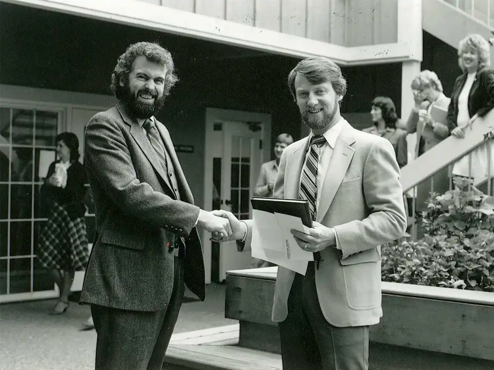
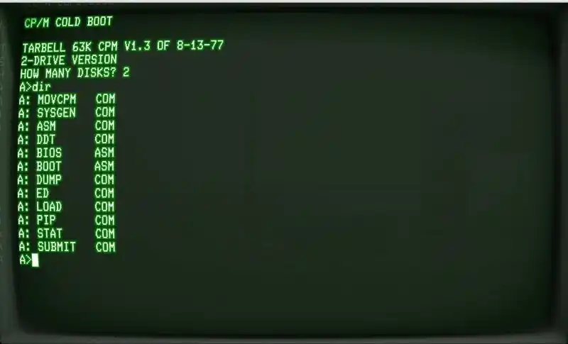
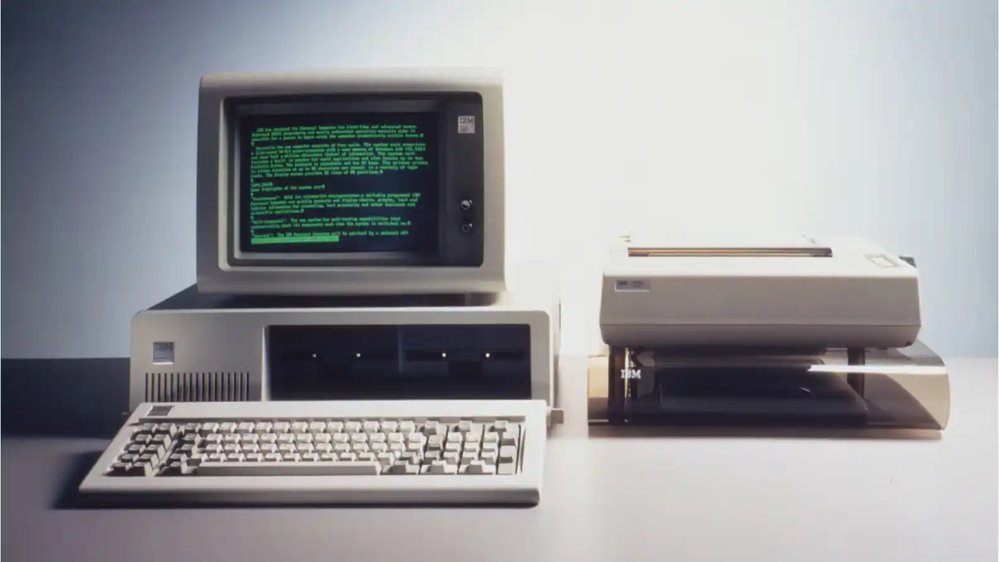
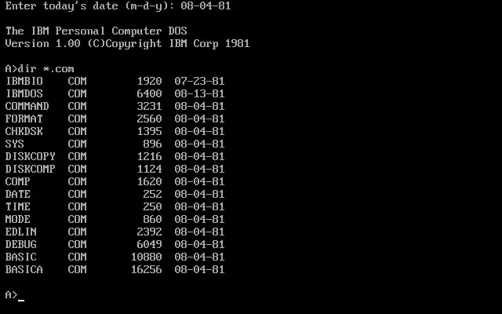
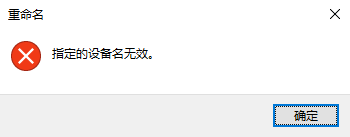
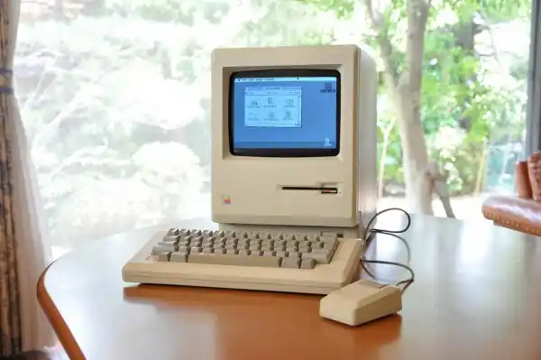
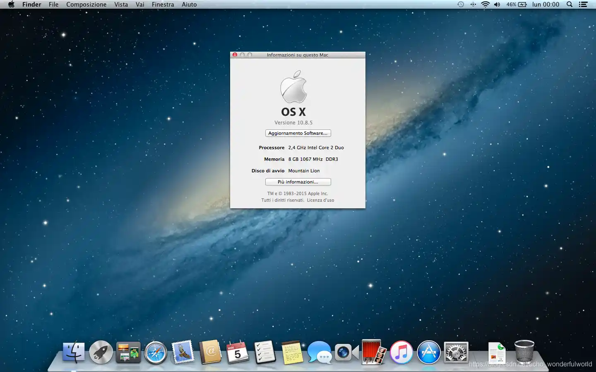
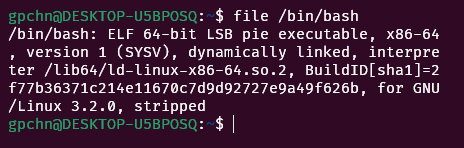

诸位好，欢迎来到全新专栏“点号之后”。本专栏不聊政坛风云，不侃国际局势，咱们聊点硬核的——那些文件名的“小尾巴”，从 `.tmp` 到 `.exe`，从 `.jpg` 到 `.pdf`，它们从哪儿来，又将往哪儿去。

今天是开篇，咱们不急着讲具体某个扩展名的故事，先来盘一盘这玩意儿到底是怎么诞生的，以及围绕这三个字符的扩展名，各路神仙打了多少年混战。

好，开场白完毕，闲言少叙，书归正传。

---

## 一、“文件”这东西，是怎么冒出来的？

在讲扩展名之前，咱们得先搞清楚一个更加基础的概念：什么是“文件”？

今天你跟任何一个用电脑的人说“文件”二字，他都会觉得这玩意儿天经地义。但在上世纪五六十年代，你在一台大型机前跟操作员说“我有一个文件”，人家可能反手给你一大耳刮子——那时候压根儿没这概念。

当时的主流计算机，比如 IBM 的主机系列，使用的是“记录”系统。什么叫“记录”？说人话就是——数据被存成一块一块的，每块有固定的格式，长度、字段都是提前定死的。你想存一篇随便写的文章进去？不行，人家机器不认。你想临时改个文件的内容？对不起，你得先把整个磁带重写一遍。

那种日子，简直是程序员的噩梦。

改变这一切的是一个叫 **汤姆·基尔本（Tom Kilburn）** 的人。这位英国曼彻斯特大学的计算机科学家，在二战期间搞过雷达，战后转向了计算机研究。1951年，他参与研发的 Manchester Mark I 计算机引入了一个重要创新：将数据存储在磁鼓上，并且允许程序创建和操作“命名”的数据集合——这就是最早的“文件”。随后在 1961 年，麻省理工学院的“兼容分时系统”（CTSS）进一步提出了“文件系统”的概念，用户不再需要跟整卷磁带或者一整摞打孔卡片打交道，而是可以直接操作一个个独立的、命名过的数据“文件”。

今天咱们每个人电脑里堆成山的 `.doc`、`.jpg`、`.mp4`，其源头都能追溯到那个年代。

更关键的是，CTSS 的创造者们不仅想出了“文件”这个概念，还想出了一个相当疯狂的设计——允许用户自己给文件起名字。这听起来好像理所当然，但在当时，这简直是“离经叛道”。要知道，此前的程序员给数据起名字，基本就是 `DATA001`、`DATA002` 这种编号模式，跟监狱里给犯人编号似的，毫无人文关怀。

---

## 二、从 `DAT001` 到 `LETTER.TXT`——文件名里的那个“点”来了

有了文件命名权，问题就来了：怎么让操作系统知道这个文件是干什么用的？

最早的办法，土得掉渣——看文件名里的“点”。具体来说是数字设备公司（DEC，就是生产 PDP 电脑的那家，详见 [从 1 bit 到 1 YB：番外篇](../../从-1-bit-到-1-YB/番外/)）的操作系统第一个搞出了“扩展名”的雏形。它们想出来的办法极其简单粗暴：把文件名分成“主体”和“尾巴”，主体说明文件名，尾巴说明类型。比如，你有个文件叫 `REPORT.TXT`，`REPORT` 是名字，`TXT` 说明这是个文本文件。

但你猜这个尾巴是几个字符？

三个。对，固定的三个字符长。

为什么是三个？原因简直让人哭笑不得：因为早期的文件系统在存储文件目录信息时，在磁盘上给文件主体预留了 6 到 9 个字符的空间，给扩展名预留了 3 个字符的空间。就是这么“凑巧”，三个字符成了事实上的标准。

DEC 的这个设计影响深远，但它还不是今天 8.3 格式的祖师爷。

---

## 三、与 8.3 格式的正本清源

说到扩展名的真正成型，就绕不开一个关键人物——**加里·基尔代尔（Gary Kildall）**。

*（右一）*

可能今天很多年轻人没听说过这个名字。那我告诉你，此人当年在计算机界的地位，好比今天互联网圈里的马斯克加扎克伯格再乘以一个比尔·盖茨——没错，比尔·盖茨本人都得管他叫一声“前辈”。

基尔代尔 1942 年生于西雅图，是个典型的“别人家的孩子”。他最早创造出了微型计算机用的磁盘操作系统（DOS），为后来所有 PC 软件开发商定义了游戏规则，甚至图形用户界面他也掺和了一脚，开发过 “Dr Logo” 计算机语言。但是，基尔代尔一生最大的贡献，是在 1973 年捣鼓出了一个名叫 CP/M 的操作系统。加里·基尔代尔，生于西雅图，长于西雅图，后来却没有得到西雅图同胞比尔·盖茨的那种泼天富贵，原因咱们后面会讲到。

CP/M 的诞生，可以说是微型计算机历史上的一件大事。在此之前，一台新电脑就是一块废铁，没有标准化的软件运行环境，每个厂商都自说自话。CP/M 出现之后，软件开发者终于有了一个可以“写一次，跑遍所有 CP/M 机器”的平台。

也就是在 CP/M 中，基尔代尔做了一件看似不起眼但影响深远的事情——他制定了 **8.3 文件名命名规则**。

什么叫 8.3？就是文件名主体最多 8 个字符，扩展名最多 3 个字符，中间用点号隔开。按照这个规则，一个完整的 8.3 文件名，包括主体、点和扩展名，总共撑死了 12 个字符。

这规定咋一听是不是特别憋屈？你的《指环王：王者归来》电影文件叫 `The.Lord.of.the.Rings.The.Return.of.the.King.Extended.Edition.2003.2160p.BluRay.HEVC.DTS-HD.MA.7.1-HDRemuxGroup.mkv`，不好意思，在那时候得改成 `LOTRROTK.MKV` 之类的东西，看着跟拆盲盒猜谜似的（实际上那个时候也不会有电影文件）。但你别抱怨，在当时的条件下，这算天大的进步了。CP/M 的文件目录条目在磁盘上存储时就是这么设计的，操作系统直读那 12 个字节就能把所有信息解析出来，效率那叫一个高。

基尔代尔可能有预感，他这 8.3 规则日后会统治世界，但他绝对没想到会以什么方式统治。

---

## 四、微软的“拿来主义”与兼容性的幽灵

1980 年，一个戏剧性的事件发生了。

个人电脑巨鳄 IBM 正准备推出自己的第一台个人计算机（IBM PC，也就是后来无数PC的“老祖宗”）。IBM 在硬件上搞了个开放式架构——主板自己做，但处理器、内存、硬盘统统外包，显得很大气。但是软件呢？操作系统谁来搞定？IBM的人找到了一家正在做 BASIC 解释器的小公司，这家公司的名字你肯定听说过——**微软**。

微软创始人比尔·盖茨向 IBM 推荐了基尔代尔的 CP/M。IBM 兴冲冲跑去跟基尔代尔谈合作，结果这位老兄当天却因为要处理别的事务缺席了，留下律师跟 IBM 的人进行了“友好但富有建设性的”谈判。然后，就没有然后了。

趁着基尔代尔缺席的空档，盖茨在微软使了一招“偷天换日”。他没有自己去写一套操作系统，而是从西雅图电脑产品公司买了一个山寨版的 CP/M，叫作 86-DOS，然后把它包装成 MS-DOS 卖给了 IBM。

1981 年，IBM PC 带着 MS-DOS 横空出世。MS-DOS 不仅采用了 CP/M 的 8.3 文件命名规则，甚至连 CP/M 中那些奇奇怪怪的“虚拟文件名”也一并继承了下来——什么 COM1、COM2、LPT1、CON、AUX、PRN、NUL，都被原封不动地带到了 MS-DOS 里。这些所谓的虚拟文件名，在今天基本就是个摆设，但在当年，它们可是操作系统与外界设备（串口、并口、键盘屏幕等）沟通的方式。事实上，你可以在 Windows 系统上尝试给一个文件起名叫 `CON.TXT`，系统会直接报错。

此后的几十年里，微软的操作系统一路进化，从 Windows 1.0 到 Windows 95 到 Windows 10 到 Windows 11，每次升级都被迫带上 CP/M 时期定下的这些“历史包袱”。哪怕到了 Windows NT 时代，微软已经推出了全面支持长文件名、不再有 8.3 限制的 NTFS 文件系统，但出于向下兼容的需要——MS-DOS 程序要能在 Windows 里跑，Windows 程序也得能跟 MS-DOS 交流——8.3 兼容模式依然被保留了下了。

什么叫“技术债”？这就是技术债。1973 年 CP/M 敲下的那行代码，直到今天还在你的 Windows 电脑里以某种方式“阴魂不散”。

顺便插一嘴，MS-DOS 早期最知名的可执行文件扩展名 `.COM`，它的起源可以追溯到 DEC 在 1970 年代的操作系统。最初的 `.COM` 格式极其原始——整个文件就是一个纯粹的二进制代码块，没有头部、没有重定位信息、没有任何元数据。操作系统把它加载到内存中的固定地址后，直接跳到第一个字节就开始执行。为了做到这一点，`.COM` 文件的大小有严格限制——最大只能到 64KB，因为 8086 芯片的内存寻址能力就那么点。后来为了解决 `.COM` 格式容量太小、功能太弱的问题，才有了更复杂的 `.EXE` 格式，带有复杂的头部结构和重定位表。

有意思的是，在早期 MS-DOS 中，如果你把一个 `.EXE` 文件改名为 `.COM`，操作系统会傻乎乎地把 `.EXE` 的头部当作机器码来执行——在绝大多数情况下会直接崩溃。不过，随着微软为了兼容性而调整程序加载器逻辑，Windows 系统中的加载器会优先检查文件内容而非扩展名。因此，你可以亲自试试将 `.exe` 文件重命名为 `.com` ，它实际上能够正常运行。至于把 `.COM` 改名为 `.EXE`，加载器则会因为找不到 `MZ` 标志而拒绝执行。

---

## 五、Mac 如何“造反”——不跟你玩 8.3

就在 MS-DOS 靠着 8.3 格式横扫 PC 市场的时候，有一个人却对这种“祖宗之法”嗤之以鼻。

这个人叫 **史蒂夫·乔布斯**。

1984 年，苹果推出了改变世界的 Macintosh 电脑。麦金塔的操作系统带来了一个革命性的设计：它彻底抛弃了文件扩展名。

当然，乔布斯再牛，也不可能真让 Mac 的程序员去逐个识别每个文件的内容格式。所以 Mac 的设计师们想出了一个在当时看来相当高明的替代方案——**Type code 和 Creator code**。

Type code 是一个四个字符的代码，用来表示文件的格式。比如说，HyperCard 程序的堆栈文件（相当于你的数据存储文件）的 type code 就叫 STAK。程序的 type code 呢？叫 APPL。Creator code 则用来指明这个文件是由哪个程序创建的，当用户双击一个文件时，系统会根据文件的 creator code 来启动对应的应用程序。

大家注意，四个字节的 type/creator code 虽然也是固定长度的死数据，但它理论上能组合出 2^32 种可能。而 8.3 格式那三个字符算来算去去掉非法字符，撑死也就两三万种组合（而且还只能大写）。不比不知道，一比吓一跳，高下立判。

在 classic Mac OS 的时代，用户完全不用操心扩展名，甚至不用知道扩展名是什么东西。你下载一个图片，它在 finder 里显示的就是一张图的样子，你双击它，它就会自动在正确的程序里打开——不管你把它保存成什么名字。相比之下，在 Windows 里换个扩展名试试？系统立刻就不认了，要么打不开，要么用错误的方式打开。

你这个设计确实优雅，但是代价是什么呢？

代价是你无法跟别的“凡夫俗子”（尤其 Windows）互通。Type/creator code 这玩意儿存储在 HFS 文件系统的元数据（metadata）里。当一个 Mac 用户把一个文件通过网络发给 Windows 用户时，Windows 用户收到的只是一个没有任何扩展名的裸文件，完全懵逼：这是啥？我怎么打开？

到了 Mac OS X（也就是今天 macOS 的前身）时代，苹果也不得不向现实低头。从 2001 年开始，苹果的官方开发者指南就强制要求所有应用程序在保存文件时必须使用文件名扩展名。虽然苹果保留了 type/creator code 的支持，甚至直到今天，macOS 可能还能追溯到某些文件里残留的这些元数据，但主流方向已经很明确了——乔布斯当年那套“我不需要扩展名”的蓝图，最终还是向现实妥协了。

很多老 Mac 用户至今对此耿耿于怀，认为用扩展名是“技术倒退”，但这也没办法：互联网的浪潮浩浩荡荡，你 Mac 再牛也架不住全世界 Windows 用户多啊。

---

## 六、Unix 的另一种思路——“你管我叫啥都行”

故事讲到这里，你可能以为，这个世界上只有“狂信扩展名派”（Windows）和“坚决不用扩展名派”（老 Mac）两大阵营。

那你可就低估了第三条道路的智慧。

Unix 系的操统，走了一条跟两者都不同的路。Unix 的设计哲学是什么？**一切皆文件**。而且，Unix 从一开始就没有把“点”符号当作一个特殊的分隔符——点号在 Unix 里就是一个普普通通的字符，没什么特别意义。

换句话说，你完全可以给 Unix 上的一个文本文件起名叫 `abcdefg.html.png.zip.tar.gz`，让它套上七八层的虚假扩展名。或者，你也可以把它起名叫 `MyFile`。系统完全不关心你的扩展名是什么。你想要打开一个文件？你需要手动告诉系统用什么程序打开，系统不会自作聪明地根据扩展名去猜。至于权限管理，那是通过文件自身的属性来控制的，跟你叫啥名字没有半毛钱关系。

那问题来了：Unix 程序员们怎么区分文件类型呢？总不能每次都把所有文件打开瞧一遍吧。

1973 年，就在基尔代尔忙着搞 CP/M 的同年，Unix Research Version 4 里诞生了一个名为 `file` 的命令行工具，它采用启发式方法来检测文件类型。具体怎么检测？它从一个叫做 **magic number（魔数）** 的文件签名数据库里读知识。所谓魔数，就是文件内容头部那几个特殊的字节。一个 ELF 格式的可执行文件，头几个字节一定是特定的数字序列。一个 PNG 图片文件，开头八个字节永远都是 `‹` 代表一个不可见的 PNG 头标识符。file 命令就是根据这些藏在“肉里”的暗号来识别你的身份，谁管你包了七八层马甲？

这种设计的影响，今天依然清晰可见。你在 Ubuntu 系统上用 ls 命令看一眼 /usr/bin 目录，里头八成都是没有扩展名的二进制可执行文件——人家根本不需要扩展名。这种“习惯”（或者说“传统”）从六七十年代一直延续到现在，成了 Linux 文化的一部分。

后来，Unix 的理念影响了一大批操作系统的设计者，甚至反过来影响了互联网的技术标准——**MIME type**。

---

## 七、互联网时代的“兼容并包”——MIME 来了

讲完了三大操统阵营的“三足鼎立”，咱们把视线拉到 1992 年。

这一年，互联网还处于“蛮荒时代”，邮件系统只能传输纯文本。你要给别人发一张图片？先转成 base64 编码扔邮件正文里，对方收到以后再拼回来。整个流程那叫一个费劲，堪称上古时代的“文件传输地狱”。

Nathaniel Borenstein 和 Ned Freed 看不下去了。这二位在 RFC 2045 里提出了一个全新的标准——**多用途互联网邮件扩展（MIME）**。

MIME 的设计思路，本质上是一种“妥协的智慧”。它不像 Unix 那样彻底不要扩展名，也不像 Windows 那样把扩展名奉为圭臬。它做的事情是：先用标准的文本传输邮件正文，然后用邮件头部里的 Content-Type 字段告诉客户端这个附件是什么类型的东西——image/jpeg 也好，video/mp4 也好，application/pdf 也好。如果实在搞不清，就用 application/octet-stream 打个“来路不明”的标签扔给对方。

而 MIME 类型和文件扩展名的“姻缘”，发生在后来的 Web 时代。HTTP 协议接纳了 MIME 标准之后，Web 服务器和浏览器开始根据资源文件的扩展名去推断它的 Content-Type。当一个浏览器请求 `https://example.com/image.jpg` 时，服务器直接返回一个 HTML 页面，浏览器看了一眼后缀名：`.jpg`？行，按图片解析。其实服务器背地里可能已经把这玩意儿的 Content-Type 改成了 text/html，但这又是另外一个令人脑洞大开的安全攻击故事了。咱们接着说正题。

今天大家经常看到的 `Content-Type: text/html; charset=utf-8`，就是这个跨平台标准在网络时代的延续。8.3 格式的幽灵终于在人见人爱的 `Web` 世界中找到了新的方式去表达自己的影响力——不过这次是用了更加灵活、支持更多字节的文本形式。

---

## 八、血淋淋的教训——扩展名的“阿喀琉斯之踵”

说了这么多“光辉历史”，咱们也得聊聊扩展名这玩意儿是怎么被人“玩坏”的。

2001 年 4 月，一位名叫**乔治·古尼斯基（Georgi Guninski）**的保加利亚籍电脑安全专家向全世界发出警告——Windows 操作系统在判断文件类型时存在一个极为危险的缺陷。怎么回事呢？Windows 判断一个文件类型的逻辑极其简单粗暴：你文件名叫什么扩展名，你就是什么类型。它不去检查文件内容到底是不是那回事儿。

听起来是不是像个傻子？对，它在这一点上还真的就是一个傻子。

黑客们很快就学会了用这个把戏。他们往木马程序后面加上 `.txt`，忽悠用户说“来来来，这是个文本文件，安全得很”。用户一看，呀，扩展名是 `.txt`，双击打开应该没事。结果双击以后，这个写着 `.txt` 的文件跑起来的是可执行代码。等你反应过来，病毒已经在你电脑里安了家。

此后类似的手段层出不穷。Windows 7 RC 版本曾被发现，操作系统默认隐藏了已知文件类型的扩展名——就是日常你根本看不到 `.exe` 后面那三个字母，看到的只是一个普通图标。这让黑客能够利用扩展名和图标搞“双重伪装”，让恶意软件看起来人畜无害。苹果的老款 Eudora 邮件客户端上，攻击者可以伪造文件扩展名，在一个无害的名字后面悄悄藏上一个恶意的可执行文件。比如 `readme.txt` 后面跟个 `.exe`，等你点了这个 `readme.txt` 附件，实际跑起来的是 `calc.exe`。

Unix/Linux 系统虽然不像 Windows 那样“傻”，扩展名的安全性看起来好一些。但只要服务器端 Web 应用按照扩展名决定代码逻辑，并且程序员对用户上传的文件扩展名过滤得不够彻底，就一样会被黑客利用。比如上传一个 `mypic.jpg` 的 GIF 图片，骗过前端验证，然后发起 Web shell 访问，在服务器上打包跑路——典型的文件上传漏洞。

由此可见，不管哪个操作系统，“有信则灵，无信则乱”，全看扩展名规则是谁设计的、在什么环境中使用。

---

## 九、未来之路：点号之后，何去何从？

聊了近百年的扩展名往事，咱们不妨展望一下未来。文件扩展名这个东西，会不会在某一天彻底走进历史？

这个问题的答案有点像问“纸质档案有一天会彻底消失吗”——短时期内不太可能，但它的地位可能越来越不重要。

为什么还能继续苟着？因为最简单、最直观、最不需要学习成本。你搞个 type/creator code，得写四字节的代码，普通人根本接触不到。你搞个 magic number file 检测，对命令行老鸟来说很溜，对大多数人来说就是天书。哪怕在 2026 年的当下，哪怕苹果已经推出了基于 Uniform Type Identifiers 的更先进的文件类型标识系统，主流的文件共享依然通过扩展名来完成。这玩意就跟汉语拼音一样——笨是笨了点，但全地球人都认。

为什么未来可能不再那么重要？因为现代操作系统和应用程序已经越来越“聪明”了。它们会通过魔法号结合多种机制来判断文件类型，而不是单纯依赖扩展名。macOS 从 OS X 10.4 开始就引入了 Uniform Type Identifiers，使用反向 DNS 格式的字符串（比如 `com.apple.application-bundle`）来标识文件类型，代码的可读性和扩展性比老旧的 OSType 不知道高到哪里去了。GPT 大模型甚至可以“看”到文件内容，然后根据语义判断这玩意到底是个什么东西。如果有一天，你只需要把文件往对话框里一拖，AI 自动告诉你“这是一个 PDF 文档，内容是关于某某主题的研究论文”，那你还会关心它叫 `sample.pdf` 还是 `whatever.xyz` 吗？

正如某些前瞻者所说，在未来，`.mp3` 和 `.jpg` 这种带有强烈扩展名辨识度的古老标识将会仅仅成为一种“快速识别参考”，而不是文件管理的核心逻辑。

---

## 尾声

文件扩展名的历史，就是计算机本身发展的一个缩影。

从 DEC 的原始三字符，到 CP/M 的 8.3 格式，再到 MS-DOS 的一统江湖，从 Mac Type/creator code 的优雅抗争，到 Unix “无为而治”的设计哲学，再到 Web 时代 MIME 的创新与适配……每一次扩展名的演变，背后都是算力、存储和网络条件的迭代，也是各种商业利益、设计美学和实用主义之间的博弈。

至于基尔代尔，这位四十年前定义了文件扩展名规则的天才，晚年过得并不如意。1994 年，在加利福尼亚的一间酒吧里，他在一场意外中头部重创而离世，年仅 52 岁。他的名字远不如比尔·盖茨那样如雷贯耳，但今天你电脑里每一个带扩展名的文件，都在无声地纪念着这位“无名英雄”。

加里·基尔代尔，生于西雅图，卒于加州，一生创造了磁盘操作系统、拓展了图形界面的边疆、定义了 8.3 的文件名法则。他在另一个层面与比尔·盖茨并列为改变计算机史的先驱，却没能分到一杯商业成功的羹。

点号之后，是文件类型。点号之前，是时代的投影。
