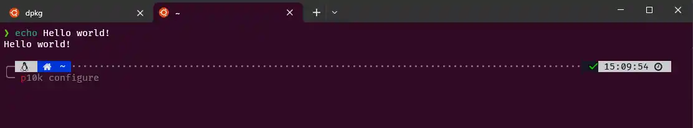
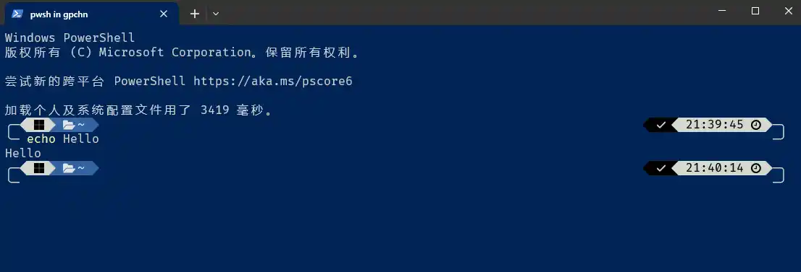
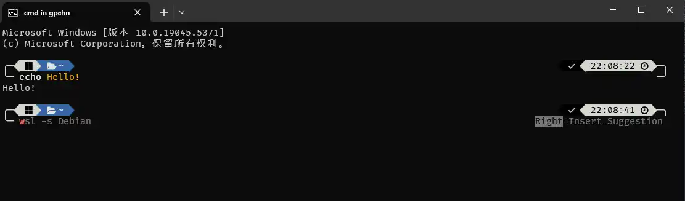
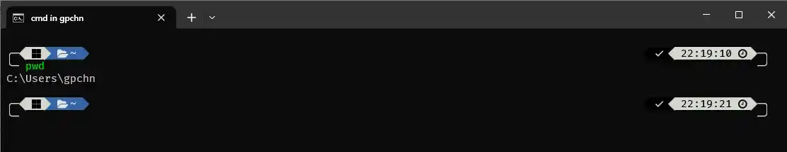

我平时在 Linux 上用 zsh，配上 oh-my-zsh 和 powerlevel10k 主题，几乎是一键起飞，颜值和效率都在线。



但 Windows 这边嘛……很多人到了 CMD 或者 PowerShell 就随缘了，顶多装个 Windows Terminal 就开干。其实只要用对工具，Windows 终端也能做到和 zsh 一样美观。这个工具就是 [oh-my-posh](https://ohmyposh.dev/)。

下面带你一步步把 CMD 和 PowerShell 的美化拉满。

## 1. 先装 Nerd Font 字体

Nerd Font 是所有终端美化的地基。它和普通字体的区别就是塞了一堆特殊图标，没有它的话，你的终端里那些炫酷的箭头、Git 分支图标全会变成乱码。

- 下载地址：[https://www.nerdfonts.com/](https://www.nerdfonts.com/)
- 我自用的是 **FiraCode Nerd Font**，进它的 GitHub Release 页面下载压缩包，解压后全选 `ttf` 文件夹里的所有字体，右键安装即可。

装完这个，后面的一切才有意义。

## 2. 安装 oh-my-posh

官方给了好几种装法，现在甚至能直接在 Microsoft Store 里找到它。不过为了避免路径和权限上的小麻烦，我还是习惯用包管理器装。

截至 2025 年 2 月 9 日，最新版是 24.19.0。安装方式三选一：

```powershell
# 用 winget（推荐）
winget install JanDeDobbeleer.OhMyPosh -s winget

# 手动安装脚本
Set-ExecutionPolicy Bypass -Scope Process -Force; Invoke-Expression ((New-Object System.Net.WebClient).DownloadString('https://ohmyposh.dev/install.ps1'))

# 用 chocolatey（社区维护，不一定最新）
choco install oh-my-posh
```

我用的是 winget。装完后开一个新的 PowerShell 窗口，跑一下 `oh-my-posh --version`，能输出版本号就说明成功了。

## 3. 美化 PowerShell

我选的主题是 [powerlevel10k_rainbow](https://ohmyposh.dev/docs/themes/powerlevel10k_rainbow)，和 oh-my-zsh 上的 powerlevel10k 长得神似，可惜不能像在 zsh 里那样交互式定制，只能直接从给出的四款 powerlevel10k 变体里挑。

先找到配置文件位置：

```powershell
$PROFILE
```

它会输出类似 `C:\Users\[你的用户名]\Documents\WindowsPowerShell\Microsoft.PowerShell_profile.ps1` 的路径。如果这个文件不存在，自己新建一个同名文件就行。

打开它，写入以下内容：

```powershell
# 下面这几行是可选插件，能装的话体验更好，想折腾的可以自己去搜
#Import-Module posh-git
#Import-Module Terminal-Icons
#Import-Module PSReadLine
#Import-Module ZLocation

# 核心命令：初始化 oh-my-posh，指定主题路径
oh-my-posh init pwsh -c C:\Users\gpchn\AppData\Local\Programs\oh-my-posh\themes\powerlevel10k_rainbow.omp.json | Invoke-Expression

# Tab 键补全增强，可选但很实用
Set-PSReadLineKeyHandler -Key Tab -Function MenuComplete
```

保存，重新打开 PowerShell，就能看到效果了。

**缺点要提前说：PowerShell 启动本来就慢，配上 oh-my-posh 后更明显。我这边就算缓存过，冷启动也要 3 秒多，有时候清理完 C 盘延迟能飙到 7 秒——这锅微软背，oh-my-posh 只是雪上加霜。**

美化效果大概是这样：



如果看腻了这个主题，随时可以换。官网主题库：[https://ohmyposh.dev/docs/themes](https://ohmyposh.dev/docs/themes)，或者在 PowerShell 里直接跑 `Get-PoshThemes` 遍历看一遍。都不满意还能自己写配置文件，定制自由度很高。

## 4. 美化 CMD

CMD 没有原生的配置文件概念，所以得下载一个小工具——[clink](https://chrisant996.github.io/clink/)。它能让 CMD 支持自动补全、持久化配置，还能加载写好的美化脚本。

官网右上方下载最新版安装即可（下载在 GitHub Release，可能需要点魔法）。装完后打开 CMD，随便敲几个字母看看有没有自动补全提示，有就说明 clink 在干活了。

然后进 clink 的安装目录，新建一个文件叫 `oh-my-posh.lua`，写入：

```lua
-- 指定主题路径，不喜欢 powerlevel10k_rainbow 可以自己去换了
load(io.popen('oh-my-posh init cmd -c C:\\Users\\gpchn\\AppData\\Local\\Programs\\oh-my-posh\\themes\\powerlevel10k_rainbow.omp.json'):read("*a"))()
```

保存，重新打开 CMD，应该就能看到漂亮的提示符了。

效果如下：



### 用 doskey 找回肌肉记忆

`doskey` 命令能实现别名功能，比如把 `ls` 映射到 `dir`。

在你的用户目录下找到 `AppData\Local\clink`，新建 `clink_start.cmd`（有些版本是 `autoexec.cmd`，具体看 clink 文档），内容参考：

```batch
@echo off
doskey ls=dir
doskey rm=del
doskey cp=copy
doskey mv=move
doskey clear=cls
doskey pwd=chdir
doskey cat=type
doskey less=type
```

这样每次打开 CMD，你就能愉快地打 `ls` 了，肌肉记忆不用重新训练。



## 5. 美化 Git Bash

Git Bash 的美化本质上和 PowerShell 差不多，只是它用的终端模拟器不好换 Nerd Font（也可能是我没找到方法），所以只能用不带图标的 `.minimal` 主题，有点遗憾。

首先把你的 `.omp.json` 主题文件复制到一个固定的路径，比如 `/etc/oh-my-posh/xxx.omp.json`。

然后在用户目录下找到或新建 `~/.profile`，写入：

```bash
# 指向你复制过去的主题文件
eval "$(oh-my-posh init bash -c /etc/oh-my-posh/xxx.omp.json)"
```

重启 Git Bash 就生效了。

## 6. Wait a minute

oh-my-posh 的美化效果严重依赖终端模拟器，像 VSCode 自带的那个终端，有时候渲染会抽风，图标变框框或者直接不显示，目前我也没找到特别靠谱的解决方法。如果你的日常主要用 IDE 里的终端，这个美化可能意义不大。

## 7. 总结

搞完之后，CMD 和 PowerShell 的颜值确实能提升好几个档次，只是代价也摆在明面上——PowerShell 启动更慢了。

凡事都有代价。PowerShell 内嵌的 .NET 框架确实比 CMD 强大很多，但我用不着。
